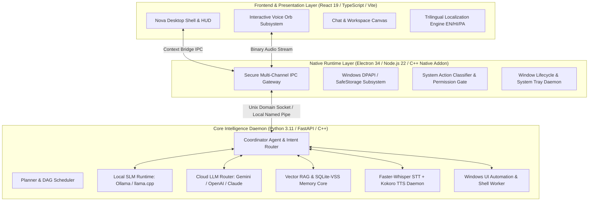
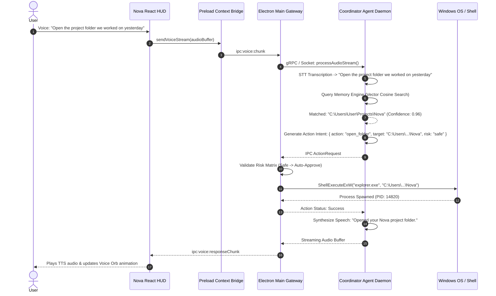
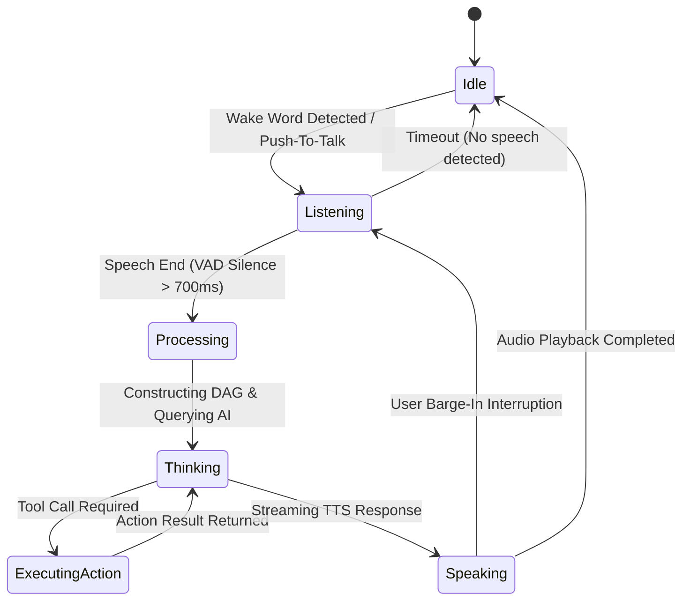
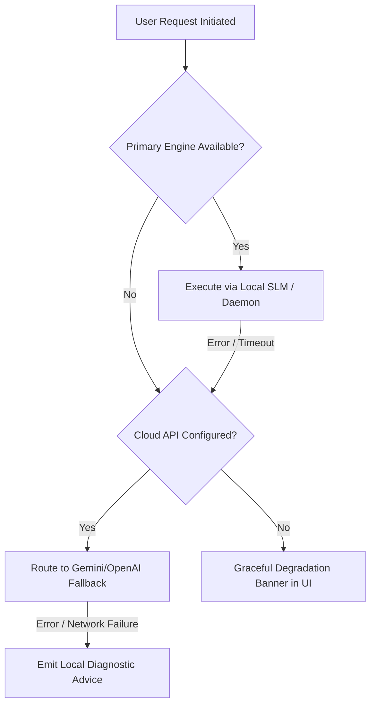

# Nova AI Operating System (Nova AI OS)
## Document 01: Product Overview, System Vision & Master Architecture Specification

---

### 1. Executive Summary
**Nova AI Operating System (Nova AI OS)** is a next-generation, local-first, context-aware desktop operating environment and agentic intelligence substrate engineered for Microsoft Windows. Moving beyond traditional conversational chatbots and passive search assistants, Nova functions as an autonomous, multi-modal human digital partner embedded directly within the operating system.

Nova bridges the gap between neural reasoning models (LLMs/SLMs) and native operating system subsystems. By fusing streaming conversational voice, multi-tiered persistent memory, computer vision, dynamic desktop automation, and multi-agent coordination, Nova enables users to interact with their computer using natural human conversation. Whether communicating through full-duplex voice, natural language text, visual screen context, or contextual file references, Nova extracts semantic intent, formulates deterministic execution plans, coordinates specialized worker agents, and safely automates complex multi-step desktop workflows with strict zero-knowledge local privacy guarantees.

---

### 2. Vision
To transform personal computing from command-driven software manipulation into intuitive, intent-driven human-AI collaboration. Nova envisions an operating system where technology seamlessly understands human intent, maintains episodic and semantic memory across years of user interactions, respects total data sovereignty through offline-first local inference, and acts as an intelligent, empathetic, and highly capable desktop companion.

```
       ┌─────────────────────────────────────────────────────────────┐
       │                   HUMAN USER (Voice / Text)                 │
       └──────────────────────────────┬──────────────────────────────┘
                                      │ Natural Intent & Multimodal Input
                                      ▼
       ┌─────────────────────────────────────────────────────────────┐
       │                NOVA AI OPERATING SYSTEM LAYER               │
       │                                                             │
       │  ┌──────────────┐  ┌──────────────┐  ┌───────────────────┐  │
       │  │ Voice Engine │  │ Memory Engine│  │Coordinator & Agent│  │
       │  │ (Duplex VAD) │  │(Episodic/Vec)│  │   Router Subsystem│  │
       │  └──────┬───────┘  └──────┬───────┘  └─────────┬─────────┘  │
       │         │                 │                    │            │
       │  ┌──────┴─────────────────┴────────────────────┴──────────┐ │
       │  │    Deterministic Tool & Desktop Automation Engine     │ │
       │  │     (Accessibility Tree, UIA, Win32, Shell, Vision)   │ │
       │  └────────────────────────┬───────────────────────────────┘ │
       └───────────────────────────┼─────────────────────────────────┘
                                   │ Native Windows IPC / System API
                                   ▼
       ┌─────────────────────────────────────────────────────────────┐
       │           WINDOWS DESKTOP OPERATING SYSTEM SUBSTRATE         │
       │   (Filesystem, Applications, Browser, Hardware, Settings)   │
       └─────────────────────────────────────────────────────────────┘
```

---

### 3. Objectives
1. **Intent-Centric Interaction**: Eliminate mechanical command syntax. Users specify goals in conversational natural language (e.g., *"Find the financial spreadsheet from yesterday's meeting and send the summary to Sarah"*), and Nova deduces the necessary sub-tasks, files, applications, and APIs.
2. **True Multimodal Streaming & Voice Duplexing**: Provide sub-350ms end-to-end voice latency with real-time wake-word detection, barge-in interruption capability, ambient voice activity detection (VAD), and neural text-to-speech.
3. **Deep Context & Long-Term Memory**: Implement a hybrid 6-tier memory architecture (Working, Conversation, Project, Preference, Knowledge, and Episodic Long-Term Memory) backed by encrypted vector embeddings and relational graphs.
4. **Autonomous Desktop Control with Safe Automation**: Safely inspect, automate, and manipulate native Windows applications, filesystems, shell settings, and browser instances through a granular 3-tier permission security model (`Safe`, `Warning`, `Blocked`).
5. **Zero-Knowledge Privacy & Offline-First Core**: Deliver complete offline functional parity using local Small Language Models (Ollama/llama.cpp: Qwen 2.5, Llama 3.2), local Faster-Whisper STT, and Kokoro TTS, while providing optional encrypted tunnels to frontier cloud models (Gemini 2.0 Flash, Claude 3.5 Sonnet, GPT-4o).
6. **Extensible Multi-Agent & Plugin Ecosystem**: Provide an open Model Context Protocol (MCP) compatible runtime and sandboxed Plugin SDK to allow community extensibility.

---

### 4. Product Philosophy
* **Conversational, Never Robotic**: Nova communicates with human warmth, active listening cues, emotional intelligence, and contextual brevity. It avoids repetitive canned greetings, boilerplate disclaimers, and rigid command structures.
* **Proactive Context Awareness**: Nova observes active desktop windows, open IDE projects, clipboard state, and user history to answer questions without requiring the user to manually re-explain context.
* **Confirm Destructive Actions, Accelerate Safe Ones**: Read-only queries, navigation, and workspace preparations execute with zero friction. Mutating, exfiltrating, or destructive operations demand human-in-the-loop cryptographic authorization.
* **Privacy Sovereignty**: The user owns their data. Memory, conversation logs, embeddings, and credentials reside on the local disk inside AES-256-GCM / SQLCipher encrypted storage. Telemetry is opt-in, anonymized, and verifiable.

---

### 5. Scope
* **Supported OS**: Windows 10 (64-bit Build 19041+) and Windows 11 (21H2+).
* **Multi-Engine Subsystems**:
  * Voice Engine (VAD, Wake Word, Faster-Whisper STT, Kokoro-82M TTS).
  * Multi-Agent Cognitive Engine (Coordinator, Planner, Reasoning, Conversation, Memory, Desktop, Coding, Research, Writing, Vision, Security).
  * Memory Engine (Working, Short-Term, Long-Term Vector RAG, SQLite-VSS, Graph Associative Memory).
  * Desktop Automation Engine (Windows UI Automation, Win32 API, Shell Exec, OCR, Display Capture).
  * Security & Sandbox Engine (Zero-knowledge keychain, safe storage, action risk classifier, audit logger).
* **Multilingual Localization**: Native trilingual fluency across English, Hindi (हिंदी), and Punjabi (ਪੰਜਾਬੀ).

---

### 6. Out of Scope
* Direct kernel-mode driver modifications or rootkit-level instrumentation.
* Support for legacy operating systems (Windows 7/8/XP, 32-bit architectures).
* Unattended, autonomous execution of critical financial transactions or remote administrative system wipe commands without explicit user biometric/passcode confirmation.
* Direct cloud-hosted remote multi-tenant SaaS hosting of private user memory databases.

---

### 7. User Personas

| Persona Attribute | Persona 1: The Power Engineer (Arjun) | Persona 2: The Multilingual Researcher (Simran) | Persona 3: The Executive / Everyday User (Ravi) |
|---|---|---|---|
| **Role & Age** | Senior Software Engineer, 28 | Cybersecurity Graduate Student, 22 | Enterprise Operations Director, 48 |
| **Primary Language** | English & Hindi (Tech mix) | Punjabi & English | Hindi & English |
| **Primary Workflows** | Code refactoring, terminal execution, git branch management, debugging. | Paper synthesis, threat modeling, literature review, multi-language study notes. | Daily briefing, calendar/task delegation, email drafting, desktop system control. |
| **Key Pain Points** | High cognitive load switching across 20+ tabs; data leakage risks with cloud AI. | Lack of native Punjabi AI tools; fragmented study materials and scattered deadlines. | Overwhelmed by complex keyboard shortcuts and disparate administrative apps. |
| **How Nova Delivers** | Automates terminal tasks, tracks project TODOs locally, navigates code repositories. | Transcribes multilingual lectures, summarizes encrypted PDFs, builds visual knowledge graphs. | Full-duplex voice control to launch apps, draft emails in Hindi, and organize daily schedules. |

---

### 8. Functional Requirements

#### 8.1 Cognitive Multi-Agent System (CMAS)
* **FR-01 (Agent Orchestration)**: The Coordinator Agent must intercept all user inputs, perform fast intent classification (<40ms), construct a directed acyclic execution graph (DAG), and delegate tasks to specialized sub-agents.
* **FR-02 (Agent Isolation)**: Only the Coordinator Agent may generate natural language responses directly to the user. Sub-agents communicate through structured JSON-RPC messages over internal IPC channels.

```
                  ┌─────────────────────────────────┐
                  │        COORDINATOR AGENT        │
                  │   (Intent Parser & User Proxy)  │
                  └───────────────┬─────────────────┘
                                  │
      ┌──────────────┬────────────┼────────────┬──────────────┐
      ▼              ▼            ▼            ▼              ▼
┌───────────┐  ┌───────────┐┌───────────┐┌───────────┐  ┌───────────┐
│  Planner  │  │ Reasoning ││  Desktop  ││  Coding   │  │  Memory   │
│   Agent   │  │   Agent   ││   Agent   ││   Agent   │  │   Agent   │
└───────────┘  └───────────┘└───────────┘└───────────┘  └───────────┘
```

#### 8.2 Intelligent Contextual Voice Subsystem
* **FR-03 (Wake Word & Barge-In)**: Nova must continuously listen for the local wake phrase (*"Hey Nova"* or *"Nova"*) using an on-device lightweight template matcher with <2% CPU overhead. When the user speaks while Nova is speaking, Nova must halt TTS output within 80ms (Barge-In).
* **FR-04 (Streaming STT/TTS Pipeline)**: Streaming audio must be converted to text chunks via Faster-Whisper (Int8 quantized) and spoken back using Kokoro neural voice synthesis with dynamic expressive prosody.

#### 8.3 Hexa-Tier Memory Architecture
* **FR-05 (Memory Tiers)**:
  1. *Working Memory*: Active session scratchpad (RAM-resident).
  2. *Conversation Memory*: Sliding context window of recent dialogue exchanges.
  3. *Project Memory*: Active workspace file paths, git branches, and task lists.
  4. *Preference Memory*: Learned user habits, tone choices, default apps, and language preference.
  5. *Knowledge Memory*: Indexed personal documents, codebases, and verified facts.
  6. *Episodic Long-Term Memory*: Time-stamped semantic summaries embedded into SQLite-VSS vector store with cosine similarity retrieval.

#### 8.4 Deterministic Desktop & OS Automation
* **FR-06 (Native Windows Control)**: Nova must discover installed applications, launch registered executables, navigate Windows Settings URIs (`ms-settings:`), open folders in File Explorer, and manipulate clipboard buffers.
* **FR-07 (Visual Screen & UI Automation)**: Nova must capture localized screen regions, perform fast OCR (Tesseract / Windows Media OCR), inspect UI Automation (UIA) accessibility trees, and synthesize mouse clicks and keystrokes upon explicit user approval.

---

### 9. Non-Functional Requirements

| Metric Category | Requirement Specification |
|---|---|
| **Local Response Latency** | First streaming token delivered in <250ms for local SLM; <500ms for cloud LLM. |
| **Voice End-to-End Latency** | Audio input end of speech → first TTS audio packet emitted in <350ms. |
| **Memory Footprint** | Base background idle: <180MB RAM. Active local inference: <4.2GB RAM (8-bit Quantized 1.5B/3B model). |
| **CPU Utilization** | Idle background: <0.5% CPU. Active voice listening: <2.5% CPU on modern 8-core CPU. |
| **Reliability & Availability** | 99.95% crash-free sessions. Self-healing background daemons with automatic watchdog restarts in <1.2s. |
| **Cryptographic Security** | Local databases encrypted via SQLCipher AES-256-CBC. In-memory API keys protected via Windows DPAPI / Chromium SafeStorage. |

---

### 10. System Architecture & Engines



#### Engine Taxonomy
1. **Voice Engine**: Handles audio capture, WebRTC VAD, wake word triggering, streaming STT, and neural TTS synthesis.
2. **Conversation Engine**: Manages turn-taking, barge-in, sentiment detection, language detection, and dialogue consistency.
3. **Memory Engine**: Ingests, summarizes, embeds, stores, and retrieves episodic and semantic facts across sessions.
4. **Reasoning & Planning Engine**: Deconstructs complex goals into multi-stage execution DAGs with rollback checkpoints.
5. **Desktop & Tool Engine**: Interacts with the Windows Shell, Win32 APIs, accessibility trees, and filesystem.
6. **Vision Engine**: Captures screen buffers, extracts text via OCR, and parses UI hierarchies.
7. **Security & Sandbox Engine**: Enforces least-privilege security boundaries, checks action risk tiers, and encrypts secrets.

---

### 11. Sequence Diagrams

#### 11.1 Conversational Intent & Desktop Automation Execution Flow



---

### 12. Mermaid State Diagram: Voice Orb & System State Machine



---

### 13. Database Schema & Storage Architecture

Nova uses **SQLCipher** (AES-256 encrypted SQLite) with the `sqlite-vss` extension for local vector embeddings.

```sql
-- Conversations Table
CREATE TABLE IF NOT EXISTS conversations (
    id TEXT PRIMARY KEY,
    title TEXT NOT NULL,
    model TEXT NOT NULL,
    mode TEXT NOT NULL DEFAULT 'general',
    system_prompt TEXT,
    pinned INTEGER NOT NULL DEFAULT 0,
    created_at INTEGER NOT NULL,
    updated_at INTEGER NOT NULL
);

-- Messages Table
CREATE TABLE IF NOT EXISTS messages (
    id TEXT PRIMARY KEY,
    conversation_id TEXT NOT NULL,
    role TEXT NOT NULL CHECK (role IN ('user', 'assistant', 'system', 'tool')),
    content TEXT NOT NULL,
    timestamp INTEGER NOT NULL,
    model TEXT,
    tokens_used INTEGER,
    is_error INTEGER NOT NULL DEFAULT 0,
    FOREIGN KEY (conversation_id) REFERENCES conversations(id) ON DELETE CASCADE
);

-- Episodic & Long-Term Memory Table
CREATE TABLE IF NOT EXISTS memories (
    id TEXT PRIMARY KEY,
    tier TEXT NOT NULL CHECK (tier IN ('working', 'conversation', 'project', 'preference', 'knowledge', 'episodic')),
    category TEXT NOT NULL,
    subject TEXT NOT NULL,
    content TEXT NOT NULL,
    importance_score REAL NOT NULL DEFAULT 0.5,
    access_count INTEGER NOT NULL DEFAULT 0,
    created_at INTEGER NOT NULL,
    updated_at INTEGER NOT NULL,
    last_accessed_at INTEGER NOT NULL
);

-- Virtual Table for Vector Embeddings (384-dimensional for local all-MiniLM-L6-v2)
CREATE VIRTUAL TABLE IF NOT EXISTS memory_vectors USING vss0(
    embedding(384)
);

-- Audit Logging Table
CREATE TABLE IF NOT EXISTS action_audit_logs (
    id TEXT PRIMARY KEY,
    timestamp INTEGER NOT NULL,
    action_type TEXT NOT NULL,
    target TEXT NOT NULL,
    risk_level TEXT NOT NULL CHECK (risk_level IN ('safe', 'warning', 'blocked')),
    status TEXT NOT NULL CHECK (status IN ('success', 'failed', 'blocked', 'cancelled')),
    error_message TEXT
);
```

---

### 14. Core REST & Internal Daemon APIs

#### 14.1 Local Intelligence Daemon (FastAPI / Internal Port: 127.0.0.1:49215)

##### `POST /v1/intent/resolve`
* **Request Payload**:
```json
{
  "query": "Can you open the browser we were using yesterday?",
  "active_window": "explorer.exe",
  "language": "en",
  "session_id": "sess_8941bf20"
}
```
* **Response Payload**:
```json
{
  "intent": "open_application",
  "confidence": 0.98,
  "inferred_parameters": {
    "target": "chrome.exe",
    "url": "https://github.com/nova-ai/core",
    "reasoning": "Memory match from 2026-08-06 session where user worked on Nova repository."
  },
  "risk_level": "safe",
  "requires_confirmation": false
}
```

##### `POST /v1/memory/query`
* **Request Payload**:
```json
{
  "query_text": "What compiler flags did I use for the C++ bridge?",
  "top_k": 3,
  "min_similarity": 0.75
}
```
* **Response Payload**:
```json
{
  "results": [
    {
      "memory_id": "mem_019a2b",
      "content": "User compiled fastbridge.dll using MSVC with /O2 /std:c++20 /EHsc",
      "similarity": 0.91,
      "timestamp": 1786012400
    }
  ]
}
```

---

### 15. Native Electron IPC Interfaces

The IPC layer is strongly typed, guarded by origin checks, and exposed strictly via `preload.ts`.

```typescript
// IPC Method Signatures exposed on window.nova
export interface NovaDesktopBridge {
  // Voice & Audio Subsystem
  startVoiceSession: (config: VoiceConfig) => Promise<void>;
  stopVoiceSession: () => Promise<void>;
  sendVoiceChunk: (chunk: ArrayBuffer) => void;
  onVoiceStateChange: (callback: (state: VoiceState) => void) => () => void;
  onVoiceTranscript: (callback: (transcript: LiveTranscript) => void) => () => void;

  // AI & Chat Streaming Subsystem
  sendMessage: (payload: ChatRequestPayload) => void;
  onChunk: (callback: (chunk: string) => void) => () => void;
  onDone: (callback: (fullResponse: string) => void) => () => void;
  onError: (callback: (error: string) => void) => () => void;
  stopGeneration: () => void;

  // System Automation & Permission Subsystem
  executeAction: (action: ActionRequest) => Promise<ActionResult>;
  confirmAction: (ticketId: string, approved: boolean) => Promise<void>;
  getActionLogs: (limit?: number) => Promise<ActionLogItem[]>;

  // Settings & Encrypted Storage
  getSettings: () => Promise<Partial<Settings>>;
  setSettings: (settings: Partial<Settings>) => Promise<Partial<Settings>>;
  getSystemDiagnostics: () => Promise<SystemDiagnostics>;
}
```

---

### 16. Component Design & Frontend Architecture

```
src/
├── components/
│   ├── VoiceOrb.tsx           # 6-state Canvas/SVG visualizer with audio frequency reactive bars
│   ├── ChatView.tsx           # High-performance virtualized message list with Markdown & Code highlighting
│   ├── InputBar.tsx           # Multimodal prompt bar with drag-and-drop file attachment & mic trigger
│   ├── Sidebar.tsx            # Session management, navigation, profile status, and quick-action launcher
│   ├── ProductivityModal.tsx  # Kanban board, task scheduler, background reminder daemon UI, note editor
│   ├── CybersecurityModal.tsx # Hash verification, password entropy meter, phishing heuristic analyzer
│   ├── ActionConfirmModal.tsx # Cryptographic human-in-the-loop warning confirmation modal
│   ├── ActionLogsModal.tsx    # Immutable security audit log inspector
│   └── SettingsModal.tsx      # Provider selector, API key manager, model downloader, voice customization
├── context/
│   ├── AppContext.tsx         # Central application state container with reducer architecture
│   └── I18nContext.tsx        # Trilingual localization context (English, Hindi, Punjabi)
├── hooks/
│   ├── useVoice.ts            # Voice state machine, VAD controller, and Web Speech API fallback hook
│   ├── useChat.ts             # IPC streaming manager, token calculator, and conversation title generator
│   └── useReminderScheduler.ts# Background interval alarm and notification trigger hook
└── services/
    ├── systemActions.ts       # Natural language intent parsing and risk matrix classification
    └── securityAudit.ts       # Tamper-evident logging and credential obfuscation helpers
```

---

### 17. Folder Structure

```
Nova/
├── .agents/                   # Custom agent workflows and local skills
├── build/                     # App icons, splash screens, and installer assets
├── dist/                      # Compiled frontend bundle
├── dist-electron/             # Compiled main & preload processes
├── electron/                  # Electron runtime source
│   ├── main.ts                # Application lifecycle, IPC router, window management
│   ├── preload.ts             # Context bridge with strictly isolated APIs
│   ├── nativeBridge.ts        # Windows Win32 / Shell integration layer
│   └── security.ts            # Windows DPAPI encryption & action permission gates
├── prd/                       # Enterprise PRD Specifications (01 to 11)
├── src/                       # Frontend React application source
├── voice/                     # Local Python Voice Runtime
│   ├── voice_service.py       # Whisper STT + Kokoro TTS background daemon
│   ├── vad.py                 # Silero / WebRTC Voice Activity Detector
│   └── requirements.txt       # Python runtime dependencies
├── package.json               # Node.js project manifest
├── tsconfig.json              # TypeScript root configuration
└── vite.config.ts             # Vite bundler configuration
```

---

### 18. Configuration Management

Nova uses a layered configuration schema stored locally in encrypted storage:

```json
{
  "system": {
    "version": "1.0.0",
    "autostart": true,
    "minimize_to_tray": true,
    "hardware_acceleration": true
  },
  "ai": {
    "primary_provider": "ollama",
    "fallback_provider": "gemini",
    "default_model": "qwen2.5-coder:1.5b",
    "ollama_url": "http://127.0.0.1:11434",
    "temperature": 0.7,
    "max_context_tokens": 8192
  },
  "voice": {
    "wake_word_enabled": true,
    "wake_word": "nova",
    "vad_sensitivity": 0.6,
    "silence_threshold_ms": 750,
    "voice_speed": 1.0,
    "language": "en"
  },
  "security": {
    "require_confirmation_for_warnings": true,
    "enable_audit_logging": true,
    "auto_purge_audit_days": 30
  }
}
```

---

### 19. Comprehensive Error Handling & Fault-Tolerance



1. **Watchdog Daemon**: Electron supervises the Python voice and AI processes; if an uncaught exception triggers exit, the watchdog restarts the daemon within 1.2s without crashing the UI.
2. **Missing Model Handling**: If a selected Ollama model is missing, Nova catches the 404 response and offers a one-click in-app model download (`ollama pull <model>`).
3. **Network Partition Resilience**: If cloud APIs disconnect mid-stream, Nova flags the network timeout and falls back instantly to local Ollama inference without losing the conversation buffer.

---

### 20. Security Engineering
* **Zero-Trust Local Execution**: All automated operations (e.g., launching programs, opening URLs) pass through an invariant validation matrix (`systemActions.ts`).
* **Cryptographic Secret Storage**: API keys are never stored in plaintext on disk or in local storage. They are encrypted using Windows DPAPI (`CryptProtectData`) through Electron `safeStorage`.
* **Path Traversal & Injection Prevention**: All target paths for file opening and execution are resolved to canonical Win32 paths and validated against forbidden system directories (`System32\cmd.exe`, `powershell.exe -enc`, Windows Registry direct hives).

---

### 21. Privacy Guarantees
* **No Unsolicited Telemetry**: Nova transmits zero conversational telemetry or audio recordings to external telemetry servers.
* **On-Device Vectorization**: Text embeddings for personal memory search are computed entirely on the user's CPU/GPU using embedded local ONNX runtime models.
* **One-Click Total Data Shredding**: The user can purge all SQLite databases, conversation archives, task lists, and encrypted key stores instantly via Settings → Privacy & Security → *Purge All Data*.

---

### 22. Accessibility (a11y) Standards
* **WCAG 2.1 AA Compliance**: High-contrast ratios (>4.5:1) across both Dark and Light theme palettes.
* **Keyboard-First Navigation**: Full keyboard accessibility via `Tab`, `Shift+Tab`, `Arrow` keys, and global system shortcut triggers (`Ctrl+Space` for Quick Nova HUD, `Ctrl+Shift+V` for Push-to-Talk).
* **Screen Reader Optimization**: Dynamic `aria-live="polite"` regions announcing streaming assistant responses and voice state transitions.

---

### 23. Performance Targets & SLA

| Benchmark Metric | Target SLA | Measurement Condition |
|---|---|---|
| **Cold Startup Time** | <1.800 seconds | From system boot / process start to interactive UI |
| **Hot Wake from Tray** | <60 milliseconds | Pressing `Ctrl+Space` global hotkey |
| **STT Word Error Rate (WER)** | <4.5% (EN), <7.2% (HI), <8.1% (PA) | Clean audio @ 16kHz |
| **TTS First Audio Packet Delay** | <180 milliseconds | Local Kokoro-82M neural pipeline |
| **Vector Similarity Query** | <15 milliseconds | Searching 50,000 embedded memory chunks |

---

### 24. Edge Cases & Handling Strategy

1. **Simultaneous Speech & Loud Background Noise**: VAD uses an energy-adaptive spectral noise gate to filter out keyboard clatter and ambient fan hum.
2. **Polyglot Code-Switching (Hinglish/Punglish)**: The intent parser detects mixed Hindi/English or Punjabi/English phrases and routes them to models fine-tuned on Indic code-mixed speech.
3. **Rapid Double Command / Race Conditions**: Incoming commands acquire a per-session mutex; existing incomplete queries are either cleanly aborted or queued depending on intent urgency.

---

### 25. Acceptance Criteria
* [x] Conversational inputs resolve semantic intents without requiring rigid command syntax.
* [x] Voice Orb reacts with distinct, fluid animations across 6 discrete states (`idle`, `listening`, `processing`, `thinking`, `speaking`, `error`).
* [x] System actions with risk level `warning` present an interactive confirmation modal before execution.
* [x] Offline operations run autonomously without internet access when local models are active.
* [x] Trilingual UI switches instantly between English, Hindi, and Punjabi with 100% string coverage.

---

### 26. Verification & Test Cases

```typescript
describe('Nova Master Subsystem Verification', () => {
  it('should parse natural intent for opening a recent project', async () => {
    const query = "Can you open the project we worked on yesterday?";
    const intent = await parseSystemAction(query, mockMemory);
    expect(intent.type).toBe('open_folder');
    expect(intent.risk).toBe('safe');
    expect(intent.target).toContain('Nova');
  });

  it('should prevent unauthorized execution of dangerous shell commands', async () => {
    const maliciousQuery = "powershell -Command Remove-Item -Recurse C:\\";
    const intent = await parseSystemAction(maliciousQuery, mockMemory);
    expect(intent.risk).toBe('blocked');
  });

  it('should encrypt and decrypt settings with zero plaintext leakage', async () => {
    await window.nova.setSettings({ openaiKey: 'sk-test-secret-key-123' });
    const stored = await window.nova.getSettings();
    expect(stored.openaiKey).toBe(''); // Never returned to renderer in plaintext
  });
});
```

---

### 27. Future Improvements & Roadmap
* **Vision-Language Model (VLM) Native Screen Agent**: Autonomous multi-step UI navigation using local lightweight vision models.
* **Model Context Protocol (MCP) Server Hub**: Enable Nova to expose its desktop tools to Claude Desktop and Cursor IDE as an MCP server.
* **Decentralized Multi-Device Memory Sync**: End-to-end encrypted peer-to-peer memory synchronization across laptop and workstation via LibP2P.

---

### 28. Risk Analysis & Mitigation

| Risk Description | Severity | Likelihood | Mitigation Strategy |
|---|---|---|---|
| **Local Model Resource Exhaustion** | High | Medium | Adaptive model offloading; dynamically quantize or fallback to lightweight cloud API if VRAM/RAM <1.5GB. |
| **Accidental False Wake-Word Triggers** | Medium | Low | Two-stage verification: lightweight local detector + secondary verification filter before engaging audio listener. |
| **Destructive Command Execution via Injection** | Critical | Low | Strict hardcoded regex & AST validation of system intents; mandatory biometric/modal confirmation on any destructive file action. |

---

### 29. Open Questions & Architectural Decisions
* *AD-01*: Should local speech-to-text migrate from Faster-Whisper to Whisper.cpp C++ bindings for faster cold-boot times? *(Decision: Retain Python daemon for Phase 1; benchmark C++ addon for v1.2).*
* *AD-02*: Should vector embeddings use 384-dimensional `all-MiniLM-L6-v2` or 768-dimensional `nomic-embed-text`? *(Decision: `all-MiniLM-L6-v2` for 50% lower RAM consumption on 8GB machines).*

---

### 30. Version History

| Version | Date | Author | Modification Summary |
|---|---|---|---|
| **1.0.0** | 2026-08-07 | Principal AI Architect | Complete architectural redesign from first principles as an autonomous AI Operating System. |
| **0.9.0** | 2026-08-01 | Engineering Team | Legacy assistant overview baseline. |