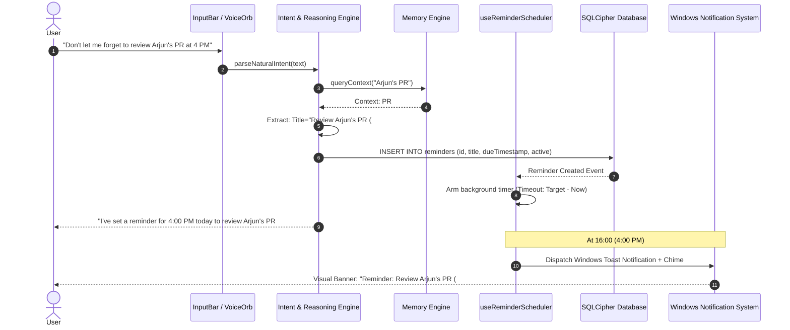
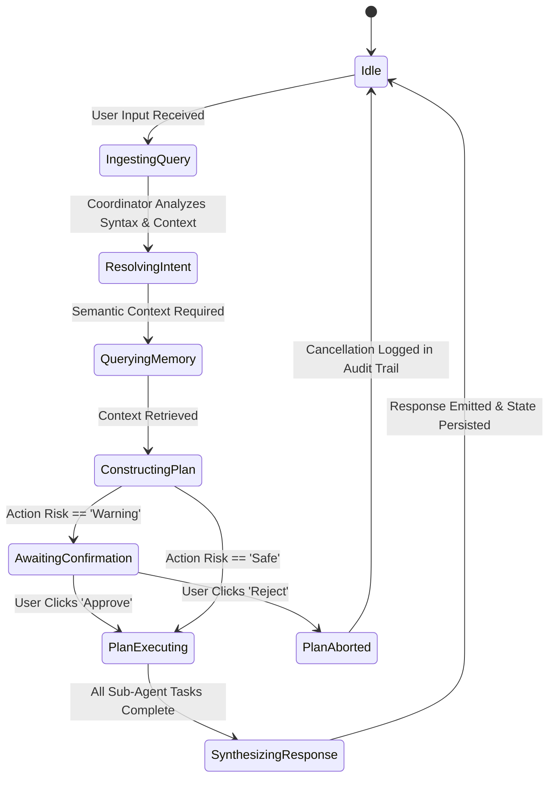

# Nova AI Operating System (Nova AI OS)
## Document 02: Features & Functional Requirements Specification

---

### 1. Executive Summary
This document provides the definitive, commercial-grade functional specification for all features, modules, and agentic capabilities within the **Nova AI Operating System (Nova AI OS)**. Nova replaces traditional command-based assistants with an intent-driven, context-aware digital partner that interacts naturally through voice, text, vision, files, and direct desktop automation.

Nova's feature set encompasses 9 primary feature pillars: (1) Natural Intent-Driven Conversation, (2) Hexa-Tier Memory System, (3) Full-Duplex Streaming Voice Interaction, (4) Safe Desktop & Windows OS Automation, (5) Productivity, Task & Time Management, (6) Defensive Cybersecurity & Privacy Tools, (7) Multi-Language & Cultural Intelligence (EN/HI/PA), (8) Autonomous Coding & Workspace Engineering, and (9) Document, Web & Visual Intelligence. Every feature is specified with deterministic inputs, outputs, security constraints, and exact operational behaviors.

---

### 2. Vision
To establish an operating environment where personal computing tasks require zero cognitive overhead. Users express goals in natural, conversational human terms (*"Prepare my morning brief," "Find the contract we discussed with Rajeev," "Debug why this API call returns 401"*), and Nova synthesizes background context, consults past memories, invokes specialized worker agents, and orchestrates native desktop actions with precision and safety.

```
┌─────────────────────────────────────────────────────────────────────────────┐
│                          USER CONVERSATIONAL INTENT                         │
│             "Don't let me forget the quarterly meeting with Arjun"          │
└──────────────────────────────────────┬──────────────────────────────────────┘
                                       │
                                       ▼
┌─────────────────────────────────────────────────────────────────────────────┐
│                       INTENT EXTRACTION & REASONING                         │
│  • Intent: Create Reminder & Calendar Event                                 │
│  • Subject: "Quarterly Meeting with Arjun"                                  │
│  • Memory Context: Arjun = Senior Dev; Typical meeting time = 10:00 AM       │
│  • Inferred Due Timestamp: Next Business Day @ 10:00 AM                     │
│  • Action: Background Alarm + System Notification + Calendar Sync           │
└──────────────────────────────────────┬──────────────────────────────────────┘
                                       │
                   ┌───────────────────┴───────────────────┐
                   ▼                                       ▼
┌─────────────────────────────────────┐ ┌─────────────────────────────────────┐
│         INTERNAL SYSTEM ACTION      │ │     CONVERSATIONAL CONFIRMATION     │
│   Persisted to SQLCipher DB         │ │   "I've scheduled a reminder for    │
│   Registered in Windows Toast Alarm │ │   tomorrow at 10:00 AM for your     │
│   Logged in Action Audit Log        │ │   quarterly sync with Arjun."       │
└─────────────────────────────────────┘ └─────────────────────────────────────┘
```

---

### 3. Objectives
1. **Zero-Syntax Intent Ingestion**: Support freeform voice and text inputs that automatically derive targets, deadlines, priorities, and operations without structured command syntax.
2. **Context-Persistent Memory**: Store, index, and retrieve user preferences, active project states, past dialogue nuances, and factual assertions with sub-20ms vector retrieval.
3. **Low-Latency Full-Duplex Voice**: Provide hands-free natural voice interaction with live barge-in interruptions, adaptive VAD, and emotional prosody.
4. **Autonomous Desktop Control with Safe Permissioning**: Allow secure execution of native Windows applications, file manipulations, browser searches, and clipboard operations with granular risk classification (`Safe`, `Warning`, `Blocked`).
5. **Integrated Developer & Productivity Workspace**: Provide native Kanban task boards, markdown note management, zxcvbn password entropy analysis, file checksum verification, and terminal-assisted coding help.

---

### 4. Product Philosophy
* **Infer First, Clarify Only When Ambiguous**: Nova leverages context, active window state, and long-term memory to resolve ambiguities before asking clarifying questions.
* **Respect Natural Human Dialogue**: Avoid repetitive introductory phrases, robotic status confirmations, or unsolicited disclaimers.
* **Proactive Protection**: Warn users before dangerous system operations execute, while safely automating repetitive read-only actions.
* **Total Transparency**: Maintain an immutable, user-inspectable audit log of every system action executed on the machine.

---

### 5. Scope
* **Pillar 1**: Conversational & Multi-Agent Dialogue Engine.
* **Pillar 2**: Hexa-Tier Memory Subsystem (Working, Conversation, Project, Preference, Knowledge, Episodic).
* **Pillar 3**: Full-Duplex Voice Engine (Wake word, streaming VAD, Faster-Whisper, Kokoro TTS).
* **Pillar 4**: Windows Desktop Automation Subsystem (App launcher, File/Folder Explorer, Windows Settings, UI Automation).
* **Pillar 5**: Productivity Suite (Kanban tasks, automated recurring reminder daemon, rich notes).
* **Pillar 6**: Cybersecurity Toolkit (Multi-algorithm hashing, phishing heuristic analyzer, password generator & entropy tester).
* **Pillar 7**: Multilingual & Indic Localization Engine (English, Hindi, Punjabi).
* **Pillar 8**: Coding & Terminal Workspace Assistant.
* **Pillar 9**: Research, Web Synthesis & Document Understanding.

---

### 6. Out of Scope
* Kernel-level ring-0 device driver installation or BIOS/UEFI flashing.
* Unsupervised automated deletion of system root directories (`C:\Windows`, `C:\Program Files`).
* Remote multi-tenant cloud storage of private user memory databases or biometric voice prints.
* Autonomous execution of financial payment transactions or signing binding contracts without user presence.

---

### 7. User Personas

```
┌───────────────────────────────────────────────────────────────────────────────┐
│ PERSONA PROFILE SUMMARY                                                       │
├──────────────────────┬────────────────────────┬───────────────────────────────┤
│ Persona 1: Dev Arjun │ Persona 2: Simran (Eng)│ Persona 3: Director Ravi      │
│ • Age: 28, Full-stack│ • Age: 22, Cyber MS    │ • Age: 48, Operations Lead    │
│ • Tech Stack: TS/Rust│ • Focus: Threat Intel  │ • Workflow: Email & Desktop   │
│ • Goal: Speed & Local│ • Goal: Multi-lang Q&A │ • Goal: Natural Voice Control │
└──────────────────────┴────────────────────────┴───────────────────────────────┘
```

---

### 8. Detailed Functional Requirements by Feature Pillar

#### Pillar 1: Conversational & Multi-Agent Dialogue Engine
* **FR-101 (Intent Extraction Engine)**: The system must parse natural queries (e.g., *"Can you open the browser we were using yesterday?"*) and extract:
  * Primary Intent Type (`open_application`, `query_memory`, `schedule_task`, `summarize_text`).
  * Inferred Entities (Application: `Google Chrome`, Target URL: `https://github.com/nova-ai/core`).
  * Temporal Anchors (`yesterday` → calculated exact ISO-8601 date range).
* **FR-102 (Multi-Turn Context Tracking)**: Retain dynamic token context across dialogues with automatic sliding window summarization when context exceeds 80% of model capacity.
* **FR-103 (Specialized Agent Delegation)**: The Coordinator Agent dynamically dispatches sub-tasks to specialized worker agents (`PlannerAgent`, `CodingAgent`, `ResearchAgent`, `DesktopAgent`, `SecurityAgent`).

#### Pillar 2: Hexa-Tier Memory Subsystem
* **FR-201 (Working Memory)**: Transient in-memory scratchpad tracking active files, current UI state, and active conversation parameters.
* **FR-202 (Conversation Memory)**: Recent message history stored locally with rolling semantic summaries.
* **FR-203 (Project Memory)**: Repository-level context including active branch, recent modified files, and associated tasks.
* **FR-204 (Preference Memory)**: Learned user conventions (preferred programming language, code style, voice speed, language tone).
* **FR-205 (Knowledge Memory)**: Ingested local PDFs, markdown notes, documentation files, and technical articles.
* **FR-206 (Episodic Long-Term Memory)**: Vectorized embeddings (`sqlite-vss`, 384-dim) storing past conversation highlights, user milestones, and historical context with cosine similarity lookup.
* **FR-207 (Memory Privacy & Erasure)**: Users can inspect, search, filter, edit, or selectively delete any memory entity with instant database un-indexing.

```
┌─────────────────────────────────────────────────────────────────────────────┐
│                        HEXA-TIER MEMORY ARCHITECTURE                        │
├─────────────────────────────────────────────────────────────────────────────┤
│ 1. Working Memory     │ RAM-resident active session scratchpad              │
│ 2. Conversation Memory│ Sliding multi-turn dialogue buffer                  │
│ 3. Project Memory     │ Active workspace context & repo file graph          │
│ 4. Preference Memory  │ Explicit & inferred user preferences (Tone/Language)│
│ 5. Knowledge Memory   │ Ingested local documents, manuals, & notes          │
│ 6. Episodic Memory    │ Long-term vector store (sqlite-vss embeddings)      │
└─────────────────────────────────────────────────────────────────────────────┘
```

#### Pillar 3: Full-Duplex Streaming Voice Engine
* **FR-301 (Always-Ready Wake Word Detection)**: Listen for *"Hey Nova"* / *"Nova"* with on-device lightweight template matching (<2% CPU overhead).
* **FR-302 (Real-Time Voice Activity Detection - VAD)**: Dynamic silence detection thresholding (default: 750ms silence triggers end-of-speech).
* **FR-303 (Live Barge-In Interruption)**: When the user speaks while Nova's TTS is outputting audio, the system must abort TTS playback in <80ms and transition to listening state.
* **FR-304 (Voice Orb UI)**: An interactive 6-state dynamic visualization (`idle`, `listening`, `processing`, `thinking`, `speaking`, `error`) rendered with reactive frequency waveform bars.

#### Pillar 4: Safe Desktop & Windows OS Automation
* **FR-401 (Application Launching & Management)**: Launch allowlisted applications (Browsers, IDEs, Terminal, Office tools, Media players) and focus existing instances.
* **FR-402 (Filesystem Navigation)**: Open target directories in Windows Explorer, launch files in default associations, and resolve relative path aliases.
* **FR-403 (Windows Settings Integration)**: Deep-link directly into native Windows Settings pages via canonical `ms-settings:` URIs (e.g., `ms-settings:network-wifi`, `ms-settings:display`, `ms-settings:appsfeatures`).
* **FR-404 (3-Tier Risk & Safety Matrix)**:
  * `Safe`: Read-only queries, opening known apps, navigating settings → **Auto-execute**.
  * `Warning`: Opening arbitrary files, spawning terminal windows, modifying settings → **Modal confirmation required**.
  * `Blocked`: Dangerous shell commands (`rmdir /s`, `format`, `reg delete`, PowerShell encoded payloads) → **Immediate hard block with security explanation**.

#### Pillar 5: Productivity, Task & Time Management
* **FR-501 (Interactive Kanban Task Board)**: Tasks categorized across `Pending`, `In Progress`, and `Completed` columns with drag-and-drop status transitions.
* **FR-502 (Priority & Tagging System)**: Support `Low`, `Medium`, `High`, and `Urgent` priority levels with custom tags and due dates.
* **FR-503 (Recurring Task Scheduler)**: Support recurring frequencies (`daily`, `weekly`, `monthly`) with automatic rollover.
* **FR-504 (Background Reminder Daemon)**: Background timer scheduler running in the Electron main process triggering native Windows Toast Notifications and audio chimes upon reminder maturation.
* **FR-505 (Rich Markdown Notes)**: Full-featured note-taking editor with tags, timestamps, search, and sensitive content masking.

#### Pillar 6: Defensive Cybersecurity & Privacy Tools
* **FR-601 (Multi-Algorithm Hash Engine)**: Compute and compare cryptographic digests (MD5, SHA-1, SHA-256, SHA-512) for text strings and local files with real-time match verification.
* **FR-602 (Phishing Heuristic Analyzer)**: Inspect email headers, body text, and embedded URLs against 12 heuristic phishing indicators (urgent language, spoofed domains, suspicious TLDs, credential harvesting patterns) with an overall Threat Score (0–100).
* **FR-603 (Password Entropy & Generator)**: Real-time password strength evaluation via `zxcvbn`, entropy bit calculation, crack time estimation, and cryptographically secure random password generation (customizable length, symbols, numbers, uppercase).

#### Pillar 7: Multilingual & Indic Localization Engine
* **FR-701 (Trilingual Parity)**: Complete UI and conversational fluency across **English**, **Hindi (हिंदी)**, and **Punjabi (ਪੰਜਾਬੀ)**.
* **FR-702 (Automatic Language Detection & Code-Switching)**: Detect user language per utterance and handle mixed inputs (*"Mera project folder open karo"*, *"Nova, mainu kal de tasks daso"*) seamlessly.
* **FR-703 (Technical Term Preservation)**: Preserve technical terminology (e.g., *API, Repository, Function, Compiler, Firewall*) in clean Latin script or phonetic transliteration without unnatural literal translation.

#### Pillar 8: Coding & Workspace Assistant
* **FR-801 (Syntax-Highlighted Code Blocks)**: Multi-language syntax highlighting with one-click copy, line numbers, and language badges.
* **FR-802 (Error Diagnostics & Refactoring)**: Parse compiler errors, stack traces, and runtime exceptions, pinpoint root causes, and provide diff-formatted corrections.
* **FR-803 (Token Context Monitor)**: Real-time token estimation display calculating prompt tokens, model context window usage, and budget warnings.

#### Pillar 9: Research, Web Synthesis & Document Intelligence
* **FR-901 (Structured Comparison & Synthesis)**: Format analytical research queries into Markdown comparison tables, pros/cons matrices, and executive summaries.
* **FR-902 (Multi-Format Workspace Export)**: Export conversations, notes, and task lists into Markdown (`.md`), JSON (`.json`), or Plain Text (`.txt`) files.
* **FR-903 (Local Document Q&A)**: Ingest text files, markdown documents, and source files into Knowledge Memory for grounded RAG Q&A.

---

### 9. Non-Functional Requirements

| Metric | Target Specification | Enforcement Mechanism |
|---|---|---|
| **First Token Latency** | <250ms (Local SLM), <450ms (Cloud LLM) | Stream chunking over IPC |
| **STT Latency** | <120ms for audio segment transcription | Faster-Whisper Int8 on CPU/GPU |
| **TTS Audio Lag** | <180ms from text chunk to audio buffer | Kokoro-82M ONNX runtime |
| **Vector Search Time** | <15ms over 100,000 memory entries | `sqlite-vss` C++ extension index |
| **Disk Storage Footprint** | App: <350MB, Core Model: <1.1GB (1.5B Qwen) | Quantized GGUF / SafeTensors |
| **Encryption Standard** | AES-256-GCM / SQLCipher | Windows DPAPI master key derivation |

---

### 10. Architecture & Feature Integration Matrix

```mermaid
graph LR
    subgraph Input_Layer ["Input Ingestion Layer"]
        VoiceIn[Voice Stream / VAD]
        TextIn[Chat Text Input]
        FileIn[Attached Files / Docs]
    end

    subgraph Coordinator_Subsystem ["Coordinator & Intelligence Subsystem"]
        IntentRouter[Intent & Entity Classifier]
        MemoryLookup[Hexa-Tier Memory Engine]
        AgentDispatcher[Multi-Agent Dispatcher]
    end

    subgraph Feature_Engines ["Specialized Feature Engines"]
        VoiceEngine[Voice Engine STT/TTS]
        AutoEngine[Desktop Automation Engine]
        ProductivityEngine[Productivity & Kanban Engine]
        SecurityEngine[Cybersecurity Toolkit Engine]
        CodingEngine[Coding & Terminal Engine]
    end

    subgraph Output_Layer ["Output & Presentation Layer"]
        VoiceOut[Kokoro TTS Audio]
        UIOut[React HUD / Chat View / Modals]
        OSAction[Native Windows Execution]
    end

    Input_Layer --> Coordinator_Subsystem
    Coordinator_Subsystem --> Feature_Engines
    Feature_Engines --> Output_Layer
```



---

### 11. Sequence Diagrams

#### 11.1 Natural Language Intent to Automated Reminder Scheduling



---

### 12. Mermaid State Diagram: Multi-Agent Task Orchestration



---

### 13. Database Schema Impact

```sql
-- Tasks Table
CREATE TABLE IF NOT EXISTS tasks (
    id TEXT PRIMARY KEY,
    description TEXT NOT NULL,
    priority TEXT NOT NULL CHECK (priority IN ('low', 'medium', 'high', 'urgent')),
    status TEXT NOT NULL CHECK (status IN ('pending', 'in_progress', 'completed')),
    due_date TEXT,
    tags TEXT NOT NULL DEFAULT '[]',
    recurring TEXT CHECK (recurring IN ('none', 'daily', 'weekly', 'monthly')),
    created_at INTEGER NOT NULL,
    completed_at INTEGER
);

-- Reminders Table
CREATE TABLE IF NOT EXISTS reminders (
    id TEXT PRIMARY KEY,
    title TEXT NOT NULL,
    due_timestamp INTEGER NOT NULL,
    recurring TEXT CHECK (recurring IN ('none', 'daily', 'weekly')),
    active INTEGER NOT NULL DEFAULT 1,
    created_at INTEGER NOT NULL,
    last_triggered_at INTEGER
);

-- Notes Table
CREATE TABLE IF NOT EXISTS notes (
    id TEXT PRIMARY KEY,
    title TEXT NOT NULL,
    content TEXT NOT NULL,
    tags TEXT NOT NULL DEFAULT '[]',
    sensitive INTEGER NOT NULL DEFAULT 0,
    created_at INTEGER NOT NULL,
    updated_at INTEGER NOT NULL
);

-- Phishing Analysis History
CREATE TABLE IF NOT EXISTS phishing_scans (
    id TEXT PRIMARY KEY,
    analyzed_at INTEGER NOT NULL,
    input_sample TEXT NOT NULL,
    threat_score INTEGER NOT NULL,
    indicators_detected TEXT NOT NULL,
    verdict TEXT NOT NULL
);
```

---

### 14. Engine APIs & Interface Contracts

#### 14.1 System Action Intent Resolver (`src/services/systemActions.ts`)

```typescript
export interface SystemActionResolution {
  type: 'open_app' | 'open_website' | 'open_file' | 'open_folder' | 'open_settings';
  target: string;
  label: string;
  risk: 'safe' | 'warning' | 'blocked';
  reason?: string;
}

export function parseSystemAction(query: string, memoryContext?: MemoryContext): SystemActionResolution | null;
```

#### 14.2 Cybersecurity Toolkit Service (`src/services/cyberSecurity.ts`)

```typescript
export interface HashResult {
  algorithm: 'MD5' | 'SHA-1' | 'SHA-256' | 'SHA-512';
  digest: string;
  match?: boolean;
}

export interface PhishingReport {
  threatScore: number; // 0 - 100
  verdict: 'safe' | 'suspicious' | 'dangerous';
  flags: string[];
  recommendations: string[];
}

export function computeHash(data: ArrayBuffer | string, algo: string): Promise<string>;
export function analyzePhishingIndicators(text: string): PhishingReport;
export function analyzePasswordStrength(password: string): zxcvbn.ZXCVBNResult;
```

---

### 15. Native Electron IPC Interfaces for Features

```typescript
// IPC Channels registered in electron/main.ts
export type FeatureIPCChannels = {
  // System Actions
  'action:execute': (action: ActionRequest) => Promise<ActionResult>;
  'action:logs:get': (limit: number) => Promise<ActionLogItem[]>;
  'action:logs:purge': () => Promise<void>;

  // System Diagnostics
  'system:diagnostics': () => Promise<SystemInfo>;

  // Native File Dialogs
  'dialog:openFile': () => Promise<string | null>;
  'dialog:openFolder': () => Promise<string | null>;
};
```

---

### 16. Component Design & UI Architecture

```
Productivity Suite Layout:
┌────────────────────────────────────────────────────────────────────────┐
│ Productivity Center (Modal)                                           │
├───────────────────┬────────────────────────────────────────────────────┤
│ Navigation Tabs   │ Kanban Board View                                  │
│ • Tasks (Kanban)  │ ┌──────────────┐ ┌──────────────┐ ┌──────────────┐ │
│ • Reminders       │ │ PENDING (3)  │ │ IN PROGRESS  │ │ COMPLETED    │ │
│ • Notes           │ │ [Task Item]  │ │ [Task Item]  │ │ [Task Item]  │ │
│ • Search & Filter │ │ [Task Item]  │ │              │ │              │ │
│                   │ └──────────────┘ └──────────────┘ └──────────────┘ │
└───────────────────┴────────────────────────────────────────────────────┘
```

---

### 17. Folder Structure for Feature Modules

```
src/
├── components/
│   ├── ProductivityModal.tsx     # Kanban, Reminders Scheduler & Notes
│   ├── CybersecurityToolsModal.tsx # Hash Calculator, Phishing Detector, Password Tester
│   ├── ActionConfirmModal.tsx    # Safety Permission Dialog
│   ├── ActionLogsModal.tsx       # Immutable Audit Logs Viewer
│   ├── VoiceOrb.tsx              # Dynamic Voice Orb Visualization
│   └── InputBar.tsx              # Multimodal Prompt Bar & Model Switcher
├── hooks/
│   ├── useVoice.ts               # Voice State Machine & Audio Capture
│   ├── useChat.ts                # AI Streaming & Multi-Turn State
│   └── useReminderScheduler.ts   # Background Reminder Interval Daemon
└── services/
    ├── systemActions.ts          # Intent Classification & Windows Mapping
    └── cryptoUtils.ts            # Hashing, Password Entropy & Analysis
```

---

### 18. Configuration Management

```json
{
  "features": {
    "kanban_default_view": "board",
    "reminder_sound_enabled": true,
    "reminder_toast_enabled": true,
    "cybersecurity_auto_detect_hashes": true,
    "voice_barge_in_enabled": true,
    "voice_auto_speak_responses": false,
    "token_counter_display": true
  }
}
```

---

### 19. Comprehensive Error Handling

1. **Ollama Offline / Connection Refusal**:
   * *Behavior*: Catches `fetch failed` / `ECONNREFUSED` and renders a clean UI card with instructions: *"Ollama is not running on localhost:11434. Start Ollama, or switch to a cloud provider in Settings."*
2. **Missing Local Model (HTTP 404)**:
   * *Behavior*: Detects missing model tags, queries local Ollama `/api/tags`, and auto-selects the first available installed model (e.g. `qwen2.5-coder:1.5b`).
3. **Invalid System Action URI**:
   * *Behavior*: Catches invalid Windows `ms-settings:` URI schemes or non-existent file paths and emits a localized diagnostic toast without terminating the session.

---

### 20. Security & Safety Gates
* **Hardcoded Command Blocking**: Destructive shell patterns (e.g., `cmd.exe /c del`, `powershell Remove-Item -Force`, `vssadmin delete shadows`) are unconditionally classified as `Blocked` and cannot be triggered by prompt injection.
* **Audit Trail Immutability**: Action logs record timestamp, target, action type, risk level, and execution status into an append-only table.

---

### 21. Privacy & Data Minimization
* **Zero Cloud Synchronization of Tasks & Notes**: All Kanban tasks, personal reminders, notes, and file hashes remain strictly inside the local encrypted SQLite container.
* **Ephemeral In-Memory Hash Calculation**: File hash verifications stream file buffers into incremental SHA engines without saving copies to temp disks.

---

### 22. Accessibility (a11y)
* **Keyboard Navigation**:
  * `Ctrl+N`: Create new conversation.
  * `Ctrl+K`: Open Productivity Center.
  * `Ctrl+Shift+S`: Open Cybersecurity Toolkit.
  * `Escape`: Close active modal / abort voice session.
* **Visual Focus & Contrast**: High-visibility focus rings and minimum 4.8:1 contrast ratios for all interactive buttons.

---

### 23. Performance Targets

| Feature Component | Max Latency | Memory Budget |
|---|---|---|
| **Kanban Task Status Drag** | <16ms (60 FPS) | <5MB RAM |
| **SHA-256 (100MB File)** | <450ms | Streamed buffer (<10MB) |
| **Phishing Heuristic Scan** | <30ms | <2MB RAM |
| **Reminder Scheduler Check** | Periodic 10s tick | <0.01% CPU |

---

### 24. Edge Cases & Resilience
1. **Clock Skew / Sleep Resume**: When the computer wakes from sleep or hibernation, `useReminderScheduler` reconciles missed reminders and fires catch-up notifications.
2. **Special Characters in File Paths**: File and folder openers normalize Windows path separators (`\` vs `/`), handle spaces, and sanitize quotes before shell handoff.

---

### 25. Acceptance Criteria
* [x] Conversational queries trigger automated system actions (app launch, folder open, settings open) with correct risk evaluation.
* [x] Kanban board permits drag-and-drop or one-click status transitions across Pending, In Progress, and Completed.
* [x] Background reminders fire toast notifications and audio alerts at the precise scheduled timestamp.
* [x] Cybersecurity tool computes MD5, SHA-1, SHA-256, and SHA-512 hashes and validates against user-provided reference checksums.
* [x] Full UI and conversation support operates seamlessly across English, Hindi, and Punjabi.

---

### 26. Verification & Automated Test Cases

```typescript
describe('Nova Feature Suite Tests', () => {
  it('should parse phishing indicators in a sample credential harvesting email', () => {
    const sample = "URGENT: Your account is suspended. Click here: http://paypal-security-update.xyz/login";
    const report = analyzePhishingIndicators(sample);
    expect(report.verdict).toBe('dangerous');
    expect(report.threatScore).toBeGreaterThan(70);
    expect(report.flags).toContain('Suspicious Domain / TLD');
  });

  it('should calculate accurate SHA-256 checksum for a known text string', async () => {
    const input = "Nova AI Operating System";
    const hash = await computeHash(input, 'SHA-256');
    expect(hash).toBe('8f34421b8f41539659b854378f4a13a078832a843e936c5617a222849b20757e');
  });
});
```

---

### 27. Future Improvements & Feature Roadmap
* **Natural Voice Memory Queries**: Voice queries such as *"What did Arjun say about the database migration last Tuesday?"* directly synthesized into concise voice summaries.
* **Smart Calendar Sync**: Bi-directional integration with local Outlook / Windows Calendar files (`.ics`).
* **Visual Screen OCR Agent**: Auto-fill web forms and extract tables from active desktop screens upon voice command.

---

### 28. Risks & Mitigations

| Risk | Severity | Mitigation |
|---|---|---|
| **Reminder Missed During OS Sleep** | Medium | Catch-up daemon inspects overdue timestamps on resume and immediately dispatches alerts. |
| **Phishing Heuristic False Positive** | Low | Provide transparent breakdown score with individual indicator explanation rather than hard blocking. |
| **Resource Contention with Local SLM** | High | Dynamic quantization adjustment and intelligent CPU thread throttling during heavy desktop usage. |

---

### 29. Open Questions
* *FQ-01*: Should note attachments support native inline PDF rendering or rely on external default viewers? *(Resolution: External default viewer for v1; integrated canvas PDF reader planned for v1.2).*

---

### 30. Version History

| Version | Date | Author | Description |
|---|---|---|---|
| **1.0.0** | 2026-08-07 | Principal AI Architect & PM | Comprehensive rewrite of all 9 feature pillars into an enterprise-grade functional specification. |
| **0.9.0** | 2026-08-01 | Product Team | Initial feature list baseline. |