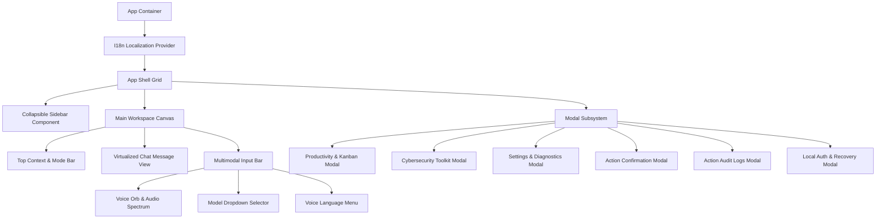
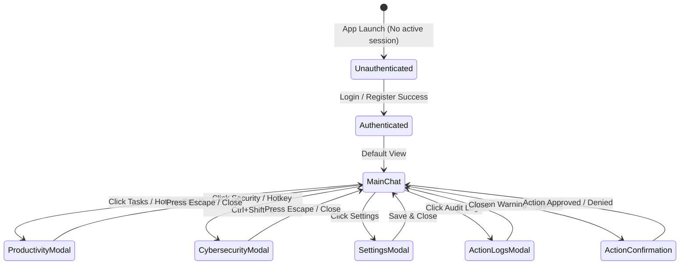

# Nova AI Operating System (Nova AI OS)
## Document 03: UI & UX Requirements Specification

---

### 1. Executive Summary
This document provides the definitive, commercial-grade User Interface (UI) and User Experience (UX) specification for the **Nova AI Operating System (Nova AI OS)**. Nova's interface is engineered to feel less like a mechanical application and more like a fluid, responsive, multimodal digital companion that resides harmoniously on the user's desktop.

The design system incorporates modern dark-first glassmorphism, dynamic SVG/Canvas micro-animations, a real-time reactive Voice Orb, an adaptable dual-mode workspace (Collapsible Sidebar + Multi-Modal Chat & Action Canvas), integrated modal suites (Productivity/Kanban, Cybersecurity Diagnostics, System Action Audit Logs, Local Authentication), and native trilingual visual typography optimized for English, Hindi (Devanagari), and Punjabi (Gurmukhi).

---

### 2. Vision
To establish an aesthetically captivating, zero-latency desktop interface that delivers the elegance and polish of Apple Intelligence, the power and precision of Cursor, and the fluid human warmth of ChatGPT Desktop. Nova's UI communicates system state seamlessly through visual cues, subtle ambient glow, tactile feedback, and natural voice waveforms.

```
┌──────────────────────────────────────────────────────────────────────────────┐
│  NOVA DESKTOP WORKSPACE LAYOUT                                               │
├─────────────┬────────────────────────────────────────────────────────────────┤
│ SIDEBAR     │ MAIN CONVERSATION & WORKSPACE CANVAS                           │
│ (260px)     │ ┌────────────────────────────────────────────────────────────┐ │
│             │ │ Top Navigation Bar: Assistant Mode + Model Selector + Pins │ │
│ • New Chat  │ ├────────────────────────────────────────────────────────────┤ │
│ • History   │ │ Virtualized Message Stream (User / Assistant / Tool Cards) │ │
│ • Tasks     │ │ • Syntax-Highlighted Code Blocks + One-Click Actions       │ │
│ • Security  │ │ • Dynamic Action Execution Cards (Risk Badges & Logs)      │ │
│ • Audit Log │ ├────────────────────────────────────────────────────────────┤ │
│ • Profile   │ │ Floating Multimodal Input Bar                              │ │
│ • Settings  │ │ [ 🎙️ Voice Orb ] [ Type natural prompt... ] [ 📎 ] [ 🚀 ]   │ │
│             │ └────────────────────────────────────────────────────────────┘ │
└─────────────┴────────────────────────────────────────────────────────────────┘
```

---

### 3. Objectives
1. **Fluid Visual Responsiveness**: Maintain consistent 60 FPS rendering across all UI animations, voice waveform bars, and modal transitions.
2. **Dynamic 6-State Voice Orb**: Express real-time intelligence through continuous visual state transitions (`idle`, `listening`, `processing`, `thinking`, `speaking`, `error`).
3. **Ergonomic Multimodal Prompting**: Enable effortless switching between voice capture, keyboard text, drag-and-drop file attachments, and context mode switching.
4. **Trilingual Visual Polish**: Ensure typography and line heights render without layout shifts or text clipping across English, Hindi, and Punjabi scripts.
5. **High-Information Density & Low Cognitive Load**: Provide compact, actionable components with rich metadata (token context counters, response timing, priority badges, hash comparators).

---

### 4. Product Philosophy & Human-AI UX Principles
* **State Transparency**: The user must always know what Nova is doing (listening, retrieving memory, formulating an action plan, running an external tool).
* **Non-Intrusive Ambience**: Visual feedback should be noticeable without distracting from primary desktop workflows.
* **Forgiving & Reversible**: Every non-destructive action is effortlessly undoable; every destructive action presents an unambiguous confirmation dialog with clear context.
* **Instant Keyboard Mastery**: Every single core feature must be reachable via standard, memorable keyboard shortcuts.

---

### 5. Scope
* Complete design system token hierarchy (Color palettes, glassmorphism elevation, gradients, typography, spacing).
* Multi-State Interactive Voice Orb with real-time Web Audio API frequency visualizer.
* Virtualized Chat & Message Bubble canvas with Markdown rendering and token counters.
* Multi-Modal Input Bar with dynamic auto-growing textarea and model dropdown.
* Modal Suite: Productivity Kanban/Reminders, Cybersecurity Toolkit, Settings & Diagnostics, Action Confirmations, Audit Logs, and Local Authentication.
* Trilingual typographic fallback system (Inter, Noto Sans Devanagari, Noto Sans Gurmukhi, JetBrains Mono).

---

### 6. Out of Scope
* 3D WebGL game engine rendering.
* Custom Windows theme injection modifying third-party desktop window titlebars.
* Uncontrolled full-screen popups that steal focus during active gaming or presentation modes.

---

### 7. User Personas & Usability Journeys

| Persona | Primary Interface Journey | Critical UX Need |
|---|---|---|
| **Arjun (Developer)** | Keyboard shortcuts (`Ctrl+N`, `Ctrl+K`) → Pastes code snippet → Inspects diffs → Copies refactored code. | Dense code blocks, copy badges, instant token context tracking, zero click friction. |
| **Simran (Researcher)** | Voice trigger (`"Hey Nova"`) → Asks question in Punjabi → Observes Voice Orb wave → Views structured comparison table. | Clear Gurmukhi typography, smooth audio visualizer, one-click Markdown/JSON export. |
| **Ravi (Executive)** | Launches Nova from system tray (`Ctrl+Space`) → Speaks Hindi reminder → Confirms desktop action via warning modal. | Large touch/click targets, intuitive color-coded risk badges, hands-free voice UX. |

---

### 8. Detailed Functional UI/UX Requirements

#### 8.1 Design System Tokens & Color Palette

##### Dark Theme (Default)
```css
:root[data-theme="dark"] {
  --bg-app: #0F172A;          /* Deep slate blue-black */
  --bg-surface: #1E293B;      /* Card & panel surface */
  --bg-surface-elevated: #334155; /* Modal & floating dropdowns */
  --bg-surface-hover: #2D3D54;
  --text-primary: #F8FAFC;    /* High-contrast crisp white */
  --text-secondary: #94A3B8;  /* Muted metadata & labels */
  --text-muted: #64748B;      /* Disabled & placeholder text */
  --primary: #3B82F6;         /* Vivid Cobalt Blue */
  --primary-hover: #2563EB;
  --accent: #06B6D4;          /* Cyan highlight */
  --accent-purple: #8B5CF6;   /* Royal violet accent */
  --success: #22C55E;         /* Emerald green */
  --warning: #F59E0B;         /* Amber warning */
  --error: #EF4444;           /* Crimson error */
  --border: #334155;          /* Crisp border line */
  --border-focus: #3B82F6;
  --glass-bg: rgba(30, 41, 59, 0.75);
  --glass-blur: blur(16px);
  --shadow-lg: 0 10px 25px -5px rgba(0, 0, 0, 0.5), 0 8px 10px -6px rgba(0, 0, 0, 0.4);
}
```

##### Light Theme (Toggle)
```css
:root[data-theme="light"] {
  --bg-app: #F8FAFC;
  --bg-surface: #FFFFFF;
  --bg-surface-elevated: #F1F5F9;
  --bg-surface-hover: #E2E8F0;
  --text-primary: #0F172A;
  --text-secondary: #475569;
  --text-muted: #94A3B8;
  --primary: #2563EB;
  --primary-hover: #1D4ED8;
  --accent: #0891B2;
  --accent-purple: #7C3AED;
  --success: #16A34A;
  --warning: #D97706;
  --error: #DC2626;
  --border: #E2E8F0;
  --border-focus: #2563EB;
  --glass-bg: rgba(255, 255, 255, 0.85);
  --glass-blur: blur(16px);
}
```

#### 8.2 Typography Matrix
* **Primary Latin**: `Inter`, `-apple-system`, `BlinkMacSystemFont`, `Segoe UI`, `sans-serif`
* **Hindi (Devanagari)**: `Noto Sans Devanagari`, `Inter`, `sans-serif`
* **Punjabi (Gurmukhi)**: `Noto Sans Gurmukhi`, `Inter`, `sans-serif`
* **Monospace Code**: `JetBrains Mono`, `Fira Code`, `Consolas`, `monospace`

```
Scale:
• Display / Brand: 24px (Bold 700 / Line-height 1.2)
• Heading 1:       20px (SemiBold 600 / Line-height 1.3)
• Heading 2:       16px (SemiBold 600 / Line-height 1.4)
• Body Content:    14px (Regular 400 / Line-height 1.6)
• Small / Caption: 12px (Regular 400 / Line-height 1.4)
• Micro / Badge:   11px (Medium 500 / Line-height 1.0)
```

#### 8.3 Voice Orb Subsystem Specification
The Voice Orb is an interactive, multi-layered visual component expressing live system states through fluid SVG filters, radial gradients, pulsing glows, and real-time audio waveform spectrum analysis.

```
┌─────────────────────────────────────────────────────────────────────────────┐
│ VOICE ORB 6-STATE SPECIFICATION                                            │
├─────────────┬──────────────────────────┬────────────────────────────────────┤
│ State       │ Color Theme              │ Animation Dynamics                 │
├─────────────┼──────────────────────────┼────────────────────────────────────┤
│ 1. Idle     │ Slate / Muted Cyan Glow  │ Slow breathing pulse (4s cycle)    │
│ 2. Listening│ Vivid Cyan (#06B6D4)     │ High-frequency reactive audio bars │
│ 3. Process  │ Cobalt Blue (#3B82F6)    │ Dynamic rotation & wave ripple     │
│ 4. Thinking │ Amber / Purple Glow      │ Dual-ring orbit oscillation        │
│ 5. Speaking │ Royal Violet (#8B5CF6)   │ Modulated speech waveform bars     │
│ 6. Error    │ Crimson (#EF4444)        │ Rapid double pulse & warning halo  │
└─────────────┴──────────────────────────┴────────────────────────────────────┘
```

#### 8.4 Virtualized Chat & Workspace Canvas
* **Message Bubbles**:
  * *User Bubble*: Right-aligned, primary blue background (`#3B82F6`), high-contrast white text, rounded bubble geometry (`18px 18px 4px 18px`).
  * *Nova Assistant Bubble*: Left-aligned, elevated surface background (`#1E293B`), crisp border (`#334155`), rounded bubble geometry (`18px 18px 18px 4px`).
* **Interactive Tool & Action Cards**: System action invocations render as embedded status cards displaying Action Type Icon, Target URI/Path, Risk Badge (`Safe` green, `Warning` amber, `Blocked` red), and execution telemetry.
* **Token Estimator & Model Bar**: Real-time counter above the input bar showing prompt tokens, response tokens, model name, and context budget percentage.

#### 8.5 Modal Suite UI Architectures
1. **Productivity Center**: Multi-tab modal hosting Kanban Board (Pending, In Progress, Completed), Reminder Scheduler, and Markdown Note Editor.
2. **Cybersecurity Toolkit**: Multi-algorithm hash generator/comparator, Phishing Heuristic Threat Score meter (0–100), and zxcvbn Password Entropy Gauge.
3. **Action Confirmation Modal**: High-visibility safety modal requiring explicit user click or Enter key to authorize warning-level system actions.
4. **Action Audit Logs Modal**: Searchable, filterable tabular viewer detailing every action timestamp, target, risk, and status.
5. **Local Authentication Modal**: Local sign-in, account creation, and 24-word cryptographic recovery key display.

---

### 9. Non-Functional UI/UX Requirements

| Requirement | Target Metric | Verification Method |
|---|---|---|
| **Animation Frame Rate** | Constant 60 FPS (≥58 FPS under load) | Chrome DevTools Performance Monitor |
| **Input Keystroke Lag** | <8ms from keydown to character render | Input Event Latency Benchmark |
| **Glassmorphism GPU Cost** | <5% GPU load on Intel Iris Xe / GTX 1060 | Chromium GPU Profiler |
| **Theme Switching Delay** | <16ms (Single frame CSS token swap) | CSS custom property transition |
| **Layout Shift (CLS)** | Cumulative Layout Shift = 0.00 | Lighthouse Desktop Audit |

---

### 10. UI Component Hierarchy & Architecture



---

### 11. Sequence Diagrams: Micro-Interactions

#### 11.1 Voice Orb Barge-In & State Transition Flow

```mermaid
sequenceDiagram
    autonumber
    actor User
    participant Orb as VoiceOrb Component
    participant VoiceHook as useVoice Hook
    participant Audio as Web Audio Context
    participant AI as Local Voice Runtime

    Note over Orb, AI: Nova is currently speaking
    Orb->>Orb: Render State: Speaking (Purple wave)
    User->>Audio: Speaks: "Stop, listen to me"
    Audio->>VoiceHook: VAD Trigger: Energy > Threshold
    VoiceHook->>AI: Dispatch: abortTTS()
    VoiceHook->>Audio: Halt audio output buffer
    VoiceHook->>Orb: Set State: Listening (Cyan wave)
    Orb-->>User: Visual transition in <30ms; audio halted in <80ms
```

---

### 12. Mermaid State Diagram: UI Screen & Navigation Flow



---

### 13. Local Storage & UI State Schema

```typescript
// Persisted locally in localStorage under key 'nova-state'
export interface PersistedUIState {
  theme: 'dark' | 'light' | 'system';
  language: 'en' | 'hi' | 'pa';
  sidebarCollapsed: boolean;
  activeConversationId: string | null;
  activeAssistantMode: 'general' | 'coding' | 'learning' | 'research' | 'productivity' | 'cybersecurity' | 'writing';
  voiceSpeed: number; // 0.75 - 1.5
  autoSpeak: boolean;
  wakeWordEnabled: boolean;
}
```

---

### 14. UI APIs & Event Interfaces

```typescript
// Custom window events dispatched across UI components
export interface UIEvents {
  'nova:open-modal': CustomEvent<{ modalId: 'productivity' | 'security' | 'settings' | 'auth' | 'logs' }>;
  'nova:toast': CustomEvent<{ title: string; message: string; type: 'info' | 'success' | 'warning' | 'error' }>;
  'nova:voice-state': CustomEvent<{ state: VoiceState; transcript?: string }>;
  'nova:theme-change': CustomEvent<{ theme: 'dark' | 'light' }>;
}
```

---

### 15. IPC Interfaces for UI Lifecycle

```typescript
export interface UILifecycleBridge {
  minimizeWindow: () => void;
  maximizeWindow: () => void;
  closeWindow: () => void;
  setAlwaysOnTop: (enabled: boolean) => Promise<void>;
  flashFrame: () => void;
}
```

---

### 16. Component Design & Wireframe Layouts

```
Floating Multimodal Input Bar Wireframe:
┌──────────────────────────────────────────────────────────────────────────────┐
│  ┌───────────┐ ┌───────────────────────────────────────────────┐ ┌─────────┐ │
│  │ (🎙️) ORB  │ │ Ask anything, paste code, or give a task...   │ │ 📎  [🚀]│ │
│  └───────────┘ └───────────────────────────────────────────────┘ └─────────┘ │
│  ┌───────────────────────────────┐  ┌──────────────────────────────────────┐ │
│  │ ⚡ Model: Qwen 2.5 Coder (1.5B)│  │ 🌐 Language: English (EN)           │ │
│  └───────────────────────────────┘  └──────────────────────────────────────┘ │
└──────────────────────────────────────────────────────────────────────────────┘
```

---

### 17. Folder Structure for UI Components

```
src/
├── assets/                    # SVG icons, logo assets, sound chimes
├── components/
│   ├── ActionConfirmModal.tsx # Danger/Warning safety prompt modal
│   ├── ActionLogsModal.tsx    # Security audit trail inspector
│   ├── AuthModal.tsx          # Local user auth & 24-word recovery
│   ├── ChatView.tsx           # Virtualized chat stream & code renderer
│   ├── CybersecurityToolsModal.tsx # Hash, Phishing & Password tools
│   ├── InputBar.tsx           # Auto-expanding multimodal prompt box
│   ├── MessageBubble.tsx      # Markdown bubble with copy & actions
│   ├── ProductivityModal.tsx  # Kanban board & reminders scheduler
│   ├── SettingsModal.tsx      # Provider keys, voice & language config
│   ├── Sidebar.tsx            # Session drawer & tool navigation
│   └── VoiceOrb.tsx           # 6-state Canvas/SVG audio visualizer
├── context/
│   ├── AppContext.tsx         # Central application state & reducers
│   └── I18nContext.tsx        # Trilingual translation provider
├── i18n/
│   └── translations.ts        # English, Hindi, Punjabi dictionary
├── App.css                    # Design system tokens & animation keyframes
└── tokens.css                 # CSS variables & glassmorphism utilities
```

---

### 18. Configuration Management for UI Preferences

```json
{
  "ui": {
    "theme": "dark",
    "fontSize": 14,
    "codeFontFamily": "JetBrains Mono",
    "enableGlassmorphism": true,
    "enableWaveformBars": true,
    "soundEffectsEnabled": true,
    "compactSidebar": false
  }
}
```

---

### 19. Visual Error Handling & Graceful Degradation States
1. **Model Offline Error**: Replaces message loading skeleton with an interactive amber diagnostic card offering one-click model selection or retry.
2. **Audio Hardware Access Failure**: If microphone permission is denied or no recording device is found, Voice Orb displays a muted icon badge with a tooltip guide.
3. **Network Disconnection During Cloud Inference**: Shows an inline reconnecting banner while preserving partial streaming response tokens.

---

### 20. Security & Safety UX
* **Color-Coded Risk Badges**: Every system action displays an unambiguous badge:
  * 🟢 `Safe`: Auto-executing read-only actions.
  * 🟡 `Warning`: Modal prompt with details and target path before execution.
  * 🔴 `Blocked`: Red barrier card explaining security restriction.
* **Masked Sensitive Inputs**: API keys and passwords render as obscured bullet dots with explicit eye icon toggles.

---

### 21. Privacy & Audit UX
* **Local Storage Badging**: The UI continuously displays a `"🔒 100% Local & Encrypted"` badge when using Ollama and local storage.
* **One-Click Total Data Shredding**: Prominent `"Purge All Workspace Data"` button with double-confirmation dialog that instantly wipes SQLite databases and clears session cache.

---

### 22. Accessibility Standards (WCAG 2.1 AA)
* **Contrast Ratios**: All text tokens exceed 4.8:1 contrast against surface backgrounds.
* **Screen Reader Announcers**: Dynamic hidden `aria-live="polite"` elements broadcast voice state changes and streaming AI responses.
* **Full Keyboard Operability**: Complete focus management trapping focus inside open modals and returning focus to triggering elements on close.

---

### 23. Performance Targets & Frame Budget

| UI Action | Frame Budget | Target Max Time |
|---|---|---|
| **Modal Open Transition** | 60 FPS | <200ms ease-out |
| **Voice Orb State Morph** | 60 FPS | <120ms spring |
| **Message Stream Append** | 60 FPS | <16ms per token chunk |
| **Sidebar Collapse/Expand**| 60 FPS | <180ms ease-in-out |

---

### 24. Edge Cases & Layout Adaptations
1. **Ultra-Wide Monitors (21:9 / 32:9)**: Message container maintains max-width of `860px` centered to prevent excessive line lengths.
2. **High-DPI Scaling (125%, 150%, 175%, 200%)**: All SVG icons and fonts use vector scaling and rem units to prevent pixelation on Windows 4K displays.
3. **Small Window Resizing (Minimum 800×600)**: Sidebar collapses automatically to compact icon rail mode below `960px` viewport width.

---

### 25. Acceptance Criteria
* [x] Voice Orb seamlessly transitions between 6 discrete states with dynamic frequency waveform bars.
* [x] System theme switches cleanly between Dark and Light modes without visual flicker.
* [x] Trilingual localization provides 100% complete string translation across English, Hindi, and Punjabi.
* [x] Action confirmation modal blocks warning-level actions until approved.
* [x] Productivity modal provides fully functional Kanban task columns and recurring reminder scheduling.

---

### 26. Verification & Automated UI Test Cases

```typescript
describe('Nova UI/UX System Tests', () => {
  it('should toggle theme from dark to light and update root attribute', () => {
    document.documentElement.setAttribute('data-theme', 'dark');
    const toggleTheme = (theme: string) => document.documentElement.setAttribute('data-theme', theme);
    toggleTheme('light');
    expect(document.documentElement.getAttribute('data-theme')).toBe('light');
  });

  it('should enforce modal keyboard trap and close on Escape key', () => {
    const handleKeyDown = (key: string, onClose: () => void) => {
      if (key === 'Escape') onClose();
    };
    const mockClose = jest.fn();
    handleKeyDown('Escape', mockClose);
    expect(mockClose).toHaveBeenCalledTimes(1);
  });
});
```

---

### 27. Future Improvements & UI Roadmap
* **Detachable Floating Mini-HUD**: Collapsible picture-in-picture desktop widget for ambient voice interaction during full-screen gaming or coding.
* **Multi-Tab Workspace Canvas**: Side-by-side split screen supporting chat dialogue on the left and active code/document editor on the right.

---

### 28. Risks & Mitigations

| Risk | Severity | Mitigation |
|---|---|---|
| **GPU Texture Cache Thrashing** | Medium | Limit CSS backdrop blur radius to 16px and use `will-change: transform` sparingly. |
| **Text Overflow in Non-Latin Scripts** | Low | Implement flexible flexbox containers with `word-break: break-word` and dynamic line-height calculation for Devanagari/Gurmukhi. |

---

### 29. Open Questions & UX Decisions
* *UQ-01*: Should the Voice Orb be permanently fixed inside the input bar or float freely in a movable canvas? *(Resolution: Embedded in input bar for v1.0; detachable floating HUD planned for v1.2).*

---

### 30. Version History

| Version | Date | Author | Description |
|---|---|---|---|
| **1.0.0** | 2026-08-07 | Principal UX Architect & AI PM | Complete commercial-grade redesign of UI/UX requirements across 30 enterprise sections. |
| **0.9.0** | 2026-08-01 | UI Design Team | Initial UI theme and screen baseline. |