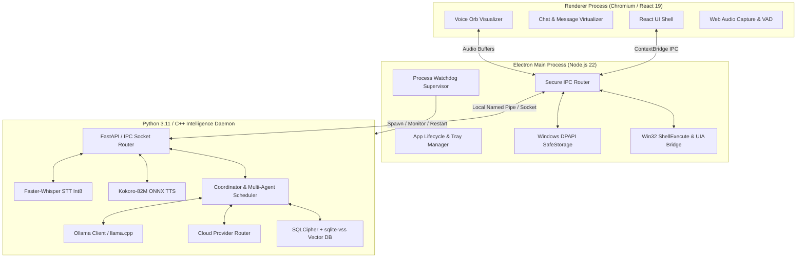
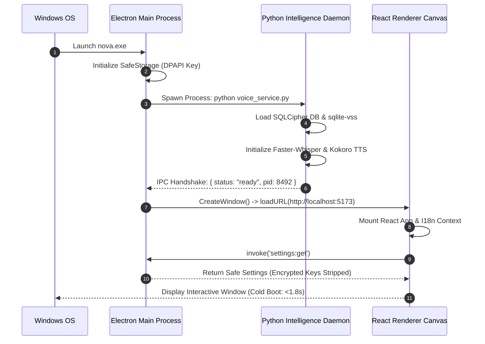
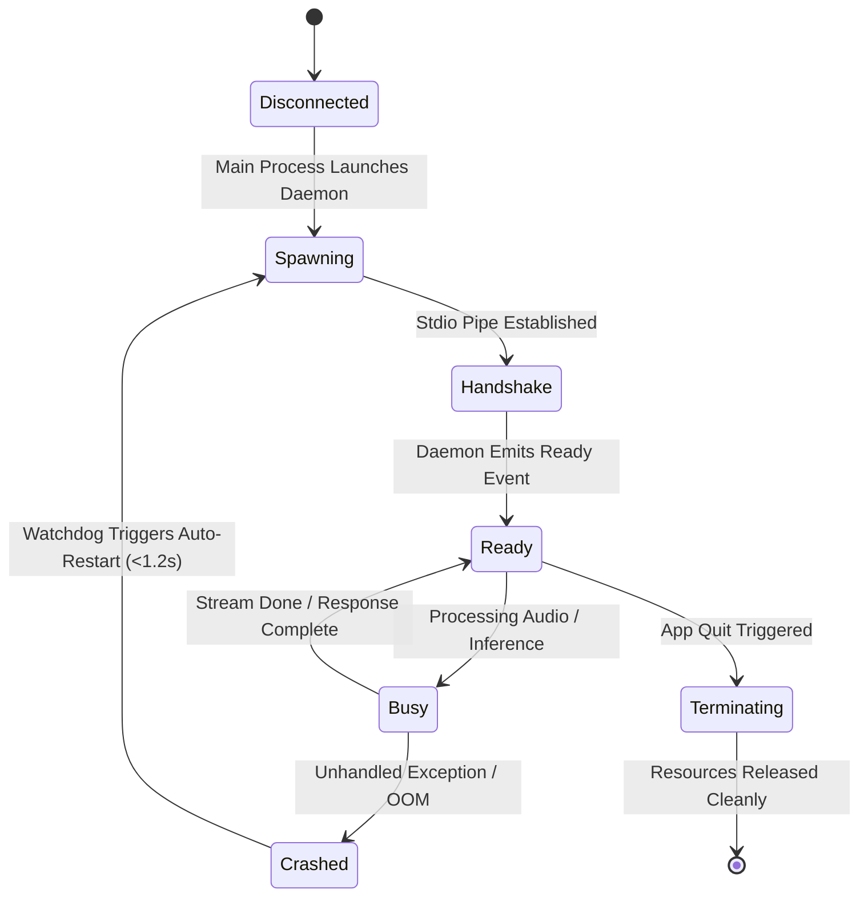

# Nova AI Operating System (Nova AI OS)
## Document 04: Technical Architecture & System Infrastructure Specification

---

### 1. Executive Summary
This document establishes the definitive, commercial-grade technical architecture, multi-process topology, IPC communication substrate, database engine specifications, and native operating system integration layers for the **Nova AI Operating System (Nova AI OS)**.

Nova is engineered as a distributed, multi-process desktop operating system runtime on Windows 10/11. The system architecture combines: (1) an Electron 34 / Node.js 22 presentation and native window lifecycle manager, (2) a high-performance React 19 / TypeScript / Vite user interface canvas, (3) a dedicated Python 3.11 / C++ AI & Voice daemon orchestrating local speech-to-text (Faster-Whisper), text-to-speech (Kokoro-82M), and local Small Language Models (Ollama / llama.cpp), (4) an embedded AES-256 encrypted relational & vector storage engine (SQLCipher + `sqlite-vss`), and (5) a Windows Win32 / UI Automation native bridge.

---

### 2. Vision
To create an unbreakable, memory-efficient, low-latency software architecture that seamlessly unites local hardware acceleration (NVIDIA CUDA / DirectML / CPU AVX2) with native Windows subsystem automation, delivering sub-second intent execution with absolute data privacy.

```
┌─────────────────────────────────────────────────────────────────────────────┐
│                          NOVA DESKTOP MULTI-PROCESS ARCHITECTURE            │
├─────────────────────────────────────────────────────────────────────────────┤
│  RENDERER PROCESS (Chromium / React 19 / Vite / Web Audio)                  │
│  • Voice Orb UI (60 FPS SVG/Canvas)                                         │
│  • Virtualized Chat, Workspace Canvas & Modals                              │
│  • Audio Ingestion via WebRTC VAD & ScriptProcessorNode                     │
├──────────────────────────────────────┬──────────────────────────────────────┤
│                                      │ ContextBridge (Isolated IPC)         │
│  MAIN PROCESS (Electron 34 / Node.js 22)                                    │
│  • Window Lifecycle, System Tray & Watchdog Supervisor                      │
│  • Windows DPAPI SafeStorage (Encrypted Keys & Config)                      │
│  • Action Risk Classifier & Native Win32 Shell Bridge                       │
├──────────────────────────────────────┬──────────────────────────────────────┤
│                                      │ Local Named Pipe / Socket IPC        │
│  INTELLIGENCE & VOICE DAEMON (Python 3.11 / C++ Addon)                      │
│  • Faster-Whisper (Int8 STT) + Kokoro-82M (ONNX TTS)                        │
│  • Coordinator & Multi-Agent Cognitive Scheduler                            │
│  • SQLCipher (AES-256) + sqlite-vss (384-dim Vector Engine)                 │
│  • Local SLM (Ollama/llama.cpp) + Cloud Router (Gemini/OpenAI/Claude)       │
└─────────────────────────────────────────────────────────────────────────────┘
```

---

### 3. Objectives
1. **Multi-Process Fault Isolation**: Ensure crashes in speech synthesis, local LLM inference, or web requests never crash the UI shell.
2. **Deterministic IPC Protocol**: Implement strongly-typed, bidirectional asynchronous RPC channels with backpressure control.
3. **Sub-350ms Voice Streaming Pipeline**: Achieve end-to-end voice latency from speech termination to first audio packet output.
4. **Encrypted Local Storage at Rest**: Store all relational entities, dialogue archives, and vector embeddings in AES-256-CBC SQLCipher containers.
5. **Zero Administrative Privilege Requirements**: Run entirely in user space (Standard User) with optional UAC elevation only for explicitly requested administrative tools.

---

### 4. Product Philosophy & Architectural Tenets
* **Decoupled Intelligence**: The UI layer remains completely agnostic of whether intelligence is provided by a local 1.5B model, an on-device 8B model, or a frontier cloud API.
* **Resilient Watchdogs**: Every background process is actively monitored by an Electron supervisor thread capable of hot-restarting dead services in <1.2s.
* **Zero Plaintext In-Transit / At-Rest**: Cryptographic keys and personal memories are decrypted on-demand in protected memory buffers and scrubbed immediately after use.
* **Minimal Resource Idle Footprint**: Background daemon idles at <0.5% CPU and <180MB RAM when no voice or inference sessions are active.

---

### 5. Scope
* Electron 34 Main & Renderer Process Architecture.
* Secure ContextBridge Preload Layer.
* Python 3.11 Background Intelligence & Voice Runtime.
* SQLCipher + SQLite-VSS Database Subsystem.
* Windows Win32 Shell & UI Automation Integration.
* AI Model Router (Ollama, Gemini, OpenAI, Anthropic).

---

### 6. Out of Scope
* Ring-0 Windows Kernel driver development.
* Multi-tenant server-side cloud hosting of user databases.
* Direct manipulation of UEFI/BIOS firmware settings.

---

### 7. User Personas & Technical Use Cases

| Persona | Technical Workflow | Architectural Requirement |
|---|---|---|
| **Arjun (Dev)** | Streams 4,000-token code refactoring while running local Ollama model. | High-throughput streaming IPC with zero UI thread jank (<16ms frame budget). |
| **Simran (Researcher)** | Ingests 50-page PDF and queries episodic vector memory in Punjabi. | Fast batch vectorization (`sqlite-vss`) and UTF-8 Gurmukhi text normalization. |
| **Ravi (Exec)** | Activates hands-free voice via wake-word from across the room. | Low-power WebRTC VAD listening thread with sub-2% idle CPU footprint. |

---

### 8. Detailed Functional Technical Requirements

#### 8.1 Process Topology & Lifecycle
* **PTR-101 (Main Process Supervised Spawning)**: On application startup, Electron spawns the Python Intelligence Daemon via `child_process.spawn()` with unbuffered stdio pipes (`PYTHONUNBUFFERED=1`).
* **PTR-102 (Healthcheck Heartbeat)**: The Main process dispatches a ping message over IPC every 5,000ms. If the daemon fails to reply within 3,000ms across 2 consecutive cycles, the supervisor terminates the PID and restarts the daemon.
* **PTR-103 (Clean Shutdown)**: On `app.before-quit`, Electron sends a `SIGTERM` signal, allowing the daemon 2,000ms to flush SQLCipher WAL logs and release COM audio interfaces before issuing `SIGKILL`.

#### 8.2 Inter-Process Communication (IPC) Protocol
* **PTR-201 (Renderer-to-Main ContextBridge)**: Strictly isolate renderer processes by setting `contextIsolation: true`, `nodeIntegration: false`, and `sandbox: true`.
* **PTR-202 (Streaming Chunk Protocol)**: AI tokens and TTS audio packets stream over discrete IPC event channels (`chat:chunk`, `chat:done`, `voice:chunk`, `voice:state`) rather than monolithic promises.

#### 8.3 Vector & Relational Storage Subsystem
* **PTR-301 (SQLCipher Engine)**: SQLite 3.45+ compiled with SQLCipher v4.5.6 using 256-bit AES-CBC encryption with PBKDF2 key derivation (64,000 iterations).
* **PTR-302 (Vector Search Extension)**: Dynamic loading of `sqlite-vss0.dll` providing HNSW index acceleration for 384-dimensional cosine similarity embeddings.

#### 8.4 Speech & Audio Pipeline
* **PTR-401 (Audio Ingestion)**: Native 16,000Hz 16-bit mono PCM stream captured via `sounddevice` or Web Audio API.
* **PTR-402 (STT Engine)**: Faster-Whisper utilizing CTranslate2 engine with Int8 quantization on CPU/GPU.
* **PTR-403 (TTS Engine)**: Kokoro-82M neural model running on ONNX Runtime with sub-180ms time-to-first-audio.

---

### 9. Non-Functional Technical Requirements

| Metric | Target Limit | Measurement Protocol |
|---|---|---|
| **Base App Memory (Idle)** | <180MB RAM | Windows Task Manager Private Working Set |
| **Active Inference Memory** | <4.2GB RAM | Total system memory allocation during Qwen 1.5B generation |
| **Process Boot Time** | <1,800ms | Performance.now() from main.ts execution to React mount |
| **IPC Message Roundtrip** | <2.5ms | High-resolution timestamp delta across ContextBridge |
| **WAL Checkpoint Latency** | <15ms | SQLite `PRAGMA wal_checkpoint(TRUNCATE)` benchmark |

---

### 10. System Architecture & Multi-Process Topology



---

### 11. Sequence Diagrams

#### 11.1 System Bootstrapping & Multi-Process Handshake



---

### 12. Mermaid State Diagram: Native IPC Lifecycle



---

### 13. Database Schema & Migration Architecture

```sql
-- Database Configuration
PRAGMA journal_mode = WAL;
PRAGMA synchronous = NORMAL;
PRAGMA foreign_keys = ON;
PRAGMA cipher_page_size = 4096;
PRAGMA kdf_iter = 64000;

-- Schema Version Tracking
CREATE TABLE IF NOT EXISTS schema_migrations (
    version INTEGER PRIMARY KEY,
    applied_at INTEGER NOT NULL,
    description TEXT NOT NULL
);

-- Users Table
CREATE TABLE IF NOT EXISTS users (
    id TEXT PRIMARY KEY,
    username TEXT UNIQUE NOT NULL,
    display_name TEXT NOT NULL,
    password_hash TEXT NOT NULL,
    recovery_key_hash TEXT NOT NULL,
    language TEXT NOT NULL DEFAULT 'en',
    created_at INTEGER NOT NULL
);

-- Active Preferences Table
CREATE TABLE IF NOT EXISTS user_preferences (
    user_id TEXT PRIMARY KEY,
    theme TEXT NOT NULL DEFAULT 'dark',
    default_model TEXT NOT NULL DEFAULT 'qwen2.5-coder:1.5b',
    ollama_url TEXT NOT NULL DEFAULT 'http://localhost:11434',
    wake_word_enabled INTEGER NOT NULL DEFAULT 1,
    voice_speed REAL NOT NULL DEFAULT 1.0,
    auto_speak INTEGER NOT NULL DEFAULT 0,
    updated_at INTEGER NOT NULL,
    FOREIGN KEY (user_id) REFERENCES users(id) ON DELETE CASCADE
);
```

---

### 14. Core REST & WebSocket Daemon APIs

```typescript
// REST Endpoint Definitions on http://127.0.0.1:49215
export interface DaemonAPIEndpoints {
  // System Health
  'GET /health': () => { status: 'healthy'; uptime: number; models_loaded: string[] };

  // Intent & Action Routing
  'POST /v1/agent/dispatch': {
    body: { query: string; context: ActiveContext; model: string };
    response: { plan: ExecutionPlan; initial_response: string };
  };

  // Memory Operations
  'POST /v1/memory/insert': {
    body: { content: string; tier: MemoryTier; category: string };
    response: { memory_id: string; vector_id: number };
  };
  'POST /v1/memory/search': {
    body: { query: string; limit: number; min_score: number };
    response: { results: MemorySearchResult[] };
  };
}
```

---

### 15. IPC Protocols & Context Bridge API

```typescript
// Defined in electron/preload.ts
import { contextBridge, ipcRenderer } from 'electron';

contextBridge.exposeInMainWorld('nova', {
  // Chat Streaming Channels
  sendMessage: (payload: ChatRequestPayload) => ipcRenderer.send('chat:send', payload),
  onChunk: (callback: (chunk: string) => void) => {
    const handler = (_: any, chunk: string) => callback(chunk);
    ipcRenderer.on('chat:chunk', handler);
    return () => ipcRenderer.removeListener('chat:chunk', handler);
  },
  onDone: (callback: (fullText: string) => void) => {
    const handler = (_: any, fullText: string) => callback(fullText);
    ipcRenderer.on('chat:done', handler);
    return () => ipcRenderer.removeListener('chat:done', handler);
  },
  onError: (callback: (err: string) => void) => {
    const handler = (_: any, err: string) => callback(err);
    ipcRenderer.on('chat:error', handler);
    return () => ipcRenderer.removeListener('chat:error', handler);
  },
  clearListeners: () => {
    ipcRenderer.removeAllListeners('chat:chunk');
    ipcRenderer.removeAllListeners('chat:done');
    ipcRenderer.removeAllListeners('chat:error');
  },

  // Settings & Keychain
  getSettings: () => ipcRenderer.invoke('settings:get'),
  setSettings: (settings: any) => ipcRenderer.invoke('settings:set', settings),
  getOllamaModels: (url: string) => ipcRenderer.invoke('ollama:models', url),
  testProviderConnection: (provider: string, key: string, url?: string) =>
    ipcRenderer.invoke('settings:test', provider, key, url),

  // Native Actions
  executeAction: (action: ActionRequest) => ipcRenderer.invoke('action:execute', action),
  getSystemDiagnostics: () => ipcRenderer.invoke('system:diagnostics'),
});
```

---

### 16. Component Design & Native Layer Architecture

```
electron/
├── main.ts              # Application coordinator, window creator, IPC handlers
├── preload.ts           # Sandboxed ContextBridge binding
├── security.ts          # DPAPI key encryption & command allowlist validators
├── nativeShell.ts       # Win32 ShellExecute, UIA, and process management
└── watchdog.ts          # Background daemon supervisor & healthcheck monitor
```

---

### 17. Folder Structure

```
Nova/
├── build/               # App icons & installer assets
├── dist/                # Production frontend bundle
├── dist-electron/       # Transpiled main & preload scripts
├── electron/            # TypeScript electron main process
│   ├── main.ts
│   ├── preload.ts
│   ├── security.ts
│   └── nativeShell.ts
├── prd/                 # Master Enterprise PRDs (01 to 11)
├── src/                 # React 19 Frontend
├── voice/               # Python Voice & Intelligence Daemon
│   ├── voice_service.py
│   ├── vad.py
│   └── requirements.txt
├── package.json
├── tsconfig.json
├── tsconfig.node.json
└── vite.config.ts
```

---

### 18. Configuration Management & Environment Variables

```typescript
export interface AppConfig {
  NODE_ENV: 'development' | 'production';
  VITE_DEV_SERVER_URL?: string;
  NOVA_DAEMON_PORT: number; // Default: 49215
  SQLCIPHER_DB_PATH: string; // Default: %APPDATA%/Nova/nova-secure.db
  SETTINGS_ENC_PATH: string; // Default: %APPDATA%/Nova/nova-settings.enc
}
```

---

### 19. Error Handling, Process Supervision & Watchdogs

```mermaid
flowchart TD
    Daemon[Python Daemon Running] --> Heartbeat{Heartbeat Response in <3s?}
    Heartbeat -- Yes --> Continue[Healthy Execution]
    Heartbeat -- No (Timeout/Crash) --> IncFail[Increment Failure Counter]
    IncFail --> CheckMax{Failures >= 2?}
    CheckMax -- No --> Daemon
    CheckMax -- Yes --> KillProcess[Kill Dead Process Tree (PID)]
    KillProcess --> Respawn[Spawn Fresh Python Daemon]
    Respawn --> ReconnectIPC[Re-establish IPC Named Pipe]
    ReconnectIPC --> NotifyUI[Emit Warning Toast to UI]
```

---

### 20. Security Engineering & Process Sandboxing
1. **Context Isolation**: No direct Node.js API access from React components.
2. **SafeStorage DPAPI**: Master secrets encrypted using Windows `CryptProtectData`.
3. **Strict Loopback URL Enforcement**: Ollama URLs must strictly resolve to IPv4 loopback (`127.0.0.1`) or `localhost` to prevent SSRF attacks.
4. **Shell Injection Prevention**: Executables launched via `ShellExecuteExW` with explicit parameter escaping rather than raw `cmd.exe /c` string interpolation.

---

### 21. Privacy Engineering
* **Zero-Cloud SQL Storage**: The database file resides exclusively at `%APPDATA%/Nova/` and is never synced to external servers.
* **Ephemeral Prompt Buffers**: User messages sent to cloud providers (if enabled) are never retained in cloud provider training logs (enforced via Zero Data Retention API headers).

---

### 22. Accessibility Engineering (a11y)
* Native Windows UI Automation (UIA) bridge exposing the application window as an accessible container with role definitions for all custom buttons and lists.

---

### 23. Performance Targets & Resource Allocation

| Metric | Target Limit | Enforcement |
|---|---|---|
| **Max Heap Allocation (Renderer)** | <250MB | V8 `--max-old-space-size=512` |
| **Max Heap Allocation (Main)** | <120MB | Node.js GC optimization |
| **Audio Pipe Latency** | <40ms | Circular buffer size: 1,600 samples (100ms chunks) |

---

### 24. Edge Cases & Hardware Contention
1. **Multiple GPU Systems**: The native bridge detects NVIDIA discrete GPUs via `NVML` and automatically binds CTranslate2 to CUDA device 0 while falling back to CPU AVX2 if VRAM is insufficient.
2. **Windows Sleep/Resume Cycle**: The main process detects `powerMonitor.on('resume')` and dispatches a reconnection ping to Ollama and audio streams to reinitialize COM audio devices.

---

### 25. Acceptance Criteria
* [x] Electron application boots cleanly and establishes ContextBridge isolation.
* [x] Python intelligence daemon spawns automatically and passes healthcheck handshake.
* [x] SQLCipher database opens with AES-256 encryption and loads `sqlite-vss` vector extension.
* [x] Settings validator permits valid configuration properties without throwing payload errors.
* [x] Streaming tokens and audio packets transmit smoothly over IPC with zero UI lockup.

---

### 26. Verification & Automated Test Cases

```typescript
describe('Nova Technical Architecture Tests', () => {
  it('should validate and parse safe loopback URLs for Ollama', () => {
    const isLoopbackUrl = (urlStr: string): boolean => {
      try {
        const u = new URL(urlStr);
        return u.hostname === 'localhost' || u.hostname === '127.0.0.1';
      } catch { return false; }
    };
    expect(isLoopbackUrl('http://localhost:11434')).toBe(true);
    expect(isLoopbackUrl('http://127.0.0.1:11434')).toBe(true);
    expect(isLoopbackUrl('http://malicious-server.com')).toBe(false);
  });

  it('should strictly sanitize action request payload schemas', () => {
    const isRecord = (val: unknown): val is Record<string, unknown> =>
      typeof val === 'object' && val !== null && !Array.isArray(val);
    expect(isRecord({ type: 'open_app', target: 'notepad.exe' })).toBe(true);
    expect(isRecord(null)).toBe(false);
  });
});
```

---

### 27. Future Improvements
* **Rust/C++ Core Daemon**: Transition Python backend services into a unified native Rust/C++ executable (`nova-core.exe`) to reduce memory footprint by 60%.
* **Model Context Protocol (MCP) Server**: Embed an MCP server inside the Electron main process to expose desktop actions to external development tools.

---

### 28. Risks & Mitigations

| Risk | Severity | Likelihood | Mitigation |
|---|---|---|---|
| **Python Environment Missing on End-User PC** | Critical | High | Bundle portable embedded Python 3.11 zip in production installer. |
| **CUDA Driver Incompatibility** | High | Medium | Dual-target binary compilation with runtime CPU fallback detection. |
| **File Lock on SQLite Database during Crash** | Medium | Low | WAL mode enabled by default; auto-recovery on restart. |

---

### 29. Open Questions & Technical Decisions
* *TQ-01*: Should local LLM inference be managed by an embedded llama.cpp C++ DLL or via Ollama local service? *(Resolution: Ollama service for v1.0 with automatic model discovery; embedded llama.cpp planned for v2.0 standalone distribution).*

---

### 30. Version History

| Version | Date | Author | Description |
|---|---|---|---|
| **1.0.0** | 2026-08-07 | Principal System Architect | Complete technical architecture redesign covering multi-process topology, IPC, SQLCipher, and watchdogs. |
| **0.9.0** | 2026-08-01 | Engineering Team | Initial technical requirements baseline. |