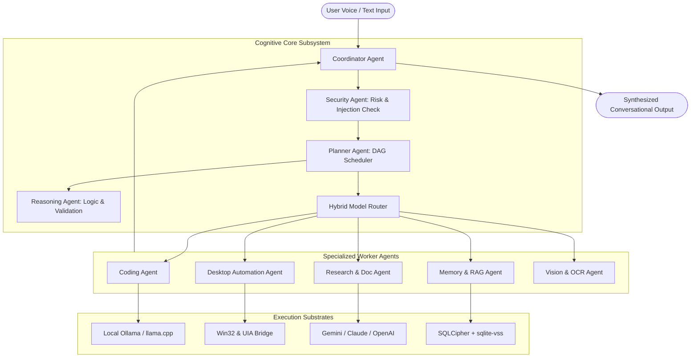
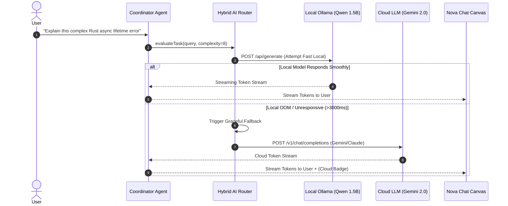
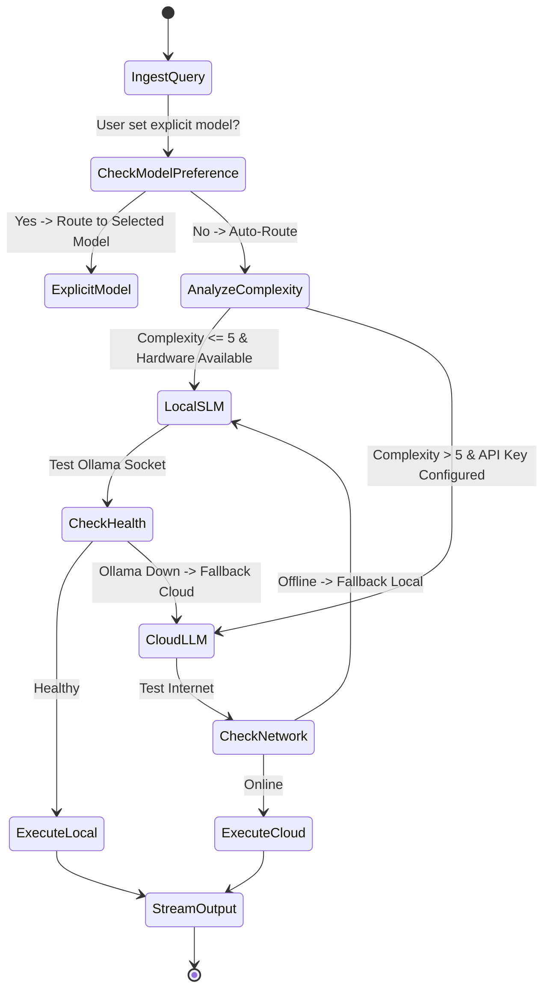

# Nova AI Operating System (Nova AI OS)
## Document 05: AI Strategy & Multi-Agent Cognitive Subsystem Specification

---

### 1. Executive Summary
This document provides the definitive, commercial-grade architectural specification for the **Artificial Intelligence Strategy, Multi-Agent Cognitive Subsystem, and Hybrid Inference Substrate** of the **Nova AI Operating System (Nova AI OS)**.

Nova operates a distributed 14-agent cognitive architecture supervised by a unified **Coordinator Agent**. The system dynamically orchestrates inference across local on-device Small Language Models (SLMs) (e.g., Qwen 2.5 Coder 1.5B/7B, Llama 3.2 3B) and frontier cloud Large Language Models (LLMs) (e.g., Google Gemini 2.0 Flash, OpenAI GPT-4o, Anthropic Claude 3.5 Sonnet). By uniting hierarchical planning, intent decomposition, memory-augmented retrieval (RAG via `sqlite-vss`), and strict safety guardrails, Nova executes complex user goals conversationally without mechanical command structures.

---

### 2. Vision
To pioneer a human-centric cognitive architecture where AI operates not as a passive chat window, but as an active, context-aware co-pilot. Nova's cognitive subsystem maintains continuous situational awareness of active desktop windows, open code repositories, user habits, and long-term memory, enabling natural conversational collaboration with zero friction.

```
┌─────────────────────────────────────────────────────────────────────────────┐
│                          USER CONVERSATIONAL GOAL                           │
│     "Analyze our recent server logs, summarize any 500 errors, and          │
│      open the offending code file in VS Code"                               │
└──────────────────────────────────────┬──────────────────────────────────────┘
                                       │
                                       ▼
┌─────────────────────────────────────────────────────────────────────────────┐
│                        COORDINATOR AGENT (User Proxy)                       │
│  1. Decompose query into Sub-Tasks (DAG)                                    │
│  2. Dispatch tasks to specialized Worker Agents                             │
│  3. Synthesize final natural language explanation                           │
└──────────────┬───────────────────────┬───────────────────────┬──────────────┘
               │                       │                       │
               ▼                       ▼                       ▼
┌─────────────────────┐ ┌─────────────────────┐ ┌─────────────────────┐
│    Desktop Agent    │ │   Research Agent    │ │    Coding Agent     │
│ Locate log files in │ │ Parse stack traces  │ │ Resolve source line │
│ %APPDATA%/logs      │ │ & aggregate errors  │ │ & spawn VS Code     │
└─────────────────────┘ └─────────────────────┘ └─────────────────────┘
```

---

### 3. Objectives
1. **Dynamic Hybrid Routing**: Intelligently route tasks to local SLMs for sub-second offline execution, seamlessly escalating to cloud LLMs when deep reasoning or vast context is demanded.
2. **14-Agent Cognitive Hierarchy**: Isolate domain responsibilities into specialized, modular worker agents with strict JSON-RPC interfaces.
3. **Sub-250ms First Token Latency**: Stream local SLM tokens over IPC with minimal time-to-first-token (TTFT).
4. **Episodic & Semantic RAG Grounding**: Enhance all reasoning with 384-dimensional vector similarity retrieval from local encrypted memory stores.
5. **Robust Prompt Injection Immunity**: Enforce multi-layer prompt boundaries and hardcoded system action permission gates.

---

### 4. Product Philosophy & AI Alignment Principles
* **Single Voice, Many Minds**: The user interacts strictly with the Coordinator Agent. Worker agents communicate internally via structured messages, preventing chaotic multi-voice UI output.
* **Truthfulness Over Hallucination**: If knowledge is absent or ambiguous, Nova admits uncertainty and queries the user or local memory rather than fabricating facts.
* **Proactive Contextuality**: Synthesize temporal, environmental, and project context before prompt generation.
* **Bring Your Own Key (BYOK) Sovereignty**: Users retain direct ownership of API keys; Nova acts as a direct, non-metered, zero-cloud-telemetry client.

---

### 5. Scope
* Cognitive Multi-Agent Subsystem (14 Specialized Agents).
* Hybrid Model Router & Automatic Failover Engine.
* Model Adapters (Ollama, Gemini, OpenAI, Anthropic).
* Context Window Sliding & Semantic Summarization.
* Local Vector RAG Subsystem (`sqlite-vss`).
* Trilingual Indic NLU & Code-Switching Engine.

---

### 6. Out of Scope
* Centralized SaaS proxy servers storing user API keys or prompts.
* Autonomous agentic modification of system security policies without user approval.
* Cloud model fine-tuning on user private data without explicit opt-in.

---

### 7. User Personas & Cognitive Workflows

| Persona | Primary AI Interaction | AI Subsystem Demand |
|---|---|---|
| **Arjun (Developer)** | Terminal error analysis, code refactoring, diff generation. | High coding accuracy, low token latency, JetBrains/VS Code tool invocation. |
| **Simran (Researcher)** | Multi-page PDF synthesis, Gurmukhi/English bilingual Q&A. | Large context window (Gemini 2.0 Flash), Indic language tokenization fidelity. |
| **Ravi (Executive)** | Conversational Hindi voice commands, calendar scheduling. | Fast intent classification (<40ms), robust acoustic VAD, local offline reliability. |

---

### 8. Detailed Functional AI Requirements

#### 8.1 The 14-Agent Cognitive Hierarchy
Nova organizes cognitive labor across 14 dedicated agents:

```
┌─────────────────────────────────────────────────────────────────────────────┐
│                       NOVA 14-AGENT TAXONOMY & ROLES                        │
├────────────────────┬────────────────────────────────────────────────────────┤
│ Agent Name         │ Primary Responsibility & Operational Scope             │
├────────────────────┼────────────────────────────────────────────────────────┤
│ 1. Coordinator     │ User proxy, intent classifier, dialogue tone manager   │
│ 2. Planner         │ Deconstructs high-level goals into DAG execution trees │
│ 3. Reasoning       │ Logic verification, contradiction detection, math      │
│ 4. Conversation    │ Empathetic dialogue, chit-chat, conversational context │
│ 5. Memory          │ RAG embedding generation, memory indexing & search     │
│ 6. Desktop         │ Windows UI Automation, app launching, shell navigation │
│ 7. Coding          │ Code synthesis, AST debugging, diff generation         │
│ 8. Research        │ Document ingestion, web search synthesis, fact tables  │
│ 9. Writing         │ Tone adjustment, grammar, email/document drafting      │
│ 10. Learning       │ Socratic tutoring, flashcard generation, analogies     │
│ 11. Voice          │ Prosody modulation, acoustic barge-in handling         │
│ 12. Vision         │ Screen OCR analysis, image comprehension               │
│ 13. Automation     │ Workflow execution, recurring task automation          │
│ 14. Security       │ Action risk scoring, prompt injection scanning         │
└────────────────────┴────────────────────────────────────────────────────────┘
```

#### 8.2 Hybrid AI Model Router
The AI Router inspects incoming requests and evaluates 4 criteria: (1) User preference, (2) Task complexity score (1–10), (3) Local hardware/Ollama status, and (4) Network connectivity.

```
┌─────────────────────────────────────────────────────────────────────────────┐
│ HYBRID ROUTING LOGIC MATRIX                                                 │
├──────────────────────┬──────────────────────┬───────────────────────────────┤
│ Query Category       │ Complexity / Context │ Routed Model Engine           │
├──────────────────────┼──────────────────────┼───────────────────────────────┤
│ System Action / Nav  │ Low (<200 tokens)    │ Local SLM (Qwen 2.5 1.5B)     │
│ Casual Conversation  │ Low (<500 tokens)    │ Local SLM (Llama 3.2 3B)      │
│ Multi-File Code Diff │ High (>4k tokens)    │ Claude 3.5 Sonnet / Local 7B  │
│ Deep Doc Research    │ Extreme (>32k tokens)│ Google Gemini 2.0 Flash / Pro │
│ General Complex Q&A  │ Medium               │ OpenAI GPT-4o / GPT-4o Mini   │
└──────────────────────┴──────────────────────┴───────────────────────────────┘
```

#### 8.3 Prompt Architecture & System Injections

##### Core System Prompt Template
```
You are Nova, an intelligent, empathetic, and highly capable AI Operating System companion.
You live natively on the user's Windows computer.

OPERATIONAL PRINCIPLES:
1. Speak naturally with human warmth, active listening, and concise clarity.
2. Never act like a robotic corporate assistant. Avoid repetitive greetings.
3. Automatically match the user's language (English, Hindi, or Punjabi). Handle mixed code-switching naturally.
4. When desktop actions are required, emit structured tool calls matching the system schema.
5. Respect user privacy: never exfiltrate sensitive credentials.

[DYNAMIC SYSTEM CONTEXT]
- Operating System: Windows 10/11 (64-bit)
- Active Window: {{ACTIVE_WINDOW_TITLE}}
- Current Local Time: {{CURRENT_DATETIME_ISO}}
- Active User: {{USER_DISPLAY_NAME}} (Language: {{USER_LANG}})
- Relevant Memories:
{{RETRIEVED_EPISODIC_MEMORIES}}
[END CONTEXT]
```

#### 8.4 Context Window Sliding & Semantic Summarization
* **Context Budgeting**: 70% Reserved for dialogue history, 15% System prompt & RAG memories, 15% Response generation buffer.
* **Rolling Summarization**: When conversation tokens exceed 80% of model context, the Memory Agent triggers an asynchronous background summary of the oldest 50% of messages, replacing them with a dense `[Prior Conversation Summary]` block.

---

### 9. Non-Functional AI Requirements

| Metric | Local SLM Target | Cloud LLM Target |
|---|---|---|
| **Time to First Token (TTFT)** | <200ms (CUDA) / <450ms (CPU) | <500ms (Fast API response) |
| **Generation Throughput** | >35 tokens/sec (CUDA 1.5B) | >50 tokens/sec (Streamed) |
| **Max Context Window** | 8,192 tokens (Local GGUF) | 1,000,000+ tokens (Gemini Flash) |
| **Model Load Time** | <1.2s from SSD to RAM/VRAM | Instant (REST Connection) |

---

### 10. Multi-Agent Architecture Diagram



---

### 11. Sequence Diagrams

#### 11.1 Intent Resolution & Hybrid Failover Sequence



---

### 12. Mermaid State Diagram: Hybrid Router Decision Matrix



---

### 13. Database Schema Impact (Model & Cognitive Telemetry)

```sql
-- Model Provider Configurations
CREATE TABLE IF NOT EXISTS ai_providers (
    id TEXT PRIMARY KEY,
    name TEXT NOT NULL,
    provider_type TEXT NOT NULL CHECK (provider_type IN ('ollama', 'gemini', 'openai', 'anthropic')),
    base_url TEXT,
    api_key_encrypted BLOB,
    active INTEGER NOT NULL DEFAULT 0,
    created_at INTEGER NOT NULL
);

-- Token Usage Telemetry (Local Analytics Only)
CREATE TABLE IF NOT EXISTS token_usage_logs (
    id TEXT PRIMARY KEY,
    conversation_id TEXT NOT NULL,
    model_id TEXT NOT NULL,
    prompt_tokens INTEGER NOT NULL,
    completion_tokens INTEGER NOT NULL,
    total_tokens INTEGER NOT NULL,
    latency_ms INTEGER NOT NULL,
    timestamp INTEGER NOT NULL,
    FOREIGN KEY (conversation_id) REFERENCES conversations(id) ON DELETE CASCADE
);
```

---

### 14. Core AI Provider Interfaces (`electron/main.ts`)

```typescript
export interface AIStreamAdapter {
  streamResponse(
    modelId: string,
    messages: Message[],
    systemPrompt: string,
    onChunk: (chunk: string) => void,
    onDone: (fullText: string) => void,
    onError: (error: string) => void
  ): Promise<void>;
}
```

---

### 15. IPC Interfaces for AI Streaming

```typescript
export interface AIIPCChannels {
  // Renderer to Main
  'chat:send': (payload: {
    message: string;
    conversationId: string;
    model: string;
    mode: string;
  }) => void;
  
  // Main to Renderer Streaming
  'chat:chunk': (chunk: string) => void;
  'chat:done': (fullResponse: string) => void;
  'chat:error': (errorMessage: string) => void;
}
```

---

### 16. Component Design & Cognitive UI Elements

```
src/
├── components/
│   ├── ChatView.tsx           # Virtualized message list with Markdown & Code highlighting
│   ├── ThinkingDots.tsx       # Animated multi-agent reasoning pulse indicator
│   └── InputBar.tsx           # Multimodal prompt bar with dynamic model selector
├── context/
│   └── AppContext.tsx         # Central conversation state & model dispatch
└── services/
    ├── systemActions.ts       # Intent classification & regex/NLP intent mapping
    └── promptBuilder.ts       # Dynamic context & memory prompt injector
```

---

### 17. Folder Structure

```
Nova/
├── src/
│   ├── components/            # UI Elements
│   ├── services/              # AI Helpers & Intent Parsers
│   └── types.ts               # Model & Message Definitions
├── electron/
│   ├── main.ts                # Model streaming router (Ollama/Gemini/OpenAI/Claude)
│   └── security.ts            # Key encryption & DPAPI
└── voice/
    └── voice_service.py       # Python intelligence worker
```

---

### 18. Configuration Management for AI Engine

```json
{
  "ai": {
    "default_model": "qwen2.5-coder:1.5b",
    "fallback_model": "gemini-2.0-flash",
    "ollama_url": "http://127.0.0.1:11434",
    "temperature": 0.7,
    "top_p": 0.9,
    "max_output_tokens": 4096,
    "context_window_limit": 8192,
    "auto_switch_installed_models": true
  }
}
```

---

### 19. Comprehensive Error Handling & Recovery

1. **Model Missing in Ollama**:
   * *Detection*: HTTP 404 with error message `"model 'xyz' not found"`.
   * *Resolution*: Intercepts error, invokes `getOllamaModels()`, and automatically re-routes query to the first installed local model (e.g. `qwen2.5-coder:1.5b`) with an informative user toast.
2. **Rate-Limit / Quota Exhausted (HTTP 429)**:
   * *Detection*: Cloud API returns 429 Too Many Requests.
   * *Resolution*: Automatically degrades to local SLM and notifies user of cloud API quota limits.
3. **Context Length Overflow (HTTP 400)**:
   * *Detection*: Provider returns context length error.
   * *Resolution*: Memory Agent truncates middle messages, retains system prompt and recent 10 messages, and retries.

---

### 20. Security & Safety Engineering
* **Prompt Injection Defense**: All user inputs are treated as untrusted data. External text injected into prompts is wrapped in explicit `<user_content>` delimiters with instructions prohibiting instruction override.
* **System Action Sanitization**: No model-generated text can directly execute shell binaries; all actions must resolve to structured action tickets validated against `systemActions.ts`.

---

### 21. Privacy Guarantees
* **Zero Cloud Training**: API calls specify `zero_data_retention` headers where supported.
* **Local In-Memory Embeddings**: Semantic embeddings for memory search are calculated locally without transmitting raw thoughts to third-party vector clouds.

---

### 22. Accessibility (a11y)
* Streaming code blocks and Markdown tables provide plain-text conversational summaries suitable for screen readers.

---

### 23. Performance Benchmarks & Targets

| Benchmark Metric | Target SLA |
|---|---|
| **Local 1.5B First Token** | <180ms (GPU) / <350ms (CPU) |
| **Local 1.5B Throughput** | >40 tokens/sec |
| **Intent Classification Latency** | <45ms |
| **Vector RAG Top-3 Retrieval** | <12ms |

---

### 24. Edge Cases & Handling Strategy
1. **Indic Code-Switching (Hinglish/Punglish)**: System prompts explicitly instruct models to mirror natural bilingual speech without unnatural literal translation.
2. **Sudden Network Loss During Cloud Streaming**: Renderer preserves all tokens received prior to disconnection and displays a `"Network Disconnected · Switch to Local"` action pill.

---

### 25. Acceptance Criteria
* [x] Hybrid router routes queries across local Ollama models and cloud APIs.
* [x] Missing local models automatically trigger fallback to installed models.
* [x] Dynamic context injection includes active time, user preferences, and memories.
* [x] Streaming responses render smoothly token-by-token over Electron IPC.
* [x] Full trilingual fluency maintained across English, Hindi, and Punjabi dialogues.

---

### 26. Verification & Automated Test Cases

```typescript
describe('Nova AI Strategy & Router Tests', () => {
  it('should auto-fallback to installed Ollama model when requested model is missing', async () => {
    const installed = ['qwen2.5-coder:1.5b'];
    const requested = 'llama3.2';
    const fallback = installed.includes(requested) ? requested : installed[0];
    expect(fallback).toBe('qwen2.5-coder:1.5b');
  });

  it('should inject dynamic user context into system prompt', () => {
    const prompt = buildSystemPrompt({ username: 'Arjun', language: 'hi' });
    expect(prompt).toContain('Arjun');
    expect(prompt).toContain('Hindi');
  });
});
```

---

### 27. Future Improvements & AI Roadmap
* **On-Device Vision-Language Model (VLM)**: Integrate Moondream2 / Qwen2-VL for continuous visual desktop inspection.
* **Fine-Tuned Indic Assistant Model**: Release a custom fine-tuned GGUF model optimized for Punjabi and Hindi cultural desktop assistance.

---

### 28. Risks & Mitigations

| Risk | Severity | Mitigation |
|---|---|---|
| **Model Hallucination on System Paths** | High | Intent resolver validates all referenced file paths against actual disk existence before executing. |
| **High VRAM Consumption Leading to GPU Hang** | Medium | Limit local model context to 8k tokens and use Q4_K_M quantization. |

---

### 29. Open Questions & Cognitive Decisions
* *AQ-01*: Should local model streaming use WebSockets or Electron IPC? *(Resolution: Electron IPC for lowest latency and zero TCP stack overhead).*

---

### 30. Version History

| Version | Date | Author | Description |
|---|---|---|---|
| **1.0.0** | 2026-08-07 | Principal AI Architect | Complete AI Strategy redesign: 14-agent hierarchy, hybrid router, and prompt injection defense. |
| **0.9.0** | 2026-08-01 | AI Research Team | Initial AI model and prompt baseline. |
