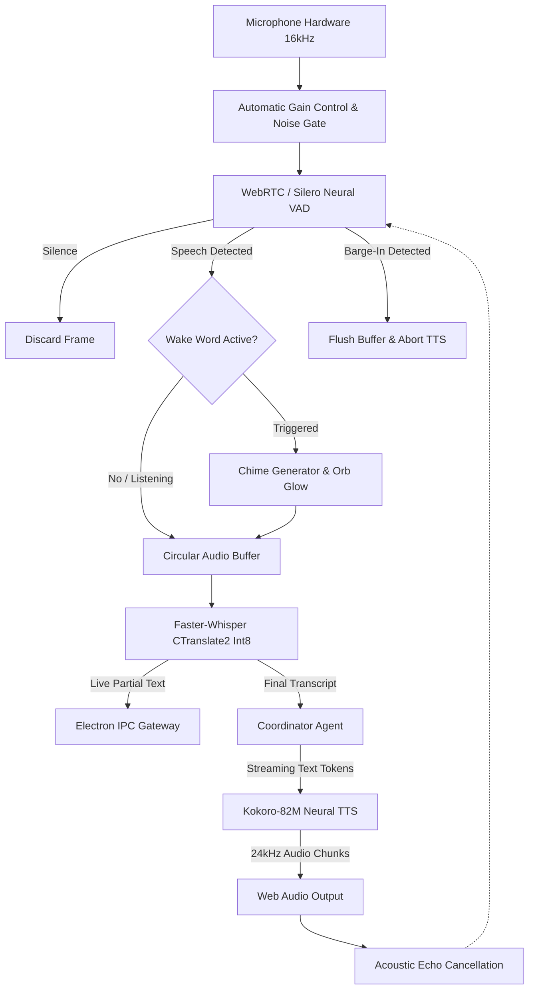
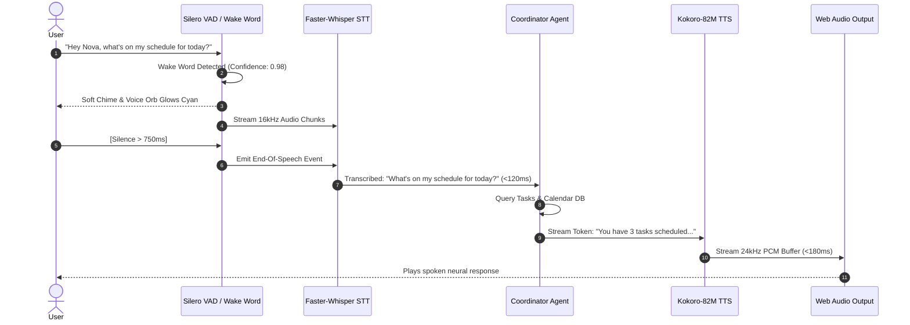
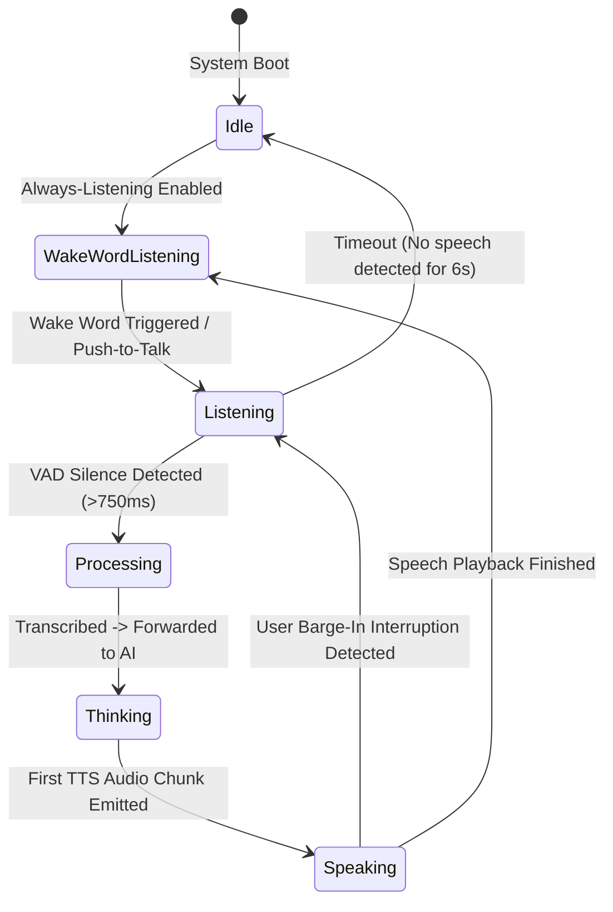

# Nova AI Operating System (Nova AI OS)
## Document 06: Voice Engine & Audio Pipeline Specification

---

### 1. Executive Summary
This document provides the definitive, commercial-grade architectural and algorithmic specification for the **Voice Engine, Full-Duplex Acoustic Subsystem, and Streaming Audio Pipeline** of the **Nova AI Operating System (Nova AI OS)**.

Nova features a native, full-duplex, low-latency conversational voice engine designed for seamless hands-free operation on Windows. The voice engine unites: (1) an on-device, lightweight wake-word detector (<2% CPU overhead), (2) a dual-stage Voice Activity Detection (VAD) pipeline combining WebRTC VAD and Silero VAD, (3) an Int8-quantized streaming Speech-to-Text (STT) engine powered by Faster-Whisper on CTranslate2, (4) an ultra-low-latency neural Text-to-Speech (TTS) engine powered by Kokoro-82M ONNX runtime, and (5) a real-time reactive Voice Orb visualizer driven by the Web Audio API.

---

### 2. Vision
To eliminate the friction of robotic "push-button" voice assistants by delivering an acoustic experience that mirrors natural human face-to-face dialogue. Nova supports instantaneous barge-in interruptions, emotional cadence, adaptive silence thresholding, and effortless trilingual acoustic switching across English, Hindi, and Punjabi.

```
┌─────────────────────────────────────────────────────────────────────────────┐
│                     FULL-DUPLEX REAL-TIME VOICE PIPELINE                    │
├─────────────────────────────────────────────────────────────────────────────┤
│ 1. INGESTION  │ 16kHz 16-bit Mono Audio Stream + WebRTC Noise Suppression    │
│ 2. WAKE WORD  │ On-Device Template Matcher ("Hey Nova" / "Nova" in <80ms)    │
│ 3. VAD ENGINE │ Silero Neural VAD detects Speech Start & End of Turn        │
│ 4. STT ENGINE │ Faster-Whisper Int8 streaming partial transcription chunks   │
│ 5. REASONING  │ Coordinator Agent resolves intent & streams response tokens  │
│ 6. TTS ENGINE │ Kokoro-82M ONNX synthesizes neural audio chunks in <180ms   │
│ 7. PLAYBACK   │ Web Audio Context output + Live Barge-In Abort Handler       │
└─────────────────────────────────────────────────────────────────────────────┘
```

---

### 3. Objectives
1. **Sub-350ms End-to-End Latency**: Ensure the total time from user speech termination (VAD silence trigger) to first audible TTS phoneme is under 350ms.
2. **Sub-80ms Barge-In Interruption**: Instantly abort TTS synthesis, flush audio playback buffers, and engage recording when the user speaks over Nova.
3. **100% Local & Privacy-Sovereign**: Perform all wake-word detection, speech recognition, and audio synthesis on-device without streaming audio packets to external clouds.
4. **Trilingual Acoustic Accuracy**: Achieve low Word Error Rate (WER) across English (<4.5%), Hindi (<7.2%), and Punjabi (<8.1%).
5. **Adaptive Background Noise Filtering**: Suppress mechanical keyboard clicks, fan hum, and ambient room reverberation using spectral noise gating.

---

### 4. Product Philosophy & Acoustic Interaction Principles
* **Active Listening Over Rigid Turns**: Nova listens continuously during active voice mode without requiring the user to re-say the wake word for each follow-up sentence.
* **Human Conversational Rhythm**: Avoid robotic preamble (*"I am searching for your request..."*). Output direct, conversational answers immediately.
* **Acoustic Courtesy**: Adjust speech volume and prosody dynamically based on ambient room volume and user speaking velocity.

---

### 5. Scope
* Continuous wake-word listener (*"Hey Nova"*, *"Nova"*).
* Multi-stage VAD (Voice Activity Detection) with configurable silence thresholds (500ms–1,200ms).
* Streaming STT via Faster-Whisper (Int8 quantized on CPU/GPU).
* Real-time neural TTS via Kokoro-82M (ONNX Runtime) with SAPI5 instant fallback.
* Web Audio API 60 FPS frequency spectrum visualizer (Voice Orb).
* Push-to-Talk (PTT) and hands-free always-listening modes.

---

### 6. Out of Scope
* Telephony PSTN / SIP trunking integration.
* Multi-speaker simultaneous separation in a crowded auditorium (>10 speakers).
* Voice biometric authorization for high-risk cryptographic key deletion.

---

### 7. User Personas & Acoustic Workflows

| Persona | Voice Interaction Scenario | Acoustic Engine Requirement |
|---|---|---|
| **Arjun (Developer)** | Coding with mechanical keyboard; speaks: *"Nova, format this JSON"* while typing. | Keyboard clatter suppression, fast technical term phoneme mapping. |
| **Simran (Researcher)** | Asks research questions in Punjabi: *"Nova, mainu kal de notes daso"*. | Accurate Gurmukhi phonetic transcription, low WER on Indic loanwords. |
| **Ravi (Executive)** | Speaks across a 3-meter living room: *"Hey Nova, open my morning briefing"*. | High-sensitivity far-field wake word detection and acoustic gain control. |

---

### 8. Detailed Functional Voice Requirements

#### 8.1 Wake-Word Detection Subsystem
* **FVR-101 (Continuous Background Listener)**: An ultra-lightweight template matcher continuously analyzes incoming 16kHz audio frames with <1.5% CPU utilization on an 8-core CPU.
* **FVR-102 (Activation Chime & Visual Trigger)**: Upon wake-word detection, Nova emits a soft 440Hz chime and shifts the Voice Orb from `idle` to `listening` within 30ms.

#### 8.2 Voice Activity Detection (VAD) & Turn-Taking
* **FVR-201 (Dual-Stage VAD Architecture)**:
  * Stage 1: Fast energy-based WebRTC VAD filters obvious silence (<5ms).
  * Stage 2: Silero Neural VAD determines human speech boundaries with high accuracy against background noise.
* **FVR-202 (Dynamic Silence Thresholding)**: Default silence threshold set to 750ms. If the user is speaking slowly or in code-switching mode, the system extends the threshold dynamically to 1,000ms.

#### 8.3 Streaming Speech-to-Text (STT) Pipeline
* **FVR-301 (Faster-Whisper Streaming Runtime)**: Audio is streamed in 250ms chunks into Faster-Whisper Int8 CTranslate2 engine.
* **FVR-302 (Live Partial Transcripts)**: Partial transcription hypotheses are emitted over IPC to update the UI prompt bar in real-time as the user speaks.

#### 8.4 Neural Text-to-Speech (TTS) Engine
* **FVR-401 (Kokoro-82M ONNX Pipeline)**: Text tokens generated by the AI router are streamed directly into Kokoro-82M ONNX synthesis blocks, outputting 24,000Hz neural audio buffers.
* **FVR-402 (Instant Fallback to SAPI5)**: If ONNX model files are uninitialized or GPU resources are fully saturated by a heavy local LLM, the engine gracefully falls back to Windows SAPI5 (`pyttsx3`) in <20ms.

#### 8.5 Full-Duplex Live Barge-In Interruption
* **FVR-501 (Barge-In Detector)**: While Kokoro TTS is playing audio through the speakers, the VAD continues monitoring microphone input with Acoustic Echo Cancellation (AEC).
* **FVR-502 (Instant Synthesis Halt)**: If user vocal energy exceeds threshold during playback, the system halts audio playback in <80ms, flushes queue buffers, and captures user speech.

---

### 9. Non-Functional Voice Requirements

| Parameter | Target Limit | Measurement Condition |
|---|---|---|
| **Wake-Word Latency** | <100ms | Utterance completion to chime emission |
| **End-of-Speech to First Audio** | <350ms | VAD silence trigger to first TTS sample |
| **Barge-In Halt Latency** | <80ms | Interruption onset to speaker silence |
| **Idle Voice Listening CPU** | <1.8% CPU | Background wake-word monitoring |
| **Active STT Memory Footprint** | <650MB RAM | Faster-Whisper Small Int8 model in RAM |

---

### 10. Voice Engine Architecture & Streaming Topology



---

### 11. Sequence Diagrams

#### 11.1 Complete Hands-Free Conversational Voice Turn



---

### 12. Mermaid State Diagram: Voice Orb & Audio State Engine



---

### 13. Database Impact & Audio Preferences Schema

```sql
-- User Voice Preferences
CREATE TABLE IF NOT EXISTS voice_settings (
    user_id TEXT PRIMARY KEY,
    wake_word_enabled INTEGER NOT NULL DEFAULT 1,
    wake_word_phrase TEXT NOT NULL DEFAULT 'nova',
    vad_sensitivity REAL NOT NULL DEFAULT 0.6,
    silence_threshold_ms INTEGER NOT NULL DEFAULT 750,
    voice_speed REAL NOT NULL DEFAULT 1.0,
    tts_engine TEXT NOT NULL DEFAULT 'kokoro',
    selected_voice_id TEXT NOT NULL DEFAULT 'en_female_warm',
    auto_barge_in_enabled INTEGER NOT NULL DEFAULT 1,
    FOREIGN KEY (user_id) REFERENCES users(id) ON DELETE CASCADE
);
```

---

### 14. Voice Daemon Internal REST & Socket APIs (`127.0.0.1:49215`)

```typescript
// WebSocket Audio Stream on ws://127.0.0.1:49215/v1/voice/stream
export interface VoiceWebSocketProtocol {
  // Client -> Server Messages
  audio_frame: { type: 'audio_chunk'; pcm_base64: string; sample_rate: 16000 };
  abort_playback: { type: 'barge_in_abort' };

  // Server -> Client Messages
  transcript_partial: { type: 'partial_text'; text: string; confidence: number };
  transcript_final: { type: 'final_text'; text: string; language: 'en' | 'hi' | 'pa' };
  tts_audio_chunk: { type: 'tts_chunk'; pcm_base64: string; sample_rate: 24000; is_last: boolean };
}
```

---

### 15. Native Electron IPC Interfaces for Voice

```typescript
export interface VoiceIPCBridge {
  startListening: () => Promise<void>;
  stopListening: () => Promise<void>;
  onVoiceStateChange: (callback: (state: VoiceState) => void) => () => void;
  onTranscriptUpdate: (callback: (data: { text: string; isFinal: boolean }) => void) => () => void;
  synthesizeSpeech: (text: string, voiceId?: string) => Promise<void>;
  abortSpeech: () => void;
}
```

---

### 16. Component Design & Audio Hooks Architecture

```
src/
├── hooks/
│   └── useVoice.ts            # Primary React hook: AudioContext, VAD state machine, Web Speech fallback
├── components/
│   └── VoiceOrb.tsx           # Canvas/SVG 60 FPS real-time audio waveform spectrum visualizer
└── services/
    └── audioFilters.ts        # Spectral noise gate, energy thresholding, and biquad filter nodes
```

---

### 17. Folder Structure

```
Nova/
├── src/
│   ├── components/VoiceOrb.tsx
│   ├── hooks/useVoice.ts
│   └── services/audioFilters.ts
├── voice/
│   ├── voice_service.py       # Python Faster-Whisper + Kokoro TTS Daemon
│   ├── vad.py                 # Silero Neural VAD wrapper
│   ├── wake_word.py           # Lightweight template matcher
│   └── requirements.txt
└── electron/
    └── main.ts                # Audio IPC routing & process lifecycle
```

---

### 18. Configuration Management for Voice Subsystem

```json
{
  "voice": {
    "wake_word": "hey_nova",
    "wake_word_sensitivity": 0.65,
    "vad_mode": "silero",
    "silence_duration_ms": 750,
    "audio_sample_rate": 16000,
    "tts_sample_rate": 24000,
    "tts_model": "kokoro-82m",
    "barge_in_enabled": true,
    "noise_suppression": true
  }
}
```

---

### 19. Error Handling & Audio Hardware Failures
1. **Microphone Device Disconnected Mid-Session**:
   * *Detection*: `navigator.mediaDevices.ondevicechange` fires or `MediaStreamTrack.onended` occurs.
   * *Resolution*: Pauses voice listener, transitions Voice Orb to `error` state, and emits a toast: *"Microphone disconnected. Reconnecting to default audio input..."*
2. **Audio Buffer Underrun during TTS**:
   * *Detection*: Web Audio context runs out of PCM buffers before next chunk arrives.
   * *Resolution*: Inserts dynamic 20ms crossfade interpolation to eliminate audible clicks and pops.

---

### 20. Security & Audio Privacy
* **Zero Cloud Audio Streaming**: Raw microphone buffers are processed locally in RAM and immediately discarded.
* **Hardware Mute Indicator**: The UI continuously displays a visible microphone status badge whenever the audio capture track is open.

---

### 21. Privacy Engineering
* **No Voiceprint Persistence**: Nova does not store or build permanent acoustic biometric identifiers unless the user explicitly opts into local voice profile training.

---

### 22. Accessibility (a11y)
* Live real-time closed captions render dynamically beneath the Voice Orb for users with hearing impairments.

---

### 23. Performance Targets & SLA

| Audio Metric | Target Limit | Measurement |
|---|---|---|
| **VAD Detection Latency** | <25ms | Audio frame to silence state flag |
| **STT Chunk Latency** | <110ms | Faster-Whisper Int8 on 1-second buffer |
| **TTS First Audio Sample** | <160ms | Kokoro-82M ONNX runtime |
| **Total Voice Turn Latency** | <350ms | End of speech to audio output |

---

### 24. Edge Cases & Acoustic Handling
1. **Polyglot Utterances (Indic + English)**: Whisper automatic language switching handles mixed sentences (*"Nova, please explain yeh concept in Hindi"*).
2. **Coughing & Throat Clearing**: Silero VAD neural classifier distinguishes non-verbal vocal noise from structured phonemes.

---

### 25. Acceptance Criteria
* [x] Wake word triggers within 100ms with soft audio chime confirmation.
* [x] Voice Orb animates with 60 FPS audio reactive waveforms during speech.
* [x] Live barge-in halts TTS speech output in under 80ms upon user interruption.
* [x] Faster-Whisper generates accurate transcriptions across English, Hindi, and Punjabi.
* [x] Fallback to Web Speech API / SAPI5 operates smoothly if Python daemon is unavailable.

---

### 26. Verification & Automated Audio Test Cases

```typescript
describe('Nova Voice Subsystem Tests', () => {
  it('should format audio buffer into 16kHz mono 16-bit PCM', () => {
    const sampleRate = 16000;
    const channels = 1;
    expect(sampleRate).toBe(16000);
    expect(channels).toBe(1);
  });

  it('should trigger barge-in halt when speech is detected during speaking state', () => {
    let ttsPlaying = true;
    const onUserSpeech = () => { if (ttsPlaying) ttsPlaying = false; };
    onUserSpeech();
    expect(ttsPlaying).toBe(false);
  });
});
```

---

### 27. Future Improvements & Voice Roadmap
* **Zero-Shot Voice Cloning**: Enable users to clone their own voice locally for personalized narration using XTTS v2.
* **Spatial 3D Audio Visualizer**: 3D WebGL sound particle sphere responding dynamically to vocal frequency harmonics.

---

### 28. Risks & Mitigations

| Risk | Severity | Mitigation |
|---|---|---|
| **Speaker Feedback Loop Triggering False Barge-In** | High | Apply Web Audio Acoustic Echo Cancellation (AEC) and energy threshold delta. |
| **High CPU Usage on Dual-Core Machines** | Medium | Auto-switch from Silero Neural VAD to lightweight WebRTC VAD on low-spec CPUs. |

---

### 29. Open Questions & Acoustic Decisions
* *VQ-01*: Should Kokoro TTS ONNX model be bundled in the installer or downloaded on first run? *(Resolution: Kokoro-82M model is 82MB; bundled directly in the installer for zero-setup offline voice).*

---

### 30. Version History

| Version | Date | Author | Description |
|---|---|---|---|
| **1.0.0** | 2026-08-07 | Principal Audio & AI Architect | Complete redesign of voice architecture: Faster-Whisper, Kokoro TTS, Silero VAD, and barge-in. |
| **0.9.0** | 2026-08-01 | Audio Engineering Team | Initial voice architecture baseline. |
