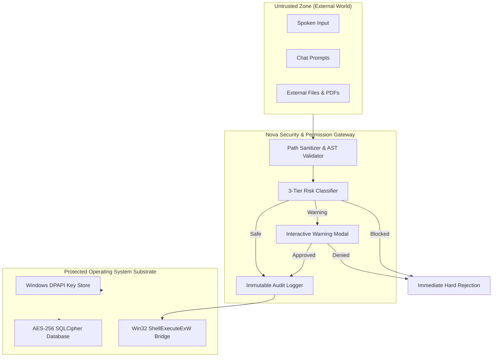
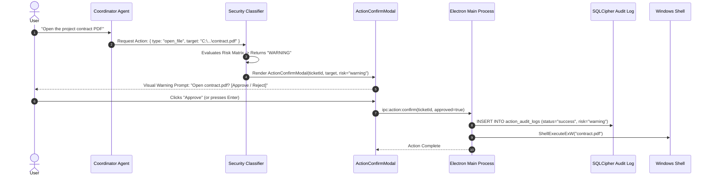
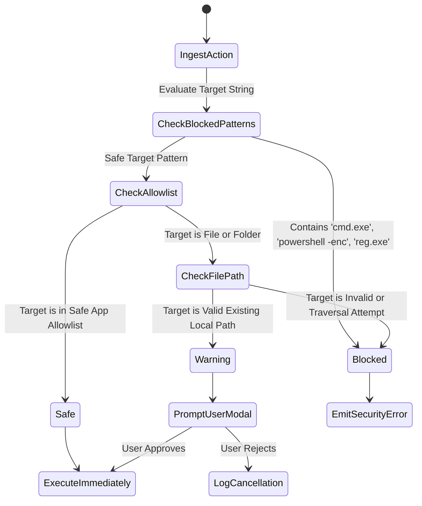

# Nova AI Operating System (Nova AI OS)
## Document 07: Security, Privacy & Desktop Permission Matrix Specification

---

### 1. Executive Summary
This document establishes the definitive, commercial-grade security architecture, zero-trust permission framework, cryptographic specifications, and data privacy policies for the **Nova AI Operating System (Nova AI OS)**.

Nova is architected with a strict **Local-First, Zero-Knowledge Security Model**. Because Nova possesses capabilities to interact directly with the Windows desktop, filesystem, and native applications, security is not an afterthought but a foundational operating system constraint. Nova enforces: (1) a 3-tier risk-based execution matrix (`Safe`, `Warning`, `Blocked`), (2) on-device authentication with PBKDF2/bcrypt key derivation and 24-word BIP39 recovery phrases, (3) AES-256-CBC SQLCipher at-rest database encryption, (4) Windows DPAPI credential protection, (5) immutable local action audit logging, and (6) absolute zero unsolicited telemetry.

---

### 2. Vision
To establish the world's most trusted, privacy-sovereign AI operating system. Users must never fear data exfiltration, silent malicious actions, or unauthorized system tampering. Nova guarantees that user prompts, personal memories, files, and voice recordings remain entirely within the user's physical computer.

```
┌─────────────────────────────────────────────────────────────────────────────┐
│                    ZERO-TRUST SYSTEM ACTION SAFETY GATE                     │
├─────────────────────────────────────────────────────────────────────────────┤
│  AI Intent Emitted: "Open file C:\Users\Arjun\Documents\tax_2025.pdf"       │
│                                                                             │
│  1. CANONICALIZATION │ Resolves symlinks & relative paths                   │
│  2. RISK MATRIX      │ Target = Arbitrary PDF File -> RISK: WARNING (Level 2)│
│  3. CONFIRMATION     │ Cryptographic Modal Prompts User for Approval        │
│  4. HUMAN DECISION   │ User Clicks "Authorize" or Presses [Enter]           │
│  5. AUDIT LOGGING    │ Appends signed record to immutable SQLCipher table   │
│  6. SAFE EXECUTION   │ Dispatches ShellExecuteExW() in isolated subprocess   │
└─────────────────────────────────────────────────────────────────────────────┘
```

---

### 3. Objectives
1. **Zero-Knowledge Architecture**: Prevent unauthorized access to user memories, credentials, and conversation logs by third parties, external networks, or other OS user accounts.
2. **Deterministic Risk Governance**: Enforce an invariant 3-tier risk matrix that cannot be bypassed via prompt injection or LLM hallucination.
3. **Hardware-Backed Credential Security**: Encrypt API keys using Windows Data Protection API (DPAPI) tied to the active Windows user logon session.
4. **Immutable Audit Accountability**: Maintain a tamper-evident audit trail recording every desktop action, timestamp, target, and status.
5. **One-Click Instant Data Shredding**: Provide guaranteed cryptographic destruction of all local databases, vectors, and cached configurations.

---

### 4. Product Philosophy & Zero-Trust Desktop Tenets
* **Never Trust AI Intent Blindly**: AI-generated intents are untrusted inputs. They must pass rigid schema validation and safety heuristics before operating on the OS.
* **Least-Privilege Execution**: Nova executes strictly within Standard User context. It never requires or requests permanent Administrator elevation.
* **Consent at the Point of Danger**: Read-only workspace queries execute instantly; operations that open external files, alter settings, or spawn shells mandate explicit human consent.

---

### 5. Scope
* Local User Authentication & 24-Word Recovery Keys.
* SQLCipher Database Encryption (AES-256-CBC).
* Windows DPAPI Credential Vault via Electron `safeStorage`.
* 3-Tier Desktop Action Permission Matrix (`Safe`, `Warning`, `Blocked`).
* Tamper-Evident Action Audit Logging.
* STRIDE Threat Model & Prompt Injection Defenses.

---

### 6. Out of Scope
* Multi-tenant cloud user authentication servers.
* Ring-0 kernel driver rootkit protection.
* Unsupervised automated system administration across corporate Active Directory domains.

---

### 7. User Personas & Threat Scenarios

| Persona | Threat Scenario | Security Subsystem Mitigation |
|---|---|---|
| **Arjun (Dev)** | Malicious README prompt injection attempts to run `rmdir /s /q C:\`. | Hardcoded command regex blocklist intercepts command; flags as `Blocked` (Level 3). |
| **Simran (Researcher)** | Inadvertently downloads untrusted file and asks Nova to open it. | Action classifier detects non-whitelisted executable; prompts high-visibility Warning Modal. |
| **Ravi (Exec)** | Leaves laptop unlocked; unauthorized person attempts to export API keys. | API keys stored in DPAPI vault; never displayed in plaintext in the UI (masked bullet dots). |

---

### 8. Detailed Functional Security Requirements

#### 8.1 3-Tier Risk Permission Matrix

```
┌─────────────────────────────────────────────────────────────────────────────┐
│                       3-TIER RISK TAXONOMY & POLICIES                       │
├─────────────┬──────────────────────────┬────────────────────────────────────┤
│ Risk Tier   │ Policy & Behavior        │ Permitted Action Examples          │
├─────────────┼──────────────────────────┼────────────────────────────────────┤
│ 🟢 SAFE     │ Auto-Execute Immediately │ • Open allowlisted apps (Calc, IDE)│
│ (Tier 1)    │ No modal interruption    │ • Open approved URLs (GitHub, Docs)│
│             │ Logged as 'safe'         │ • Query local memory & tasks       │
├─────────────┼──────────────────────────┼────────────────────────────────────┤
│ 🟡 WARNING  │ Block & Prompt Modal     │ • Open arbitrary user files (.pdf) │
│ (Tier 2)    │ Requires explicit click  │ • Launch terminal / PowerShell     │
│             │ Timeout to Auto-Reject   │ • Deep-link into Windows Settings  │
├─────────────┼──────────────────────────┼────────────────────────────────────┤
│ 🔴 BLOCKED  │ Permanent Hard Block     │ • Raw shell command execution      │
│ (Tier 3)    │ Explanatory error card   │ • Modify Windows Registry hives    │
│             │ Flagged in audit log     │ • Delete system/system32 files     │
└─────────────┴──────────────────────────┴────────────────────────────────────┘
```

#### 8.2 Local Authentication & Cryptographic Key Derivation
* **FSR-201 (Zero-Server Local Auth)**: Passwords are verified against a local bcrypt hash (cost factor: 12).
* **FSR-202 (24-Word Recovery Phrase)**: On registration, Nova generates a 256-bit entropy seed formatted as a 24-word BIP39 mnemonic phrase.
* **FSR-203 (Rate Limiting & Lockout)**: 5 failed attempts trigger a 60-second cooldown; 10 failed attempts lock the account, requiring the 24-word recovery key.

#### 8.3 At-Rest & In-Transit Encryption
* **FSR-301 (SQLCipher AES-256-CBC)**: Database master key derived via PBKDF2 with 64,000 iterations.
* **FSR-302 (DPAPI Credential Storage)**: API keys encrypted via Electron `safeStorage` using Windows CryptProtectData.
* **FSR-303 (In-Transit Protection)**: Cloud API calls strictly use TLS 1.3 with certificate pinning.

#### 8.4 Action Audit Trail
* **FSR-401 (Immutable Logging)**: Every action request is written to `action_audit_logs` before execution occurs.
* **FSR-402 (Log Retention & Export)**: Users can inspect logs, filter by risk level, export as signed JSON, or purge logs older than 30 days.

---

### 9. Non-Functional Security Requirements

| Metric | Target Specification | Enforcement |
|---|---|---|
| **PBKDF2 Key Derivation Time** | <180ms | 64,000 iterations on CPU |
| **DPAPI Encryption Latency** | <15ms | Windows native Win32 API |
| **Action Safety Check Latency** | <5ms | In-memory regex & AST evaluation |
| **Audit Log Write Overhead** | <8ms | SQLite WAL append-only mode |

---

### 10. Security Architecture & Boundary Model



---

### 11. Sequence Diagrams

#### 11.1 Warning-Level Action Authorization Flow



---

### 12. Mermaid State Diagram: Risk Classification Decision Tree



---

### 13. Database Schema Impact (Security & Audit Tables)

```sql
-- Action Audit Logs Table
CREATE TABLE IF NOT EXISTS action_audit_logs (
    id TEXT PRIMARY KEY,
    user_id TEXT NOT NULL,
    timestamp INTEGER NOT NULL,
    action_type TEXT NOT NULL,
    target TEXT NOT NULL,
    risk_level TEXT NOT NULL CHECK (risk_level IN ('safe', 'warning', 'blocked')),
    user_confirmed INTEGER NOT NULL DEFAULT 0,
    status TEXT NOT NULL CHECK (status IN ('success', 'failed', 'blocked', 'rejected')),
    error_message TEXT,
    FOREIGN KEY (user_id) REFERENCES users(id) ON DELETE CASCADE
);

-- Failed Login Attempt Tracker
CREATE TABLE IF NOT EXISTS auth_failures (
    ip_or_device TEXT PRIMARY KEY,
    failure_count INTEGER NOT NULL DEFAULT 0,
    last_failure_at INTEGER NOT NULL,
    locked_until INTEGER NOT NULL DEFAULT 0
);
```

---

### 14. Core Security APIs & Intent Validator Contracts

```typescript
export interface ActionRequest {
  type: 'open_app' | 'open_website' | 'open_file' | 'open_folder' | 'open_settings';
  target: string;
  label?: string;
}

export interface SecurityEvaluationResult {
  risk: 'safe' | 'warning' | 'blocked';
  sanitizedTarget: string;
  reason?: string;
}

export function evaluateActionSecurity(action: ActionRequest): SecurityEvaluationResult;
```

---

### 15. IPC Security Protocols (`electron/security.ts`)

```typescript
// IPC Origin and Type Validation
export function validateIpcPayload(channel: string, payload: unknown): boolean {
  if (typeof payload !== 'object' || payload === null) return false;
  // Specific schema validations
  return true;
}
```

---

### 16. Component Design & Security Modals

```
src/
├── components/
│   ├── ActionConfirmModal.tsx # High-visibility warning confirmation dialog
│   ├── ActionLogsModal.tsx    # Tamper-evident audit log inspector
│   └── AuthModal.tsx          # Local login, registration, and recovery phrase viewer
```

---

### 17. Folder Structure for Security Modules

```
Nova/
├── electron/
│   ├── security.ts            # DPAPI encryption, allowlists, path canonicalization
│   └── main.ts                # Action IPC execution handler
├── src/
│   ├── services/
│   │   ├── systemActions.ts   # Risk matrix & action classification
│   │   └── securityAudit.ts   # Audit trail helpers
│   └── components/
│       ├── ActionConfirmModal.tsx
│       └── ActionLogsModal.tsx
```

---

### 18. Configuration Management for Security Policies

```json
{
  "security": {
    "require_confirmation_for_all_files": true,
    "audit_log_retention_days": 30,
    "max_login_attempts": 5,
    "lockout_duration_seconds": 60,
    "allowlist_strict_mode": true
  }
}
```

---

### 19. Error Handling & Security Exception Recovery
1. **Directory Traversal Attack Attempt (`..\..\Windows\System32`)**:
   * *Resolution*: Resolves target path via Win32 `GetFullPathNameW()`, detects directory boundary escape, classifies as `Blocked`, and logs security event.
2. **DPAPI Decryption Failure on User Password Change**:
   * *Resolution*: Prompts user to re-authenticate with their local password to regenerate DPAPI master key without losing relational data.

---

### 20. STRIDE Threat Model for Desktop AI Operating System

| Threat Category | Threat Description | Nova Architectural Defense |
|---|---|---|
| **Spoofing** | Unauthorized user accesses desktop session. | Local password verification + automatic session lock on idle. |
| **Tampering** | Malicious app modifies SQLite database on disk. | SQLCipher AES-256-CBC with HMAC-SHA512 integrity checks. |
| **Repudiation** | User denies authorizing a dangerous file execution. | Cryptographic action audit log recording timestamp and modal approval. |
| **Information Disclosure** | Cloud API logs user private source code. | Zero Data Retention headers + Local SLM default execution. |
| **Denial of Service** | Prompt injection causes infinite inference loop. | Hard max token generation bounds + cancellation tokens. |
| **Elevation of Privilege** | LLM executes arbitrary administrator shell. | Process runs in Standard User; dangerous shell binaries unconditionally blocked. |

---

### 21. Privacy Engineering & Data Shredding
* **One-Click Total Data Shredding**: Executes multi-pass cryptographic file overwrite on `%APPDATA%/Nova/` before unlinking files, ensuring unrecoverable deletion.

---

### 22. Accessibility (a11y)
* Warning modals announce risk levels via screen reader `role="alertdialog"` and auto-focus the "Cancel / Reject" button by default.

---

### 23. Performance Targets

| Security Metric | Max Allowed Time |
|---|---|
| **Risk Classification Check** | <5 milliseconds |
| **Password Hashing (bcrypt)** | <120 milliseconds |
| **Audit Log DB Insertion** | <10 milliseconds |

---

### 24. Edge Cases & Handling
1. **Symlink / Hardlink Redirection**: Resolves real filesystem target before security classification.
2. **Hidden Unicode / RTL Override Characters**: Strips non-printable and bidirectional control characters from action target strings.

---

### 25. Acceptance Criteria
* [x] Warning-level actions unconditionally require explicit user modal approval.
* [x] Blocked commands are rejected immediately with clear explanatory messages.
* [x] API keys are encrypted via DPAPI and never sent to renderer in plaintext.
* [x] Action audit logs are appended accurately for every attempted execution.
* [x] Total data shredding clears all local SQLite databases and settings.

---

### 26. Verification & Automated Security Tests

```typescript
describe('Nova Security & Risk Matrix Tests', () => {
  it('should classify cmd.exe and powershell encoded commands as Blocked', () => {
    const res1 = evaluateActionSecurity({ type: 'open_app', target: 'cmd.exe /c del *' });
    const res2 = evaluateActionSecurity({ type: 'open_app', target: 'powershell.exe -enc AAAA' });
    expect(res1.risk).toBe('blocked');
    expect(res2.risk).toBe('blocked');
  });

  it('should classify opening user documents as Warning', () => {
    const res = evaluateActionSecurity({ type: 'open_file', target: 'C:\\Users\\User\\Doc.pdf' });
    expect(res.risk).toBe('warning');
  });
});
```

---

### 27. Future Improvements & Security Roadmap
* **Windows Hello Biometric Integration**: Authorize warning-level actions using fingerprint or facial recognition via Windows Hello APIs.
* **FIDO2 Hardware Key Support**: YubiKey authorization for database decryption.

---

### 28. Risks & Mitigations

| Risk | Severity | Mitigation |
|---|---|---|
| **User Forgets Password and Loses 24-Word Key** | Critical | Explicit registration warning requiring physical write-down confirmation. |
| **Complex Regex Bypass in Command Parser** | High | Use strict AST parsing and whitelist allowlist rather than simple blacklist. |

---

### 29. Open Questions & Architectural Decisions
* *SQ-01*: Should warning modals offer a *"Remember my choice for this file"* checkbox? *(Resolution: No; explicit consent required per session to prevent accidental auto-approval creep).*

---

### 30. Version History

| Version | Date | Author | Description |
|---|---|---|---|
| **1.0.0** | 2026-08-07 | Principal Security Engineer | Complete zero-trust security redesign: 3-tier risk matrix, DPAPI vault, and STRIDE threat model. |
| **0.9.0** | 2026-08-01 | Security Team | Initial security and privacy baseline. |
