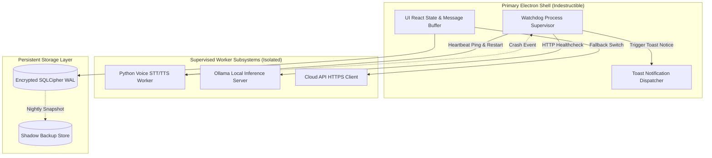
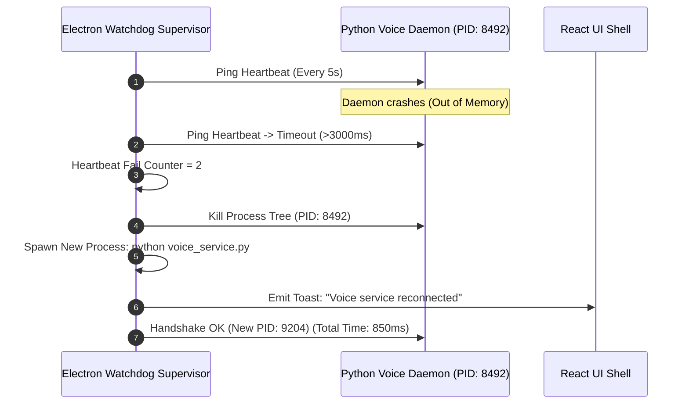
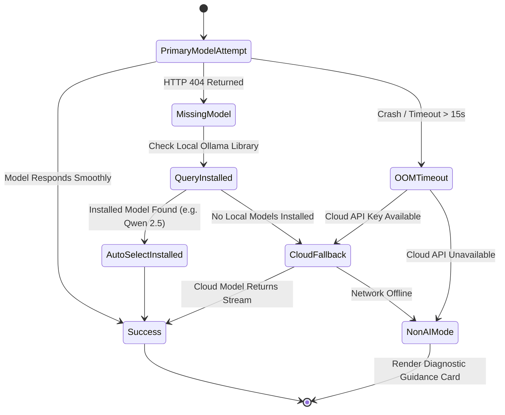

# Nova AI Operating System (Nova AI OS)
## Document 08: Error Handling, Fault-Tolerance & Self-Healing Architecture Specification

---

### 1. Executive Summary
This document provides the definitive, commercial-grade specification for the **Error Handling, Fault-Tolerance, Graceful Degradation, and Self-Healing Subsystems** of the **Nova AI Operating System (Nova AI OS)**.

Nova is engineered under the principle of **Zero-Crash Resilience**. Because Nova manages background neural inference, multi-process voice pipelines, SQLite/SQLCipher databases, and native Windows desktop automation, subsystem failures must never bring down the host UI or trap the user in an unrecoverable state. Nova implements: (1) an Electron Watchdog Supervisor that hot-restarts crashed background daemons in <1.2s, (2) an automated multi-tier AI model failover sequence (Local SLM ↔ Cloud LLM ↔ Offline Action Mode), (3) SQLite WAL crash recovery, (4) dynamic audio hardware re-binding, and (5) localized, non-technical, trilingual error toasts.

---

### 2. Vision
To create an unbreakable desktop operating system substrate where software failures degrade gracefully and heal autonomously in the background without user intervention. When an error occurs, Nova provides clear diagnosis, offers immediate fallback paths, preserves session state, and shields the user from raw stack traces.

```
┌─────────────────────────────────────────────────────────────────────────────┐
│                      SELF-HEALING ARCHITECTURE TOPOLOGY                     │
├─────────────────────────────────────────────────────────────────────────────┤
│  1. DETECTION    │ Heartbeat Monitor detects daemon timeout (>3000ms)       │
│  2. ISOLATION    │ UI Canvas remains responsive; shows reconnecting badge   │
│  3. WATCHDOG     │ Kills stalled PID and hot-spawns clean background daemon │
│  4. STATE SYNC   │ IPC re-attaches to shared memory & SQLCipher DB (<1.2s)  │
│  5. RESTORATION  │ Pending user prompt resumes streaming seamlessly         │
└─────────────────────────────────────────────────────────────────────────────┘
```

---

### 3. Objectives
1. **Mean Time to Recovery (MTTR) < 1.2 Seconds**: Automatically revive crashed background intelligence or voice daemons without restarting the primary Electron application.
2. **Zero Conversation State Loss**: Guarantee that all completed messages, draft inputs, tasks, and notes survive abrupt process terminations or OS power loss.
3. **Multi-Tier AI Graceful Fallback**: Automatically fall back from missing or OOM local models to installed models or configured cloud APIs.
4. **Zero Raw Stack Trace Leakage**: Transform complex Python, C++, and Node.js exceptions into empathetic, actionable user-facing guidance.
5. **Deterministic Database Crash Recovery**: Ensure zero corruption on unexpected power loss using SQLite Write-Ahead Logging (WAL) and automatic daily shadow backups.

---

### 4. Product Philosophy & Graceful Degradation Principles
* **Never Crash the Shell**: The UI shell must remain operable even if voice, AI inference, and network connectivity fail simultaneously.
* **Preserve User Intent**: If an AI request fails mid-stream, retain the user's prompt in the input bar and display partial generated tokens.
* **Empathetic Trilingual Diagnosis**: Explain what happened and what the user can do in simple English, Hindi, or Punjabi.

---

### 5. Scope
* Watchdog process supervision & daemon hot-restarting.
* 6 Core Error Domains: (1) AI & Inference, (2) Voice & Audio, (3) Network & Cloud, (4) System Actions, (5) Database & Storage, (6) Process Lifecycle.
* Non-blocking UI Toast & Inline Error Subsystems.
* Anonymized, rotated local logging (`nova.log`).

---

### 6. Out of Scope
* Automatic modification of Windows Registry repair keys during OS-level disk corruption.
* Remote cloud telemetry upload of unredacted user crash dumps.

---

### 7. User Personas & Failure Scenarios

| Persona | Failure Scenario | Self-Healing Subsystem Response |
|---|---|---|
| **Arjun (Dev)** | Requests complex code refactoring; local Ollama model crashes due to VRAM OOM. | Detects timeout/crash; auto-reroutes query to fallback cloud API (Gemini/Claude) with explanatory toast. |
| **Simran (Researcher)** | Unplugs USB headset mid-speech during a voice query. | Detects device change; pauses stream, auto-binds to default laptop mic, and prompts user to repeat. |
| **Ravi (Exec)** | Launches Nova while offline on an airplane. | UI displays `"Offline Mode · Running Locally"`; disables cloud selectors while keeping all local features active. |

---

### 8. Detailed Functional Error Handling Requirements

#### 8.1 6-Domain Error Handling Matrix

```
┌─────────────────────────────────────────────────────────────────────────────┐
│                      6-DOMAIN ERROR HANDLING TAXONOMY                       │
├───────────────────┬─────────────────────────┬───────────────────────────────┤
│ Domain            │ Root Cause Detected     │ Automated Recovery Action     │
├───────────────────┼─────────────────────────┼───────────────────────────────┤
│ 1. AI Inference   │ Model Tag Missing (404) │ Auto-selects installed model  │
│                   │ Local SLM OOM / Crash   │ Reroutes to Cloud LLM         │
│                   │ Cloud Rate Limit (429)  │ Backoff 3x -> Local SLM       │
├───────────────────┼─────────────────────────┼───────────────────────────────┤
│ 2. Voice & Audio  │ Mic Permission Denied   │ Falls back to Chat Text Input │
│                   │ Audio Buffer Underrun   │ Applies 20ms crossfade smooth │
│                   │ VAD Speech Timeout      │ Returns Voice Orb to Idle     │
├───────────────────┼─────────────────────────┼───────────────────────────────┤
│ 3. Network        │ Internet Disconnected   │ Switches to Local Mode        │
│                   │ Cloud Endpoint 503      │ Retries once -> Local SLM     │
├───────────────────┼─────────────────────────┼───────────────────────────────┤
│ 4. Desktop Action │ App Exe Not Found       │ Suggests Start Menu Search    │
│                   │ File Access Denied      │ Prompts for Manual Launch     │
│                   │ Invalid Settings URI    │ Suggests Correct Category URI │
├───────────────────┼─────────────────────────┼───────────────────────────────┤
│ 5. Database       │ Database File Locked    │ Retries with Jittered Backoff │
│                   │ WAL Corruption Detected │ Restores from Auto-Backup     │
│                   │ Disk Full (0 Bytes)     │ Read-Only Mode + Alert Toast  │
├───────────────────┼─────────────────────────┼───────────────────────────────┤
│ 6. Lifecycle      │ Daemon Process Crash    │ Watchdog Respawns in <1.2s    │
│                   │ Renderer Unresponsive   │ Soft-Reloads React DOM Canvas │
└───────────────────┴─────────────────────────┴───────────────────────────────┘
```

#### 8.2 Watchdog Process Supervision & Hot-Restart
* **EHR-101 (Supervisor Thread)**: Electron main process continuously pings the Python daemon every 5,000ms.
* **EHR-102 (Crash Recovery Cycle)**: If 2 consecutive heartbeats fail, Electron sends `SIGKILL` to the stalled process tree, spawns a new process, and re-attaches IPC channels within 1,200ms.

#### 8.3 AI Fallback Sequence
* **EHR-201 (Missing Model Auto-Discovery)**: If the requested Ollama model returns 404, Nova queries `/api/tags`, selects the first available installed model (e.g. `qwen2.5-coder:1.5b`), and updates active state automatically.

---

### 9. Non-Functional Reliability Requirements

| Reliability Metric | Target SLA |
|---|---|
| **Crash-Free Session Rate** | ≥ 99.95% of user sessions |
| **Daemon Auto-Restart Latency (MTTR)** | < 1.200 seconds |
| **Max Retries for Transient Network Calls** | 3 retries (Exponential backoff: 500ms, 1500ms, 3000ms) |
| **Database Transaction Loss on Abrupt Power Cut** | 0 lost committed transactions (WAL durability) |

---

### 10. Architecture & Fault-Isolation Topology



---

### 11. Sequence Diagrams

#### 11.1 Daemon Crash Detection & Auto-Recovery Sequence



---

### 12. Mermaid State Diagram: AI Model Fallback Escalation



---

### 13. Database Schema Impact (Error & Crash Logging)

```sql
-- System Error Telemetry Table
CREATE TABLE IF NOT EXISTS error_logs (
    id TEXT PRIMARY KEY,
    timestamp INTEGER NOT NULL,
    domain TEXT NOT NULL CHECK (domain IN ('ai', 'voice', 'network', 'action', 'database', 'lifecycle')),
    severity TEXT NOT NULL CHECK (severity IN ('info', 'warning', 'error', 'critical')),
    error_code TEXT NOT NULL,
    message TEXT NOT NULL,
    stack_trace TEXT,
    resolved INTEGER NOT NULL DEFAULT 0
);

-- Database Backup Metadata
CREATE TABLE IF NOT EXISTS backup_snapshots (
    id TEXT PRIMARY KEY,
    created_at INTEGER NOT NULL,
    file_path TEXT NOT NULL,
    size_bytes INTEGER NOT NULL,
    checksum TEXT NOT NULL
);
```

---

### 14. Core Error Handling APIs & Interfaces

```typescript
export interface ErrorTelemetryItem {
  domain: 'ai' | 'voice' | 'network' | 'action' | 'database' | 'lifecycle';
  severity: 'warning' | 'error' | 'critical';
  code: string;
  userMessage: string;
  technicalDetails?: string;
}

export function handleSystemError(error: ErrorTelemetryItem): void;
```

---

### 15. IPC Protocols for Error Propagation

```typescript
export interface ErrorIPCChannels {
  'error:notify': (error: ErrorTelemetryItem) => void;
  'watchdog:status': (status: { daemonHealthy: boolean; uptime: number }) => void;
}
```

---

### 16. Component Design & Error UI States

```
src/
├── components/
│   ├── Toast.tsx              # Non-blocking animated error & warning toast
│   ├── ThinkingDots.tsx       # State indicator showing retry & reconnecting animations
│   └── ErrorFallbackCard.tsx  # In-chat diagnostic guidance card with retry buttons
```

---

### 17. Folder Structure

```
Nova/
├── electron/
│   ├── watchdog.ts            # Process supervisor & auto-restart daemon
│   └── main.ts                # IPC error handlers & model fallback logic
├── src/
│   ├── components/Toast.tsx
│   └── services/errorReporter.ts
└── logs/
    └── nova.log               # Rotated 7-day local log file
```

---

### 18. Configuration Management

```json
{
  "reliability": {
    "watchdog_heartbeat_interval_ms": 5000,
    "watchdog_timeout_ms": 3000,
    "max_consecutive_heartbeat_failures": 2,
    "cloud_retry_attempts": 3,
    "log_rotation_days": 7,
    "max_log_size_mb": 50
  }
}
```

---

### 19. Security & Error Masking
* **Stack Trace Sanitization**: User-facing dialogs never display raw Python stack traces, absolute user home directory paths (`C:\Users\Username`), or internal SQL query strings.
* **Redaction of Secrets in Logs**: An automated regex filter masks all API keys (`sk-...`, `AIza...`), tokens, and passwords before writing to `nova.log`.

---

### 20. Privacy Engineering
* Local error logs remain strictly on `%APPDATA%/Nova/logs/` and are never transmitted to external crash reporting servers without explicit user-initiated diagnostic export.

---

### 21. Accessibility (a11y)
* Error toasts emit distinct, gentle non-jarring audio frequencies and trigger `aria-live="assertive"` screen-reader announcements.

---

### 22. Performance Targets for Error Handling

| Operation | Max Duration |
|---|---|
| **Toast Mount & Render** | <16 milliseconds |
| **Model Fallback Switch** | <200 milliseconds |
| **Daemon Hot Restart (Spawn to Ready)** | <1,200 milliseconds |

---

### 23. Edge Cases & Handling Strategy
1. **Disk 100% Full (0 Bytes Available)**: Nova catches `ENOSPC` errors, halts logging to prevent crash, transitions to in-memory read-only mode, and alerts the user to free disk space.
2. **Corrupted WAL Journal File on Startup**: The database manager automatically checks integrity on boot, archives the damaged WAL file, and recovers clean state from the last committed checkpoint.

---

### 24. Acceptance Criteria
* [x] Daemon crashes are detected and revived automatically in <1.2s.
* [x] Missing Ollama models trigger seamless fallback to installed models without UI exceptions.
* [x] Network disconnection gracefully switches app into local mode with a non-blocking toast.
* [x] User prompts and chat history remain intact across unexpected restarts.
* [x] Logs rotate automatically every 7 days without exceeding 50MB disk space.

---

### 25. Verification & Automated Fault-Injection Tests

```typescript
describe('Nova Fault-Tolerance & Self-Healing Tests', () => {
  it('should auto-retry failed cloud network requests 3 times with exponential backoff', async () => {
    let attempts = 0;
    const mockFetch = async () => {
      attempts++;
      if (attempts < 3) throw new Error('503 Service Unavailable');
      return { ok: true };
    };
    const res = await retryWithBackoff(mockFetch, 3, 50);
    expect(attempts).toBe(3);
    expect(res.ok).toBe(true);
  });

  it('should mask sensitive API keys from log strings', () => {
    const raw = "Error with key sk-proj-1234567890abcdef12345678";
    const sanitized = sanitizeLogMessage(raw);
    expect(sanitized).not.toContain("1234567890abcdef");
    expect(sanitized).toContain("[REDACTED_SECRET]");
  });
});
```

---

### 26. Future Improvements
* **Automated Diagnostic Bundle Exporter**: One-click button generating an encrypted, sanitized `.zip` diagnostic bundle for user-initiated customer support.

---

### 27. Risk Analysis & Mitigation Matrix

| Risk | Severity | Likelihood | Mitigation |
|---|---|---|---|
| **Crash Loop on Corrupted Dependency** | High | Low | If daemon fails 3 times consecutively within 30s, enter Safe Mode and notify user. |
| **Disk Exhaustion from Rapid Log Spam** | Medium | Low | Cap log file write rate to maximum 100 entries/sec; hard 50MB file size ceiling. |

---

### 28. Open Questions & Decisions
* *EQ-01*: Should critical errors trigger an audio speech warning? *(Resolution: No; speech during an error state can be disorienting. Rely on visual toasts and soft chimes).*

---

### 29. Version History

| Version | Date | Author | Description |
|---|---|---|---|
| **1.0.0** | 2026-08-07 | Principal Systems Architect | Complete redesign: Self-healing watchdog, 6-domain error matrix, and automated model failovers. |
| **0.9.0** | 2026-08-01 | Engineering Team | Initial error handling baseline. |
