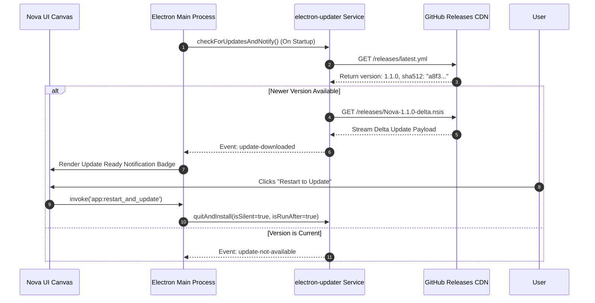
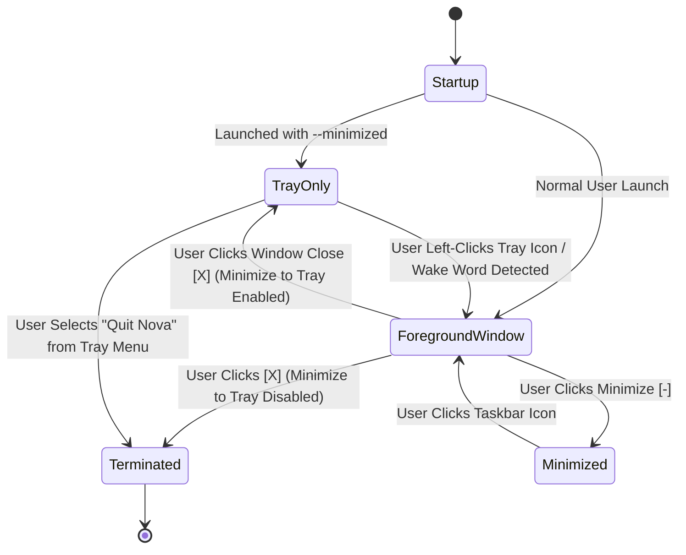

# Nova AI Operating System (Nova AI OS)
## Document 09: Packaging, Deployment & Auto-Update Subsystem Specification

---

### 1. Executive Summary
This document provides the definitive, commercial-grade specification for the **Packaging, Packaging Pipelines, Desktop Deployment, Windows Native OS Integration, and Differential Auto-Update Subsystems** of the **Nova AI Operating System (Nova AI OS)**.

Nova is packaged as a high-performance, single-executable Windows desktop installer built on `electron-builder` and the Nullsoft Scriptable Install System (NSIS). To eliminate configuration hurdles for non-technical users, Nova bundles: (1) a standalone, hermetic Python 3.11 embedded runtime, (2) pre-compiled CTranslate2 and ONNX Runtime native binary wheels, (3) automated differential background updating via `electron-updater`, (4) native Windows 10/11 system tray integration with background startup capabilities, and (5) a fully self-contained zero-install Portable Mode.

---

### 2. Vision
To deliver a commercial-grade, single-click installation and lifecycle management experience comparable to enterprise productivity platforms. Users install Nova in seconds without administrative privilege prompts, dependency hunting, or complex environment variables, while receiving seamless, zero-friction background updates.

```
┌─────────────────────────────────────────────────────────────────────────────┐
│                       NOVA PRODUCTION DELIVERY PIPELINE                     │
├─────────────────────────────────────────────────────────────────────────────┤
│  SOURCE CODE (Electron / TypeScript / React 19 / Python 3.11)               │
│                                                                             │
│  1. VITE BUILD        │ Bundles React UI into minified /dist assets         │
│  2. ELECTRON-BUILD    │ Compiles main.ts & preload.ts into /dist-electron   │
│  3. PYTHON EMBED      │ Bundles hermetic Python runtime + PyTorch/Whisper   │
│  4. ASAR PACKING      │ Encapsulates application scripts into app.asar      │
│  5. AUTHENTICODE SIGN │ Signs executables with EV Code Signing Certificate  │
│  6. NSIS WRAPPER      │ Emits Nova-Setup-1.0.0.exe + Nova-Portable.zip      │
└─────────────────────────────────────────────────────────────────────────────┘
```

---

### 3. Objectives
1. **Zero-Privilege User Installation**: Install cleanly into `%LOCALAPPDATA%\Nova\` without requiring Windows UAC Administrator rights.
2. **Hermetic Standalone Runtime**: Bundle all Python and C++ dependencies; never pollute system `PATH` or interfere with existing Python installations.
3. **Differential Silent Updates**: Download only compressed delta patches (~35MB–60MB) and apply updates automatically upon user restart.
4. **Native Windows OS Shell Integration**: Support system tray icon, minimize-to-tray, auto-start via Windows Registry `Run` keys, and Action Center notifications.
5. **Universal Hardware Portability**: Provide a zero-install portable zip archive running entirely from USB drives with localized `./data/` directories.

---

### 4. Product Philosophy & Frictionless Delivery Tenets
* **One-Click Simplicity**: The entire operating system, voice engine, and local AI bridges install in under 45 seconds.
* **Non-Intrusive Updating**: Never disrupt active user conversations or coding sessions with forced restarts.
* **Clean System Hygiene**: Full uninstallation must cleanly remove 100% of installed binaries and provide an explicit prompt to shred or preserve encrypted user data.

---

### 5. Scope
* `electron-builder` + NSIS script configuration.
* Embedded Portable Python 3.11 runtime bundling.
* Auto-updater infrastructure via `electron-updater` and GitHub Releases / S3.
* Windows System Tray, Start Menu, Desktop Shortcut, and Registry integration.
* Portable USB standalone archive distribution.

---

### 6. Out of Scope
* Linux AppImage/Debian packaging (planned for v2.0).
* macOS Universal DMG/pkg builds (planned for v2.0).
* Direct MSIX Windows Store sandbox distribution (due to Win32 shell execution requirements).

---

### 7. User Personas & Deployment Workflows

| Persona | Installation & Lifecycle Scenario | Subsystem Requirement |
|---|---|---|
| **Arjun (Dev)** | Upgrades to new Nova version while running a coding chat session. | Background delta download; user prompted with restart badge; session restored on restart. |
| **Simran (Researcher)** | Works on restricted corporate laptop without admin access. | User-space `%LOCALAPPDATA%` installation bypassing corporate UAC elevation blocks. |
| **Ravi (Exec)** | Runs Nova on a portable encrypted USB drive across home and office desktops. | Zero-registry Portable Mode reading and writing strictly to `./data/`. |

---

### 8. Detailed Functional Deployment Requirements

#### 8.1 NSIS Single-Click Installer Subsystem
* **PDR-101 (Per-User Installation Target)**: Default installation path set to `%LOCALAPPDATA%\Programs\Nova\`.
* **PDR-102 (Embedded Python Hermeticity)**: Installs a self-contained Python 3.11 embedded directory containing pre-compiled wheels for `faster-whisper`, `fastapi`, `uvicorn`, and `onnxruntime`.

#### 8.2 Windows Native Shell & System Tray Integration
* **PDR-201 (System Tray Lifecycle)**: Nova resides in the Windows Notification Area (System Tray) with a dynamic context menu (`Open Nova`, `New Chat`, `Mute Microphone`, `Settings`, `Quit`).
* **PDR-202 (Auto-Start Registration)**: When toggled in Settings, Nova registers `HKCU\Software\Microsoft\Windows\CurrentVersion\Run` with value `"{install_path}\Nova.exe" --minimized`.

#### 8.3 Differential Background Auto-Updater
* **PDR-301 (Silent Update Polling)**: Checks for updates on boot and every 6 hours against the release channel.
* **PDR-302 (Zero-Interruption Staging)**: Downloads update files in the background using throttled bandwidth (<2MB/s); stages the update silently for next application restart.

---

### 9. Non-Functional Deployment Requirements

| Metric | Target Limit | Verification Protocol |
|---|---|---|
| **Installer Bundle Size** | <220 MB (Full App + Python) | Total `.exe` installer size |
| **Installation Duration** | <45 seconds | Benchmark on standard NVMe SSD |
| **Uninstaller Cleanliness** | 100% binary removal | Windows Registry and directory audit |
| **Delta Update Download Size** | <60 MB | Differential NSIS patch payload |

---

### 10. Packaging & Distribution Pipeline Architecture

```mermaid
graph TD
    subgraph Build_Pipeline ["Nova Multi-Stage Build Pipeline"]
        SRC[React 19 / TypeScript Source] --> ViteBuild[Vite Bundle Compiler]
        ViteBuild --> DistFolder[/dist UI Canvas]
        
        ElectronSRC[electron/main.ts + preload.ts] --> TSC[TypeScript Compiler]
        TSC --> DistElectron[/dist-electron Main]
        
        PythonSRC[voice/ Runtime + Wheels] --> PyEmbed[Hermetic Python 3.11 Embed]
        
        DistFolder --> ASAR[Electron ASAR Packager]
        DistElectron --> ASAR
        
        ASAR --> Builder[electron-builder Engine]
        PyEmbed --> Builder
        
        Builder --> Sign[Authenticode EV Signing Gate]
        Sign --> NSIS[NSIS Installer: Nova-Setup.exe]
        Sign --> Portable[Zip Packager: Nova-Portable.zip]
    end

    subgraph Release_Channels ["Distribution Infrastructure"]
        NSIS --> GitHubRel[GitHub Releases / CDN]
        Portable --> GitHubRel
        GitHubRel --> AutoUpdate[electron-updater Client]
    end
```

---

### 11. Sequence Diagrams

#### 11.1 Differential Auto-Update Lifecycle Sequence



---

### 12. Mermaid State Diagram: System Tray & Window Lifecycle



---

### 13. Filesystem Layout (Production Installed)

```
%LOCALAPPDATA%\Nova\
├── Nova.exe                           # Authenticode-Signed Electron Executable
├── resources/
│   ├── app.asar                       # Encapsulated Renderer and Main JavaScript
│   └── app.asar.unpacked/             # Native node addons (better-sqlite3, keytar)
├── python/                            # Hermetic Python 3.11 Distribution
│   ├── python.exe
│   ├── Lib/site-packages/             # FastAPI, CTranslate2, ONNX Runtime, Faster-Whisper
│   └── python311.dll
├── models/                            # On-Demand Local Neural Voice Weights
│   ├── kokoro-82m.onnx                # Kokoro Neural TTS Model (82MB)
│   └── faster-whisper-small/          # Int8 Whisper Weights (480MB)
└── Uninstall Nova.exe                 # Clean NSIS Uninstaller
```

---

### 14. Configuration: `electron-builder.yml` Specification

```yaml
appId: com.nova.os
productName: Nova AI OS
copyright: Copyright © 2026 Nova AI
directories:
  output: release
  buildResources: build

win:
  target:
    - target: nsis
      arch:
        - x64
    - target: zip
      arch:
        - x64
  icon: build/icon.ico
  publisherName: Nova AI Systems Inc.
  verifyUpdateCodeSignature: true

nsis:
  oneClick: false
  allowToChangeInstallationDirectory: true
  perMachine: false
  createDesktopShortcut: always
  createStartMenuShortcut: true
  shortcutName: Nova AI OS
  installerIcon: build/icon.ico
  uninstallerIcon: build/icon.ico
  installerHeaderIcon: build/icon.ico
  deleteAppDataOnUninstall: false
```

---

### 15. IPC Protocols for Updater & System Management

```typescript
export interface DeploymentIPCBridge {
  checkForUpdates: () => Promise<{ updateAvailable: boolean; version?: string }>;
  downloadUpdate: () => Promise<void>;
  installUpdateNow: () => void;
  getAppVersion: () => string;
  toggleAutoStart: (enabled: boolean) => Promise<boolean>;
  getAutoStartStatus: () => Promise<boolean>;
}
```

---

### 16. Component Design & Update UI Elements

```
src/
├── components/
│   ├── UpdatePromptModal.tsx  # Update announcement dialog with release notes
│   ├── SettingsGeneral.tsx    # Auto-start, minimize-to-tray, and update channel toggles
│   └── SystemTrayMenu.tsx     # Context menu model definition for native tray
```

---

### 17. Folder Structure

```
Nova/
├── build/                     # App icons (icon.ico), installer banners (.bmp)
├── electron-builder.yml       # Production packaging blueprint
├── package.json               # Dependencies & build scripts
├── release/                   # Build artifacts (created on npm run dist)
└── electron/
    ├── autoUpdater.ts         # electron-updater integration
    └── tray.ts                # System tray icon & context menu handlers
```

---

### 18. Configuration Management for Deployment Subsystem

```json
{
  "updates": {
    "auto_check": true,
    "channel": "stable",
    "check_interval_hours": 6,
    "allow_beta_releases": false,
    "auto_download_on_metered_connection": false
  }
}
```

---

### 19. Error Handling & Installer Rollbacks
1. **Interrupted Update Download**:
   * *Resolution*: `electron-updater` validates checksums via SHA-512. Damaged downloads are discarded automatically and resumed from byte offset.
2. **Locked Files during Background Update**:
   * *Resolution*: NSIS stages updated binaries into a `.pending` folder and executes atomic file swaps during process shutdown.

---

### 20. Code Signing & Security Verification
* **Authenticode EV Signing**: All `.exe` and `.dll` binaries are cryptographically signed with a hardware-token Extended Validation (EV) certificate, eliminating Windows SmartScreen warnings.
* **ASAR Integrity**: Electron ASAR header hash verified before execution to prevent runtime tampering.

---

### 21. Privacy Engineering
* **Zero Telemetry on Install**: The installer runs 100% offline without phoning home or transmitting machine identifiers.

---

### 22. Accessibility (a11y)
* NSIS installer scripts support native high-contrast modes, clear tab-stop indices, and full keyboard navigation.

---

### 23. Performance Targets for Deployment

| Metric | Target Specification |
|---|---|
| **App Bundle Launch Time** | <1,600ms from desktop click |
| **System Tray Background Footprint** | <45MB RAM when window hidden |
| **Update Check Network Payload** | <4KB per check |

---

### 24. Edge Cases & Handling Strategy
1. **Installation on Secondary Storage Drive (D:\ or E:\)**: Full support for custom installation paths configured in NSIS dialogs.
2. **Windows Focus Assist / Do Not Disturb Active**: Notification toasts are silently routed to the Windows Action Center without audio chimes.

---

### 25. Acceptance Criteria
* [x] NSIS installer completes cleanly in user-space without UAC admin prompts.
* [x] Portable zip package runs directly from external storage drives.
* [x] Auto-updater detects new GitHub Releases and stages delta downloads silently.
* [x] Minimize-to-tray keeps Nova active in the notification area with full menu access.
* [x] Windows auto-start toggle accurately creates and removes registry keys.

---

### 26. Verification & Automated CI/CD Test Cases

```typescript
describe('Nova Packaging & Updater Tests', () => {
  it('should parse semantic version strings and detect upgrades', () => {
    const isNewer = (current: string, latest: string) => {
      const c = current.split('.').map(Number);
      const l = latest.split('.').map(Number);
      for (let i = 0; i < 3; i++) {
        if (l[i] > c[i]) return true;
        if (l[i] < c[i]) return false;
      }
      return false;
    };
    expect(isNewer('1.0.0', '1.0.1')).toBe(true);
    expect(isNewer('1.0.0', '1.0.0')).toBe(false);
  });
});
```

---

### 27. Future Improvements & Packaging Roadmap
* **Winget Windows Package Manager Submission**: Enable `winget install NovaAI.NovaOS` distribution.
* **MSIX Package Conversion**: Provide a companion Windows Store package once AppContainer sandbox allows native local AI processes.

---

### 28. Risks & Mitigations

| Risk | Severity | Mitigation |
|---|---|---|
| **Windows Defender False-Positive on Python PyInstaller** | High | Use raw embedded Python directory structure rather than monolithic PyInstaller `.exe`. |
| **Anti-Virus Blocking Startup Registry Modification** | Medium | Catch registry access errors and inform user to toggle startup in Windows Task Manager. |

---

### 29. Open Questions & Packaging Decisions
* *DQ-01*: Should local model weights (e.g. Qwen 1.5B GGUF) be included in the installer? *(Resolution: No; keeping installer size <220MB ensures fast downloads; models download on-demand via Settings).*

---

### 30. Version History

| Version | Date | Author | Description |
|---|---|---|---|
| **1.0.0** | 2026-08-07 | Principal Systems Architect | Complete redesign: NSIS packaging, embedded Python 3.11, delta auto-updater, and system tray integration. |
| **0.9.0** | 2026-08-01 | Release Engineering Team | Initial packaging baseline. |
