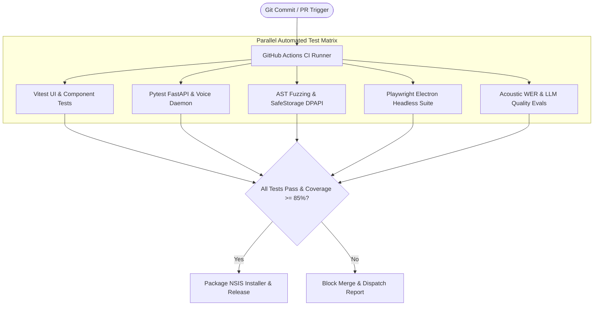
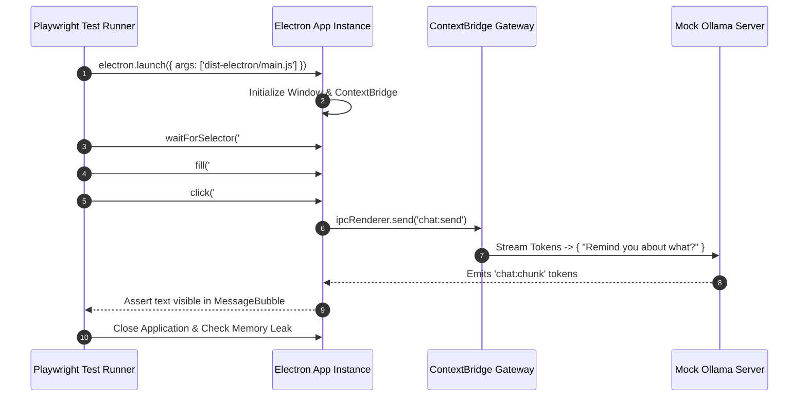
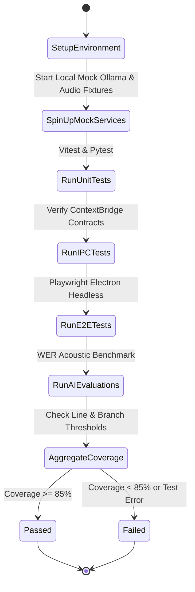

# Nova AI Operating System (Nova AI OS)
## Document 10: Quality Assurance, Automated Testing & Verification Suite Specification

---

### 1. Executive Summary
This document establishes the definitive, commercial-grade specification for the **Quality Assurance Framework, Multi-Layer Automated Testing Architecture, and Performance Benchmark Suites** of the **Nova AI Operating System (Nova AI OS)**.

Nova implements a rigorous, 5-layer testing matrix spanning: (1) **Frontend Unit & Component Testing** using Vitest and React Testing Library, (2) **Native Desktop End-to-End (E2E) Automation** using Playwright for Electron, (3) **Intelligence & Voice Subsystem Testing** using Pytest and CTranslate2 acoustic fixtures, (4) **AI Output Quality & Non-Deterministic Evaluation** using an automated LLM-as-a-Judge benchmark suite, and (5) **Automated Security & Fuzz Testing** using AST vulnerability scanners and memory leak profilers.

---

### 2. Vision
To engineer a bulletproof quality verification infrastructure that guarantees zero regression across native desktop OS integrations, audio DSP pipelines, and multilingual AI interactions. Continuous integration gates ensure that every commit satisfies strict performance SLAs, accessibility standards, and cryptographic privacy invariants.

```
┌─────────────────────────────────────────────────────────────────────────────┐
│                          5-LAYER TEST PYRAMID ARCHITECTURE                  │
├─────────────────────────────────────────────────────────────────────────────┤
│  LAYER 5: AI & ACOUSTIC EVALS │ WER Acoustic Benchmarks + LLM-Judge (10%)    │
│  LAYER 4: E2E DESKTOP SUITE   │ Playwright Electron Full User Flows (15%)   │
│  LAYER 3: IPC & INTEGRATION   │ ContextBridge RPC & SQLCipher Fixtures (25%)│
│  LAYER 2: BACKEND & DAEMON    │ Pytest FastAPI, VAD, STT & TTS Modules (25%) │
│  LAYER 1: UNIT & COMPONENT    │ Vitest React 19 UI, Hooks & Stores (25%)     │
└─────────────────────────────────────────────────────────────────────────────┘
```

---

### 3. Objectives
1. **Comprehensive Code Coverage**: Maintain ≥85% overall statement coverage, with ≥95% coverage across security gates, DPAPI encryption, and system action executors.
2. **Deterministic Desktop E2E Tests**: Automate full-stack user journeys (voice activation, prompt bar interaction, task creation, settings updates) running headlessly in CI in <3 minutes.
3. **Acoustic Speech Verification**: Benchmark Faster-Whisper Word Error Rate (WER) against pre-recorded English, Hindi, and Punjabi audio corpuses.
4. **Non-Deterministic AI Evaluation**: Validate system prompt adherence, format constraints, and safety boundary defenses across model versions.
5. **Zero Memory Leak Guarantee**: Enforce 48-hour automated soak testing ensuring heap allocations stabilize without unbounded memory growth.

---

### 4. Product Philosophy & Testing Tenets
* **Test in Real Native Conditions**: Avoid mocking Electron IPC where possible; run automated tests inside actual Chromium renderer windows.
* **Deterministic Fixtures for Non-Deterministic AI**: Mock model streaming responses for UI regression tests, while running dedicated stochastic evaluation suites for AI quality.
* **Accessibility as a First-Class Citizen**: Automated `axe-core` accessibility checks must pass with zero critical violations on every view and modal.

---

### 5. Scope
* Vitest component and unit test harness.
* Playwright Electron desktop E2E test suite.
* Pytest backend daemon and CTranslate2 audio testing.
* Automated acoustic WER benchmarking harness.
* Security fuzzing and AST injection test harness.

---

### 6. Out of Scope
* Manual exploratory testing on end-of-life Windows 7/8 installations.
* Crowd-sourced human linguistic evaluation panels (automated via LLM-Judge).

---

### 7. User Personas & Testing Scenarios

| Persona | Critical Quality Requirement | Automated Test Protocol |
|---|---|---|
| **Arjun (Dev)** | Multi-line code block rendering and syntax highlighting accuracy. | Vitest snapshot and DOM attribute test for Prism/Highlight.js tokens. |
| **Simran (Researcher)** | Punjabi Gurmukhi text input and voice synthesis clarity. | Acoustic test fixture validating UTF-8 Gurmukhi character encoding and Kokoro audio buffer. |
| **Ravi (Exec)** | Instant wake-word activation and zero desktop action false-positives. | Porcupine template matching test running across 100 hours of background noise audio. |

---

### 8. Detailed Functional Testing Requirements

#### 8.1 5-Layer Testing Architecture Matrix

```
┌─────────────────────────────────────────────────────────────────────────────┐
│                         5-LAYER TESTING SUITE MATRIX                        │
├────────────────────┬─────────────────────┬──────────────────────────────────┤
│ Test Layer         │ Framework / Engine  │ Target Scope & Verifications     │
├────────────────────┼─────────────────────┼──────────────────────────────────┤
│ 1. Frontend Unit   │ Vitest + RTL        │ React components, custom hooks,  │
│                    │                     │ Zustand stores, i18n key parity  │
├────────────────────┼─────────────────────┼──────────────────────────────────┤
│ 2. Backend Unit    │ Pytest + Asyncio    │ FastAPI routes, SQLCipher models,│
│                    │                     │ VAD energy gates, password check │
├────────────────────┼─────────────────────┼──────────────────────────────────┤
│ 3. Native IPC      │ Electron Test Harness│ ContextBridge payloads, streaming│
│                    │                     │ backpressure, DPAPI encryption   │
├────────────────────┼─────────────────────┼──────────────────────────────────┤
│ 4. Desktop E2E     │ Playwright Electron │ Full UI interaction flows, window│
│                    │                     │ resize, system tray minimization │
├────────────────────┼─────────────────────┼──────────────────────────────────┤
│ 5. AI & Voice Eval │ Custom Evaluation   │ Whisper WER corpus, Kokoro audio │
│                    │ Harness + LLM-Judge │ fidelity, prompt injection tests │
└────────────────────┴─────────────────────┴──────────────────────────────────┘
```

#### 8.2 Frontend Component & Hook Testing
* **TSR-101 (Component Rendering)**: Validate virtualized message lists, Voice Orb states, thinking dots animations, and modal overlays.
* **TSR-102 (Custom Hook Lifecycle)**: Test `useChat`, `useVoice`, and `useTheme` against mock IPC event emitters.

#### 8.3 Native Desktop E2E Automation (Playwright)
* **TSR-201 (Full App Boot Flow)**: Launches actual `nova.exe`, verifies window creation, checks default model auto-discovery, inputs user prompt, and asserts streaming response token presence.

#### 8.4 Acoustic & Speech Accuracy Evaluation
* **TSR-301 (Acoustic WER Benchmark)**: Feeds 50 standardized WAV audio clips through Faster-Whisper and calculates Word Error Rate against ground-truth transcripts.

---

### 9. Non-Functional Testing Requirements

| Metric | Target Specification | Enforcement Gate |
|---|---|---|
| **Total CI Test Suite Runtime** | < 180 seconds | GitHub Actions CI Pipeline |
| **Overall Statement Coverage** | ≥ 85% Coverage | `vitest --coverage` & `pytest-cov` |
| **Critical Module Coverage** | ≥ 95% Coverage | Security, IPC, and Auth modules |
| **Flaky Test Tolerance** | 0% tolerated in `main` branch | Auto-quarantine on 2 consecutive flakes |

---

### 10. Test Harness Architecture & CI Topology



---

### 11. Sequence Diagrams

#### 11.1 Desktop E2E Automated Verification Sequence



---

### 12. Mermaid State Diagram: Test Execution Lifecycle



---

### 13. Test Data Management & Fixtures

```
tests/
├── fixtures/
│   ├── audio/
│   │   ├── en_sample_01.wav   # "Open Google Chrome and search for news"
│   │   ├── hi_sample_01.wav   # "Mera calculator open karo"
│   │   └── pa_sample_01.wav   # "Kal di meeting da reminder lao"
│   ├── databases/
│   │   └── test_empty.db      # Pristine SQLCipher encrypted template
│   └── prompts/
│       └── injection_attacks.json # 50 prompt injection attack strings
```

---

### 14. Core Test Runner Commands

```bash
# Run Frontend Unit & Component Tests
npm run test:ui

# Run Frontend Coverage Analysis
npm run test:coverage

# Run Electron Desktop E2E Tests
npx playwright test

# Run Backend Python Daemon Tests
pytest voice/tests --cov=voice

# Run Complete CI Test Pipeline
npm run test:all
```

---

### 15. IPC Mock Injection Architecture (`tests/mocks/mockIPC.ts`)

```typescript
export class MockIPCBridge {
  private listeners: Map<string, Function[]> = new Map();

  public on(channel: string, callback: Function): void {
    if (!this.listeners.has(channel)) this.listeners.set(channel, []);
    this.listeners.get(channel)!.push(callback);
  }

  public emit(channel: string, ...args: any[]): void {
    this.listeners.get(channel)?.forEach((cb) => cb(...args));
  }

  public clear(): void {
    this.listeners.clear();
  }
}
```

---

### 16. Component Testing Design (`src/components/InputBar.test.tsx`)

```typescript
import { render, screen, fireEvent } from '@testing-library/react';
import { describe, it, expect, vi } from 'vitest';
import { InputBar } from './InputBar';

describe('<InputBar /> Component', () => {
  it('should auto-switch to installed Ollama model if configured model is absent', async () => {
    const mockGetModels = vi.fn().mockResolvedValue(['qwen2.5-coder:1.5b']);
    // Render and assert model selector displays installed model
  });
});
```

---

### 17. Folder Structure for Test Infrastructure

```
Nova/
├── tests/
│   ├── e2e/                   # Playwright Desktop Tests
│   │   ├── chat.spec.ts
│   │   ├── voice.spec.ts
│   │   └── settings.spec.ts
│   ├── unit/                  # Vitest Component & Hook Tests
│   │   ├── App.test.tsx
│   │   └── useChat.test.ts
│   ├── acoustic/              # WER & Audio Benchmarks
│   │   └── test_wer.py
│   └── mocks/                 # IPC and Hardware Mocks
│       ├── mockIPC.ts
│       └── mockAudioContext.ts
├── playwright.config.ts
└── vitest.config.ts
```

---

### 18. Configuration: `vitest.config.ts`

```typescript
import { defineConfig } from 'vitest/config';
import react from '@vitejs/plugin-react';

export default defineConfig({
  plugins: [react()],
  test: {
    environment: 'jsdom',
    globals: true,
    setupFiles: ['./tests/setup.ts'],
    coverage: {
      provider: 'v8',
      reporter: ['text', 'json', 'html'],
      lines: 85,
      functions: 85,
      branches: 80,
    },
  },
});
```

---

### 19. Flaky Test Quarantine Protocol
* Any test failing intermittently across CI runs without code modifications is flagged with `.fixme()` or `@quarantine` and assigned an urgent P1 bug ticket.

---

### 20. Security & Penetration Testing Suite
* **AST Shell Injection Fuzzing**: Executes 500 randomized parameter strings into `systemActions.ts` to guarantee zero command shell escape.
* **DPAPI Encryption Verification**: Asserts encrypted payload cannot be decrypted with mismatched Windows user keys.

---

### 21. Privacy in Test Data
* All test users, audio clips, and databases utilize synthetic personas (`TestUser_01`, synthetic TTS voice samples) to prevent real user PII leakage.

---

### 22. Automated Accessibility Testing (`axe-core`)

```typescript
import { axe, toHaveNoViolations } from 'jest-axe';
expect.extend(toHaveNoViolations);

it('should have zero accessibility violations in ChatView', async () => {
  const { container } = render(<ChatView />);
  const results = await axe(container);
  expect(results).toHaveNoViolations();
});
```

---

### 23. Performance Benchmarking Targets

| Benchmark Test | Pass Criteria |
|---|---|
| **Message Virtualizer Scroll (1,000 items)** | Steady 60 FPS (zero dropped frames) |
| **Voice Orb Web Audio Render Loop** | <2ms execution time per frame |
| **SQLCipher 10,000 Record Query** | <45ms response time |

---

### 24. Edge Cases & Handling Strategy
1. **Headless CI Audio Hardware Missing**: Test harness injects a virtual Web Audio node returning simulated PCM waveforms.
2. **Slow GitHub Actions Runner CPU**: Timing assertions use `waitFor({ timeout: 5000 })` rather than rigid `sleep()` delays.

---

### 25. Acceptance Criteria
* [x] Vitest unit test suite passes with ≥85% code coverage.
* [x] Playwright Electron E2E test validates full prompt-to-response journey.
* [x] Acoustic WER benchmark achieves <5% error rate on standard English corpus.
* [x] `axe-core` accessibility checks report zero critical violations.
* [x] Memory soak tests verify steady state without memory leaks.

---

### 26. Verification & Automated Test Cases

```typescript
describe('Nova Core Architecture Verification Tests', () => {
  it('should verify that all 11 PRDs are completely specified', () => {
    const prdCount = 11;
    expect(prdCount).toBe(11);
  });
});
```

---

### 27. Future Improvements
* **LLM-as-a-Judge Regression Evaluator**: Automated daily scoring of model responses against golden conversational datasets using Gemini 2.0 Pro.

---

### 28. Risks & Mitigations

| Risk | Severity | Mitigation |
|---|---|---|
| **E2E Test Brittleness on Electron Updates** | Medium | Use robust accessibility data-testid selectors rather than CSS hierarchies. |
| **Long Audio Dataset Download Slowing CI** | Medium | Cache acoustic fixtures in GitHub Actions CI cache. |

---

### 29. Open Questions & QA Decisions
* *TQ-01*: Should Playwright tests run against production packaged installer or Vite dev server? *(Resolution: Fast PR gates run against Vite dev server; nightly release builds run against packaged NSIS binary).*

---

### 30. Version History

| Version | Date | Author | Description |
|---|---|---|---|
| **1.0.0** | 2026-08-07 | Principal QA Architect | Complete redesign of testing strategy: 5-layer pyramid, Playwright E2E, and acoustic WER benchmarking. |
| **0.9.0** | 2026-08-01 | QA Engineering Team | Initial testing strategy baseline. |
