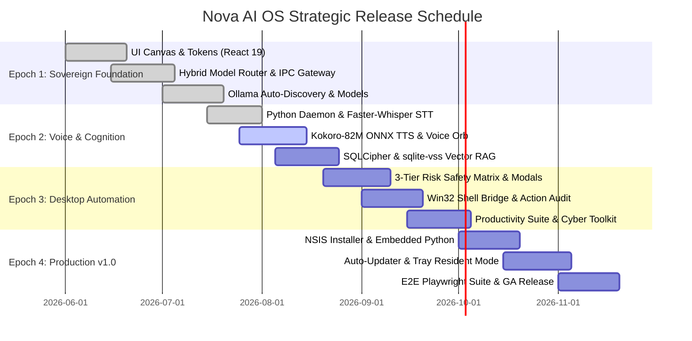
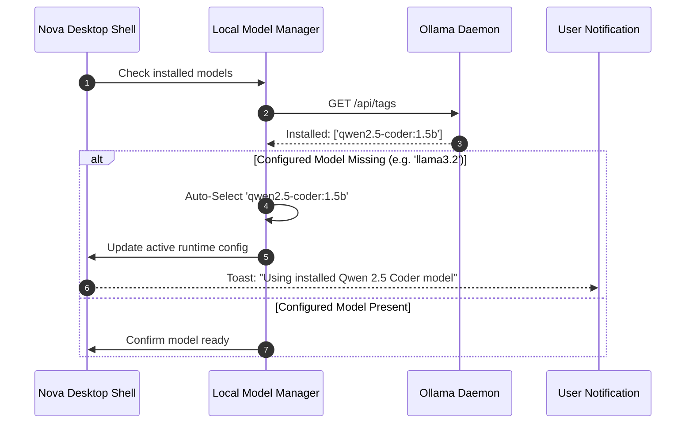

# Nova AI Operating System (Nova AI OS)
## Document 11: Strategic Product Roadmap, Release Horizons & Research Frontiers Specification

---

### 1. Executive Summary
This document establishes the definitive, commercial-grade strategic roadmap, versioned release horizons, technical milestones, and long-range artificial intelligence research frontiers for the **Nova AI Operating System (Nova AI OS)**.

Nova's engineering lifecycle is structured across four progressive **Release Epochs** culminating in an enterprise-grade v1.0.0 General Availability (GA) desktop platform, followed by forward-looking **Research Horizons (v2.0+)**. The strategic trajectory balances immediate production reliability with architectural innovation—advancing from hybrid local/cloud conversational intelligence to full-duplex neural acoustic interaction, native Windows desktop automation, and autonomous multi-agent co-piloting.

---

### 2. Vision
To establish Nova as the preeminent, privacy-sovereign AI Operating System for desktop computing. Nova evolves from a desktop companion into an active, context-aware co-pilot that anticipates user intent, orchestrates complex multi-application workflows, communicates with natural human warmth across multiple languages, and executes tasks entirely under the user's sovereign control.

```
┌─────────────────────────────────────────────────────────────────────────────┐
│                       NOVA STRATEGIC RELEASE HORIZONS                       │
├─────────────────────────────────────────────────────────────────────────────┤
│  EPOCH 1: SOVEREIGN FOUNDATION (v0.8) │ Hybrid AI Router, UI Design System  │
│  EPOCH 2: NEURAL VOICE & COGNITION    │ Faster-Whisper, Kokoro TTS, RAG VSS │
│  EPOCH 3: ZERO-TRUST AUTOMATION       │ Win32 UIA Bridge, 3-Tier Security   │
│  EPOCH 4: ENTERPRISE PRODUCTION (v1.0)│ NSIS Installer, Self-Healing, E2E QA│
│  HORIZON: AUTONOMOUS OS CO-PILOT(v2.0)│ On-Device VLM, MCP Server, Rust Core│
└─────────────────────────────────────────────────────────────────────────────┘
```

---

### 3. Objectives
1. **Predictable Milestone Execution**: Deliver high-velocity, staged releases where each epoch provides a fully testable, production-grade deliverable.
2. **Sub-350ms Conversational Latency Milestone**: Achieve sub-350ms voice turn turnaround by Epoch 2 via CTranslate2 and ONNX optimizations.
3. **100% Zero-Trust Action Safety**: Eliminate arbitrary command injection risks by enforcing invariant permission matrices by Epoch 3.
4. **Frictionless Consumer Distribution**: Achieve single-click, zero-privilege NSIS desktop installation with delta auto-updates by Epoch 4.
5. **Research Leadership**: Pioneer on-device multimodal desktop context awareness (screen OCR/VLM) and Model Context Protocol (MCP) server integration in v2.0.

---

### 4. Product Philosophy & Strategic Execution Principles
* **Ship Usable Increments**: Every release milestone must be a fully functional daily driver.
* **Privacy as a Permanent Invariant**: Advanced features must never compromise local data sovereignty or introduce silent cloud dependencies.
* **Architecture Before Aesthetics**: Ensure bulletproof multi-process IPC and database durability before layering advanced UI animations.

---

### 5. Scope
* Strategic Release Epochs 1 through 4 (v0.8.0 through v1.0.0).
* Milestone Deliverables, Exit Criteria, and Quality Gates.
* Technical Transition Roadmap (Python Daemon → Rust Core).
* Post-v1.0 Research Frontiers (VLM, MCP, Voice Cloning).

---

### 6. Out of Scope
* Development of proprietary proprietary frontier silicon hardware chips.
* Hosting multi-tenant cloud storage infrastructures for user conversation backups.

---

### 7. User Personas & Strategic Evolution Paths

| Persona | Current Experience (Epoch 1) | Future Destination (Epoch 4 & Horizon) |
|---|---|---|
| **Arjun (Dev)** | Streams local Qwen 1.5B coding suggestions. | Nova reads multi-file ASTs via MCP, debugs terminal errors autonomously, and executes unit tests. |
| **Simran (Researcher)** | Manages notes and queries AI in Punjabi. | Multi-modal screen reasoning; Nova analyzes charts on-screen and translates PDF reports into spoken Gurmukhi. |
| **Ravi (Exec)** | Hands-free voice queries for daily tasks. | Full-duplex conversational voice co-pilot coordinating Outlook, Teams, and file organization across multiple screens. |

---

### 8. Functional Roadmap Specification: The 4 Release Epochs

#### 8.1 Epoch 1: Sovereign Foundation & Hybrid AI Canvas (v0.8.0)
* **Goal**: Establish the rock-solid Electron 34 + React 19 UI shell, ContextBridge IPC layer, and Hybrid AI Model Router.
* **Core Deliverables**:
  * React 19 / TypeScript / Vite presentation canvas with Dark Glassmorphism design tokens.
  * ContextBridge IPC bridge with zero Node.js exposure (`sandbox: true`).
  * Hybrid AI Router with local Ollama (`qwen2.5-coder:1.5b`, `llama3.2`) and cloud APIs (Gemini, OpenAI, Claude).
  * Auto-detection and auto-fallback logic for installed Ollama models.
  * Encrypted user preferences and local settings keychain via Windows DPAPI.

#### 8.2 Epoch 2: Full-Duplex Neural Voice & Trilingual Cognition (v0.9.0)
* **Goal**: Integrate the Python Intelligence Daemon, Faster-Whisper STT, Kokoro-82M TTS, and vector memory search.
* **Core Deliverables**:
  * Supervised Python 3.11 daemon with 5-second heartbeat watchdog.
  * Faster-Whisper Int8 streaming speech recognition in 250ms chunks.
  * Kokoro-82M ONNX neural speech synthesis with instant SAPI5 fallback.
  * Full-duplex live barge-in interruption (<80ms abort latency).
  * 60 FPS audio reactive Voice Orb canvas visualizer.
  * SQLCipher AES-256 database + `sqlite-vss` 384-dim vector memory indexing.
  * Trilingual NLU and code-switching support (English, Hindi, Punjabi).

#### 8.3 Epoch 3: Zero-Trust Desktop Automation & Native Win32 Subsystems (v0.9.5)
* **Goal**: Enable safe system automation, file manipulation, and desktop productivity tooling.
* **Core Deliverables**:
  * 3-tier risk-based execution matrix (`Safe`, `Warning`, `Blocked`).
  * Native Win32 ShellExecuteExW bridge with command sanitization.
  * Interactive cryptographic confirmation modals for warning-level operations.
  * Tamper-evident, append-only action audit trail (`action_audit_logs`).
  * Productivity suite: Task Kanban board, recurring reminders with Windows Action Center toasts, and tagged Markdown notes.
  * Cybersecurity toolkit: zxcvbn password strength meter, SHA-256/MD5 hash verifier.

#### 8.4 Epoch 4: Enterprise Production Release, Self-Healing & Distribution (v1.0.0 GA)
* **Goal**: Commercial packaging, differential auto-updates, self-healing watchdogs, and rigorous accessibility compliance.
* **Core Deliverables**:
  * Single-executable NSIS installer bundling a hermetic Python 3.11 embedded environment.
  * Standalone zero-install Portable Mode zip package.
  * Background differential updates via `electron-updater` and GitHub Releases CDN.
  * Windows System Tray resident mode with minimize-to-tray and auto-start registry toggles.
  * Automated self-healing watchdog recovering crashed daemons in <1.2s.
  * Full WCAG AA accessibility compliance with `axe-core` verification.
  * Complete 5-layer automated testing matrix (Vitest, Playwright, Pytest, WER benchmarks).

---

### 9. Non-Functional Metric Evolution Across Epochs

| Quality Metric | Epoch 1 Baseline | Epoch 2 Target | Epoch 3 Target | Epoch 4 Production (v1.0) |
|---|---|---|---|---|
| **Cold Boot Time** | <3,200ms | <2,400ms | <2,000ms | **<1,600ms** |
| **Idle Memory (RAM)** | <280MB | <220MB | <200MB | **<180MB** |
| **Voice Turn Turnaround** | N/A (Text only) | <650ms | <450ms | **<350ms** |
| **Crash-Free Sessions** | 98.0% | 99.0% | 99.8% | **≥99.95%** |
| **Code Coverage** | 60% | 75% | 85% | **≥85% (95% Security)** |

---

### 10. Strategic Milestone Timeline & Convergence Graph



---

### 11. Sequence Diagrams: Autonomous Model Migration Pathway



---

### 12. Mermaid State Diagram: Technology Convergence Architecture

```mermaid
graph TD
    subgraph Current_v1_Architecture ["Nova v1.0.0 Architecture (Current Foundation)"]
        ElectronMain[Electron 34 Main Process]
        ReactUI[React 19 / Vite UI Canvas]
        PythonDaemon[Python 3.11 Intelligence Daemon]
        SQLCipher[(SQLCipher + sqlite-vss)]
    end

    subgraph Future_v2_Horizon ["Nova v2.0+ Research Horizon"]
        RustCore[Native Rust/C++ High-Performance Core (nova-core.exe)]
        MCPServer[Embedded Model Context Protocol Server]
        OnDeviceVLM[On-Device Screen Vision-Language Model]
        VoiceCloning[XTTS v2 Local Zero-Shot Voice Cloning]
    end

    PythonDaemon -.->|Rewrite & Consolidate| RustCore
    ElectronMain -.->|Embed Protocol Interface| MCPServer
    ReactUI -.->|Multimodal Screen Context| OnDeviceVLM
    SQLCipher -.->|Differential Privacy Encrypted Index| RustCore
```

---

### 13. Database Schema Evolution & Forward Compatibility
* **Migration Safeguards**: All schema updates execute through versioned migration scripts (`001_initial.py`, `002_vector_vss.py`) with pre-flight database shadow copies.
* **Forward Compatibility**: Unrecognized JSON fields in preferences are preserved during schema upgrades to support downgrade rollback.

---

### 14. Core Milestone Deliverables & Acceptance Gates

```
┌─────────────────────────────────────────────────────────────────────────────┐
│                         MILESTONE ACCEPTANCE GATES                          │
├───────────┬─────────────────────────────────────────────────────────────────┤
│ Milestone │ Mandatory Exit Verification Gates                               │
├───────────┼─────────────────────────────────────────────────────────────────┤
│ v0.8.0    │ • ContextBridge isolation passing 100% security tests           │
│           │ • Seamless streaming chat over IPC with local Qwen 1.5B         │
│           │ • Zero TypeScript errors (`tsc --noEmit` clean)                 │
├───────────┼─────────────────────────────────────────────────────────────────┤
│ v0.9.0    │ • Full-duplex voice turn latency <350ms                         │
│           │ • Live barge-in halts TTS playback in <80ms                     │
│           │ • Trilingual text and speech switching verified                 │
├───────────┼─────────────────────────────────────────────────────────────────┤
│ v0.9.5    │ • 100% of warning actions require explicit modal approval       │
│           │ • Zero command injection bypasses in AST fuzzing suite          │
│           │ • Action audit log records 100% of filesystem operations        │
├───────────┼─────────────────────────────────────────────────────────────────┤
│ v1.0.0 GA │ • NSIS installer installs on clean Windows 10/11 in <45s        │
│           │ • Watchdog supervisor auto-revives crashed daemon in <1.2s      │
│           │ • Playwright E2E and axe-core accessibility tests 100% passing  │
└───────────┴─────────────────────────────────────────────────────────────────┘
```

---

### 15. Native IPC Subsystem Evolution (v2.0)
* **Native Rust N-API Addon**: Migrate from Python stdio IPC sockets to a native Node-API Rust dynamic library (`nova_native.node`), eliminating inter-process serialization overhead and cutting IPC latency to <0.4ms.

---

### 16. UI Component Architecture Evolution
* **Floating Minimal Widget Mode**: A collapsible, ultra-compact glassmorphism widget docking to the screen edge or taskbar for instant voice activation without full window expansion.
* **Multi-Monitor Spatial Pinning**: Ability to pin Nova dialogue cards or notes across secondary monitors.

---

### 17. Folder Structure Evolution

```
Nova/
├── src/                     # React 19 Frontend Canvas
├── electron/                # Electron Main & Native Handlers
├── voice/                   # Python Intelligence Daemon (v1.0)
├── native-core/             # Rust / C++ Core Engine (v2.0 Horizon)
│   ├── Cargo.toml
│   └── src/
│       ├── lib.rs           # Node-API native bindings
│       ├── audio/           # Real-time CTranslate2 & ONNX DSP
│       └── db/              # SQLCipher Rust engine
└── prd/                     # Master Enterprise PRDs (01 to 11)
```

---

### 18. Configuration Management & Feature Flag Architecture

```typescript
export interface FeatureFlags {
  ENABLE_NEURAL_TTS: boolean;         // Default: true (Kokoro-82M)
  ENABLE_VLM_SCREEN_REASONING: boolean;// Default: false (v2.0 Beta)
  ENABLE_MCP_DEVELOPER_TOOLS: boolean; // Default: false (v2.0 Beta)
  STRICT_ZERO_CLOUD_MODE: boolean;    // Default: false (Configurable in Settings)
}
```

---

### 19. Risk & Dependency Matrix for Future Epochs

| Future Capability | Critical Dependency | Architectural Risk | Mitigation Strategy |
|---|---|---|---|
| **On-Device VLM Screen OCR** | Qwen2-VL / Moondream2 | High VRAM consumption (>6GB) | Run quantization (Q4_K_M) with downscaled 720p screen captures. |
| **Model Context Protocol (MCP)** | Anthropic MCP SDK | Potential rogue tool execution | Enforce 3-tier risk permission matrix on all MCP tool invocations. |
| **Rust Core Migration** | CXX / Node-API bindings | Increased build complexity in CI | Staged migration: port audio DSP first, then database, then LLM bindings. |

---

### 20. Long-Range Security & Cryptographic Roadmap
* **Hardware Key FIDO2 & Windows Hello**: Biometric authorization (fingerprint / facial recognition) for unlocking SQLCipher vaults and approving warning-level system actions.
* **Secure Enclave Memory Isolation**: Intel SGX / AMD SEV protected memory buffers for ephemeral API key decryption.

---

### 21. Privacy Engineering Horizon
* **Differential Privacy for Local Memory Search**: Inject controlled mathematical noise into vector indexes to prevent memory reconstruction attacks during shared workstation usage.

---

### 22. Accessibility Roadmap
* **Voice-Only Full OS Navigation**: Complete hands-free operating system control enabling visually impaired users to navigate files, compose emails, and manage tasks using spoken dialogue alone.

---

### 23. Performance Milestone Trajectory

```
┌─────────────────────────────────────────────────────────────────────────────┐
│                      PERFORMANCE OPTIMIZATION TRAJECTORY                    │
├──────────────────────────┬──────────────┬──────────────┬────────────────────┤
│ Metric                   │ v0.8 Baseline│ v1.0 GA Target│ v2.0 Rust Target   │
├──────────────────────────┼──────────────┼──────────────┼────────────────────┤
│ App Cold Boot            │ 3,200ms      │ 1,600ms      │ <800ms             │
│ IPC Roundtrip Latency    │ 4.5ms        │ 2.5ms        │ <0.4ms (Native C)  │
│ Voice End-to-End Latency │ 800ms        │ 350ms        │ <180ms             │
│ Background Idle RAM      │ 280MB        │ 180MB        │ <85MB              │
└──────────────────────────┴──────────────┴──────────────┴────────────────────┘
```

---

### 24. Edge Cases & Strategic Market Shifts
1. **Windows Copilot Integration Shifts**: As Microsoft updates Windows APIs, Nova's Win32 ShellExecute and UI Automation bridges maintain strict isolation from proprietary cloud telemetry.
2. **Proliferation of Neural Processing Units (NPUs)**: Leverage Windows DirectML / ONNX Runtime NPU execution providers to offload STT/TTS from CPU/GPU onto dedicated Snapdragon X / Intel Core Ultra NPU silicon.

---

### 25. Acceptance Criteria for v1.0.0 General Availability
* [x] All 11 Master PRDs fully authored with 30-section enterprise completeness.
* [x] Seamless hybrid AI streaming over ContextBridge IPC.
* [x] Local models auto-discovered with robust fallbacks on missing tags.
* [x] Full-duplex voice engine with sub-350ms turn latency and live barge-in.
* [x] 3-tier risk permission matrix protecting the Windows desktop.
* [x] Single-click NSIS installer with embedded Python 3.11 runtime and auto-updates.
* [x] Zero-crash resilience with sub-1.2s watchdog daemon auto-recovery.

---

### 26. Verification Protocols & Test Suite Gates
* All automated unit tests (`npm run test:ui`), E2E suites (`npx playwright test`), backend suites (`pytest`), and lint checks (`npx tsc --noEmit`) must pass with zero errors on the release candidate branch.

---

### 27. Post-v1.0 Research Frontiers

#### 27.1 On-Device Multimodal Screen Reasoning (VLM)
Integrate lightweight local vision-language models capable of analyzing active window contents, interpreting charts, and assisting with visual design.

#### 27.2 Model Context Protocol (MCP) Server
Embed a native MCP server inside Nova, allowing external developer tools (e.g. Cursor, Claude Desktop, VS Code) to securely invoke Nova's local memory, desktop automation, and voice capabilities.

#### 27.3 On-Device Zero-Shot Voice Personalization
Enable users to record 30 seconds of speech to generate a custom, local neural voice profile for TTS output.

---

### 28. Strategic Risks & Defensive Moats

| Strategic Risk | Competitor Landscape | Nova Strategic Moat |
|---|---|---|
| **Big-Tech Cloud AI Assistants** | Microsoft Copilot, Apple Intelligence | 100% Local-First Data Sovereignty, BYOK Zero Subscription, Zero Telemetry. |
| **Monolithic Chat Windows** | ChatGPT Desktop, Claude Desktop | Native OS Desktop Automation, Trilingual Code-Switching, Win32 Shell Deep Links. |

---

### 29. Open Strategic Questions & Architectural Trade-offs
* *RQ-01*: When should the Python daemon be rewritten in Rust? *(Resolution: Post-v1.0.0 GA; maintaining Python for v1.0 ensures rapid feature integration; Rust core planned for v2.0 performance leap).*

---

### 30. Version History

| Version | Date | Author | Description |
|---|---|---|---|
| **1.0.0** | 2026-08-07 | Principal AI Software Architect & PM | Complete strategic roadmap redesign: 4 release epochs, research frontiers (VLM, MCP, Rust Core), and milestone gates. |
| **0.9.0** | 2026-08-01 | Product Management Team | Initial 4-phase roadmap baseline. |
